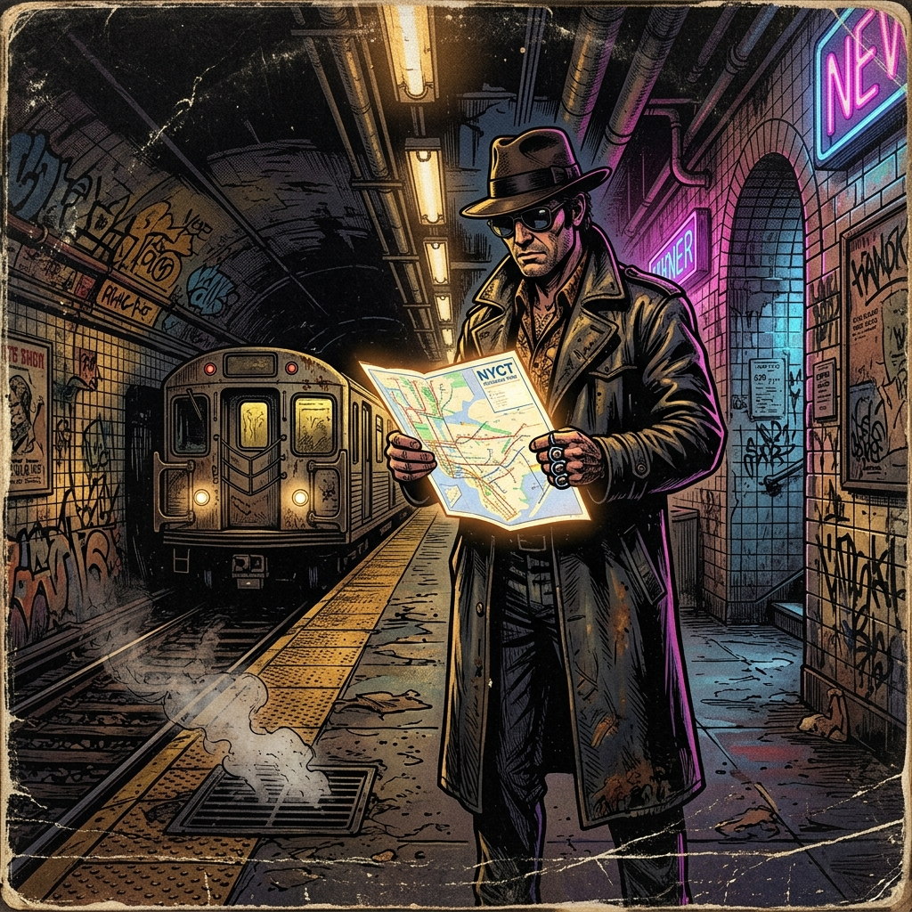
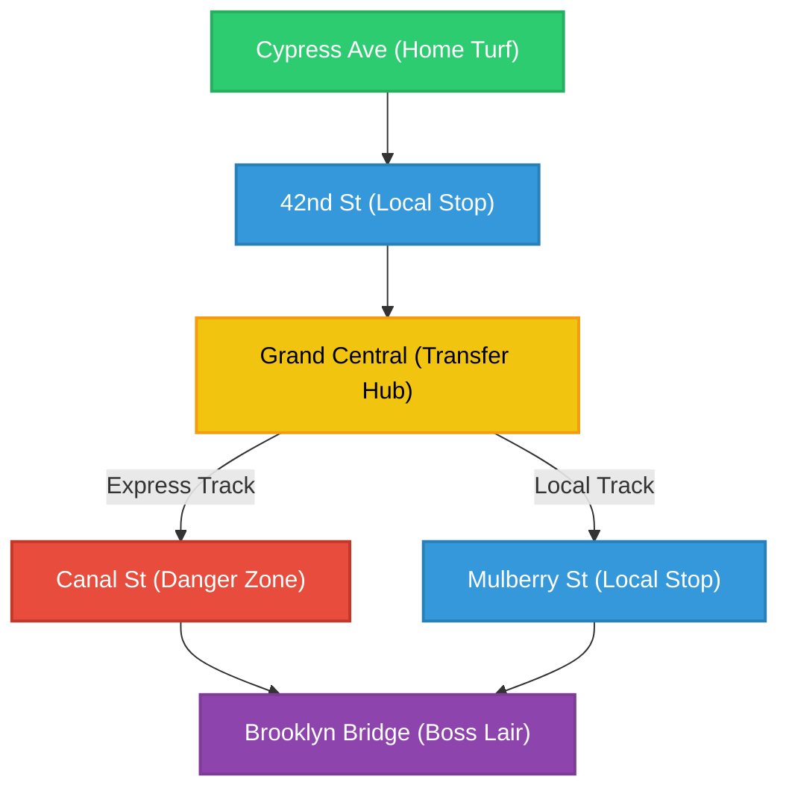

# Saturday Night Street Fight — Game Master's Guide

This guide provides the Game Master (GM) with setting guidelines, environmental generation tables, encounter building rules, and NPC stat blocks to run street-level brawls in a gritty, high-friction urban landscape.

---

## Table of Contents

1. [The Setting: 1975 Urban Decay](#the-setting-1975-urban-decay)
2. [Subway Traversal (The Station Crawl)](#subway-traversal-the-station-crawl)
3. [Block Generation System](#block-generation-system)
4. [Block Danger Ranks & Encounters](#block-danger-ranks--encounters)
5. [Encounter Building & Starting Range Matrix](#encounter-building--starting-range-matrix)
6. [Encounter Disposition (Reaction Roll)](#encounter-disposition-reaction-roll)
7. [NPC Stats & Threat Tiers](#npc-stats--threat-tiers)
8. [Group Combat Rules](#group-combat-rules)
9. [The Saturday Night Soundtrack (1970s Playlist)](#the-saturday-night-soundtrack-1970s-playlist)
10. [Brawler Name & Alias Database](#10-brawler-name--alias-database)

---

## The Setting: 1975 Urban Decay

> *"In the midst of chaos, there is also opportunity."* — Sun Tzu

The setting is inspired by 1970s New York City—a blighted, financially broken metropolis during the mid-1970s. 
*   **The Vibe**: Steam rising from manholes, cracked asphalt, flickering neon signs, graffiti-covered subway cars, piles of uncollected garbage, and yellow cabs splashing through puddles under broken streetlights.
*   **The Conflict**: Power vacuums, street gangs defending blocks, turf wars, corrupt officials, and neighborhoods left to fend for themselves.

---

## Subway Traversal (The Station Crawl)

> *"Notice that the stiffest tree is most easily cracked, while the bamboo or willow survives by bending with the wind."* — Bruce Lee

Fighters move through the blighted city by riding the subway line. Traveling from neighborhood to neighborhood is a dangerous journey where every stop brings new threats.

### Traversal Loop
1.  **Select Destination**: Players choose their target neighborhood or destination station.
2.  **Riding the Rails**: The train travels through the underground tunnels. For each station the train passes through or stops at, the GM rolls on the **Subway Station Event Table** below.
3.  **Explore the Block (Station-Linked Danger)**: When players exit a station to the surface, the GM generates a new block using the **Block Generation System**. The block's **Danger Rank** is directly tied to the type of station they just exited:
    *   **Transit Safe House** (Event Roll 10) $\rightarrow$ Exits onto a **Danger Rank 1** block.
    *   **Transfer Hub** (Station Type 5-7) $\rightarrow$ Exits onto a **Danger Rank 1** (1-4 on $1\text{d}10$) or **Danger Rank 2** (5-10 on $1\text{d}10$) block.
    *   **Local Stop** (Station Type 1-4) $\rightarrow$ Exits onto a **Danger Rank 2** (1-6 on $1\text{d}10$) or **Danger Rank 3** (7-10 on $1\text{d}10$) block.
    *   **Danger Zone** (Station Type 8-9) $\rightarrow$ Exits onto a **Danger Rank 4** (1-6 on $1\text{d}10$) or **Danger Rank 5** (7-10 on $1\text{d}10$) block.
    *   **Final Station (Boss's Lair)** $\rightarrow$ Exits onto a **Danger Rank 5** block.

### Subway Station Event Table (Roll $1\text{d}10$)
Whenever the train pulls into a station, roll to see what awaits the players on the platform:

| Roll | Station Event | Description & Rules |
| :--- | :--- | :--- |
| **1-3** | **Clear Platform** | The station is quiet, populated only by a few nervous commuters. Players can safely exit to the street (generating a new block) or rest to recover minor attribute damage. |
| **4-5** | **Local Gang Toll** | A group of **Standard Thugs (Tier 2)** guards the turnstiles, demanding a toll. Players can offer a street favor/bribe (**Cool Check DC 10**), fight, or bluff/intimidate past (**Contested Cool Check**). |
| **6-7** | **Ambush!** | The platform lights flicker out. A **Mob of Punks (Tier 1)** ambushes from the shadows at **Grapple Range**. Players must pass a **Cool Check (DC 10)** to keep their nerve; on a failure, the attackers gain **Advantage** on the first round. |
| **8-9** | **Rival Crew Turf** | A rival **Boss (Tier 3)** and their enforcers are waiting on the platform, looking to defend their turf from outsiders. |
| **10** | **Transit Safe House & Clinic Connection** | A friendly transit worker lets players hide in a breakroom. This station is directly connected to a **City Hospital** (players can immediately roll the **Cool Check [DC 12]** to get admitted for Severe Recovery within the 24-Hour emergency window without exiting to the surface). Restores Cool to maximum. |

### Procedural Subway Line Generator
To map out a transit line between the players' Home Turf and their target destination:
1.  **Roll Line Length**: Roll **$1\text{d}10$** to determine the number of intermediate stations on the line (1–3: 3 stations, 4–7: 5 stations, 8–10: 7 stations).
2.  **Generate Stations**: For each intermediate station, roll a **$1\text{d}10$** on the table below to determine its layout and routing choices:

| Roll ($1\text{d}10$) | Station Type | Description & Routing Rules |
| :--- | :--- | :--- |
| **1-4** | **Local Stop** | Standard station. Roll on the *Subway Station Event Table* normally when arriving. |
| **5-7** | **Transfer Hub** | Large intersecting station. Players can choose to switch to a different line, bypassing the next station on their current route but adding $+1$ station to their total trip. |
| **8-9** | **Danger Zone** | A gang-controlled choke point. Any rolls on the *Subway Station Event Table* at this stop are made with **Disadvantage** (taking the worse result). |
| **10** | **Express Line Bypass** | A fast-track tunnel. Allows the train to bypass the next scheduled station entirely, skipping an event roll. |

### Example Subway Campaign Map
Below is an example of a procedurally generated subway route connecting the players' starting neighborhood (**Cypress Ave**) to the final Syndicate Boss's lair (**Brooklyn Bridge**). 

At **Grand Central**, players are presented with a tactical routing choice: take the fast but high-danger Express track through the **Canal St Danger Zone** (guaranteeing a Danger Rank 4-5 street exit), or take the slower, safer Local track through the **Mulberry St Local Stop** (Danger Rank 2-3).

---

## Block Generation System

> *"The general who wins the battle makes many calculations in his temple before the battle is fought."* — Sun Tzu

To generate the block where a fight takes place, the GM rolls on the following tables to create a distinct intersection, populate it with businesses, and add environmental hazards.

### Step 1: Street Name Generator (Roll $2\text{d}10$ four times)
Roll two ten-sided dice to get a number between 2 and 20. Roll four times to generate the street names that intersect to form your block.

| Roll | Street Name A (Prefix) | Street Name B (Suffix/Avenue) |
| :--- | :--- | :--- |
| **2** | Cypress | Avenue A |
| **3** | Lexington | Broadway |
| **4** | Delancey | St. Ann's Street |
| **5** | Mercer | Madison Avenue |
| **6** | St. Mark's | 42nd Street |
| **7** | Bowery | Grand Street |
| **8** | Lafayette | Hudson Street |
| **9** | Bleeker | 8th Avenue |
| **10** | Greenwich | Canal Street |
| **11** | Mulberry | Rivington Street |
| **12** | Kenmare | MacDougal Street |
| **13** | Orchard | Houston Street |
| **14** | Sullivan | Christopher Street |
| **15** | Thompson | Allen Street |
| **16** | Waverly | Chrystie Street |
| **17** | Ludlow | Eldridge Street |
| **18** | Pitt | Forsyth Street |
| **19** | Clinton | Essex Street |
| **20** | Broome | Division Street |

*Example Roll: 7, 10, 4, 13 $\rightarrow$ The block is the corner of **Bowery & Canal**, stretching down to **Delancey & Houston**.*

---

### Step 2: Populate the Block (Roll $1\text{d}10$ three times)
Roll to determine the three primary landmarks on the block.

| Roll | Landmark / Business | Tactical Layout / Features |
| :--- | :--- | :--- |
| **1** | **Dive Bar** | Pool table (obstructs movement), jukebox, slippery spilled drinks. **Social Sanctuary**: Players can unwind here to fully restore Cool back to maximum. |
| **2** | **Pawn Shop** | Iron security gates (can be used to pin), glass display cases. |
| **3** | **Abandoned Movie Theater** | Littered lobby, broken ticket booth, heavy double doors. |
| **4** | **Greasy Spoon Diner** | High counter stools, hot coffee pots, narrow aisle-ways. **Social Sanctuary**: Players can eat hot meals and unwind here to fully restore Cool back to maximum. |
| **5** | **Tenement Steps & Stoop** | Elevated concrete steps, metal handrails, basement stairwell. |
| **6** | **Narrow Alleyway** | Dumpsters (can block exits), fire escapes, wooden pallets. |
| **7** | **Auto Repair Shop** | Tire stacks, motor oil slicks (Agility hazard), tool racks. |
| **8** | **Billiards Hall** | Narrow green tables, wooden cues (can be improvised strikes). |
| **9** | **Subway Station Entrance** | Concrete stairs descending into darkness, metal turnstiles. |
| **10** | **County Hospital / Free Clinic** | Crowded emergency room, police guards, antiseptic smells. Required to treat Severe Recovery (attributes at 0). Getting admitted requires a **Cool Check (DC 12 — Medium)** within the 24-hour emergency window (max 2 Admittance Checks; failure to get admitted within 24 hours results in **Street Death**). |

---

### Step 3: Environmental Hazards (Roll $1\text{d}10$ for the block)
These hazards add mechanical friction to the brawls.

| Roll | Hazard | Mechanical Effect |
| :--- | :--- | :--- |
| **1-3** | **Steam Vent** | Blind spot. Any reaction-based action rolled near it has **Disadvantage**. |
| **4-5** | **Oil Slick / Wet Pavement** | Slippery. Any character moving or dodging must pass an **Agility Check (DC 10 — Easy)** or fall **Prone**. |
| **6-7** | **Broken Streetlight** | Low visibility. All Strike actions suffer a $-1$ penalty to rolls. |
| **8-9** | **Loose Garbage / Debris** | Footing hazard. Dodge actions lose their $+2$ Outside Spacing bonus. |
| **10** | **Fire Escape Scaffolding** | Vertical space. Clambering up allows Strikes from above (gaining **Advantage**). |

---

## Block Danger Ranks & Encounters

> *"The ultimate weapon in any fight is a person's courage and composure."* — Joe Lewis *(1970s World Karate Champion)*

Every block in the city has a **Danger Rank** from **1 to 5** that reflects the presence of hostile gang control. When players arrive at a block, the GM determines the Danger Rank and rolls a **$1\text{d}10$** on the corresponding table below to generate the encounter:

### Danger Rank 1: Safe Zone / Home Turf
*Friendly neighborhoods, neutral territory, or heavily patrolled sectors.*
*   **1: Empty Street**: A quiet, peaceful night under the streetlights. No threats.
*   **2: Friendly Merchant**: A local vendor or street ally. Players can trade street rumors, get directions to local safe houses, or rest safely without threat of ambushes.
*   **3: Transit Police Patrol**: Active police presence. Brawling is forbidden; any combat actions rolled on this block immediately summon police enforcers.
*   **4: Local Informant**: A street contact. Players can roll a **Cool Check (DC 10)** to gather rumors, gaining **Advantage** on their next Subway Station Event roll on a success.
*   **5: Safe Alleyway**: A hidden, dry alcove to hide. Players can safely rest here to recover minor attribute damage ($+1$ point to all attributes at 1 or higher).
*   **6: Minor Nuisance**: A single pickpocket (**Tier 1 Punk**) attempts a grab and run. They will immediately flee if the player wins a contested **Cool** (intimidation) or Reaction (chase) check.
*   **7: Corner Newsstand**: Commuters reading evening papers. Peaceful safe zone.
*   **8: Diner Window Seat**: Warm interior light shining onto the sidewalk. Safe resting spot.
*   **9: Off-Duty Brawler**: A retired veteran brawler offering combat advice (grants **Advantage** on your next stance read check).
*   **10: Street Musician**: A saxophone player playing a calm jazz melody; unwinds stress and restores Cool to maximum.

### Danger Rank 2: Low Danger / Disputed Blocks
*Fringe territory where low-level crews occasionally pick fights.*
*   **1: Quiet Corridor**: The block is quiet, but shadows flicker in the alleys. No immediate threats.
*   **2: Solitary Lookout**: A single **Tier 1 Lookout** stands guard. Players can sneak/take them down using contested Reaction, or bluff past them using a contested **Cool** check.
*   **3: Street Craps Game**: A group of locals gambling. Players can participate in a high-stakes street game by winning a contested **Cool** check against the dealer to earn **+1 XP** (representing street reputation and experience gained from high-stakes gambling).
*   **4: Foot Patrol**: Two **Tier 1 Punks** walking the beat. They will harass the players unless intimidated by a contested **Cool** check.
*   **5: Drunk Fighter**: A single **Tier 2 Thug** who is highly intoxicated and looking for a brawl. Due to their state, they roll all checks with **Disadvantage**.
*   **6: Shakedown**: A single **Tier 2 Thug** demands a turf toll. Players can fight or bluff past them by winning a contested **Cool** check.
*   **7: Tagging Crew**: Three **Tier 1 Punks** spray-painting gang slogans. They grow hostile if confronted.
*   **8: Narrow Alley Shortcut**: A dark alley starting at **Striking Range**.
*   **9: Debris Obstruction**: Loose wooden crates; requires an **Agility Check (DC 10 — Easy)** to cross without tripping.
*   **10: Stolen Vehicle**: A stripped car creating cover in the center of the block.

### Danger Rank 3: Medium Danger / Active Turf
*Core gang territory where members actively defend their blocks.*
*   **1: Watchful Eyes**: Gang watchmen occupy the rooftops. Crossing the block without panic requires a contested **Cool** check to blend into the shadows.
*   **2: Rival Patrol**: Two **Tier 2 Thugs** of the local style (e.g., Boxers if in Boxers' turf) patrolling.
*   **3: Heavy Hitter**: A single **Tier 2 Thug** carrying an improvised weapon (baseball bat or pipe), adding $+1$ damage to all successful Strikes.
*   **4: Gang Rush**: A **Mob of Punks (Tier 1)** rushes the players, starting at Striking Range.
*   **5: Corner Defense**: Two **Tier 2 Thugs** guarding a business entry. They block passage until defeated.
*   **6: Alleyway Ambush**: A **Mob of Punks (Tier 1)** ambushes the players from the shadows, starting immediately at **Grapple Range**.
*   **7: Barroom Spillout**: Two **Tier 2 Thugs** crashing out of a dive bar onto the sidewalk.
*   **8: Guard Dog Handler**: A **Tier 2 Thug** with an aggressive guard dog enforcing gang turf lines.
*   **9: Chokepoint Fence**: A chainlink fence blocking the block, forcing **Grapple Range**.
*   **10: Street Standoff**: A hostile Mob of 3 Punks staring down the block at **Outside Range**.

### Danger Rank 4: High Danger / Contested Turf War
*War zones where rival factions are actively brawling or heavily fortified.*
*   **1: Fortified Blockade**: Barbwire and wooden crates block the street. Crossing requires a contested **Power** check against barricade defenders (**two Tier 2 Thugs**).
*   **2: Elite Enforcer**: A single **Tier 2 Thug** who has upgraded one of their style techniques to **Mastered Rank 2 ($+5$)** stands guard.
*   **3: Warlord Patrol**: Three **Tier 2 Thugs** patrolling. They fight with high coordination.
*   **4: The Pack**: A **Mob of Punks (Tier 1)** led by a **Tier 2 Thug** enforcer.
*   **5: Hit Squad**: Two **Tier 2 Thugs** who coordinate their attacks to specifically target the players' lowest attribute.
*   **6: Double Ambush**: Two separate **Mobs of Punks (Tier 1)** attack from both sides, catching the players in a crossfire (Flanking rules apply!).
*   **7: Arson Threat**: A **Tier 2 Thug** threatening to burn down a local storefront unless stopped immediately.
*   **8: Rooftop Bottle Throwers**: Gang scouts throwing bricks/bottles from above, giving enemies **Advantage** on the first round.
*   **9: Heavy Enforcer Duo**: Two **Tier 2 Thugs** wielding lead pipes.
*   **10: Subway Stairs Chokepoint**: Ambush right at the subway exit stairs at **Grapple Range**.

### Danger Rank 5: Extreme Danger / Boss Territory
*Fortified syndicate headquarters or the personal turf of a gang leader.*
*   **1: Grime Trap**: Low visibility and steam vents cover the street. All action rolls on this block suffer a $-1$ penalty.
*   **2: The Elite Guard**: Two **Tier 3 Bosses** (built using full Character Creation rules) patrolling.
*   **3: Syndicate Patrol**: A **Mob of Punks (Tier 1)** led by an elite **Tier 3 Boss** enforcer.
*   **4: Style Champion**: A **Tier 3 Boss** who has active style perks and multiple Mastered techniques ($+5$) challenges the players to a 1-on-1 duel.
*   **5: Death Alley Ambush**: Two **Tier 2 Thugs** and one **Tier 3 Boss** ambush the players immediately at **Grapple Range**.
*   **6: The Overlord**: The main Boss of the sector is present with a personal bodyguard of **two Tier 2 Thugs**.
*   **7: Syndicate Warband**: A Mob of 6 Punks led by two **Tier 2 Thugs**.
*   **8: Heavyweight Champion**: A **Tier 3 Boss** with maxed Power and Stamina (4).
*   **9: Iron Gate Trap**: Security gates lock behind the crew; forces a fight to the TKO!
*   **10: Final Showdown**: The Syndicate Leader challenges the crew at **Outside Range** under glowing neon lights.

---

## Encounter Building & Starting Range Matrix

> *"If you know the enemy and know yourself, you need not fear the result of a hundred battles."* — Sun Tzu

When building a street encounter or resolving a random event during the Street Crawl, combine the **Threat Tier** with the **Environmental Starting Range Table**:

### 1. Threat Tier & XP Budget
*   **Tier 1: Punks / Lookouts (Minor Obstacle)**: Groups of 2–6 Punks using **Mob Punk Rules** (1 damage = 1 Punk TKO'd; all defeated at Mob Pool 0). Tuned as minor street hurdles (PC Win Rate ~90%).
*   **Tier 2: Thugs / Enforcers (Standard Encounter)**: 1–2 seasoned brawlers (Attributes 2–3, 1–2 Trained/Mastered moves). Always individual combatants (PC Win Rate ~60%).
*   **Tier 3: Syndicate Boss (Climax Encounter)**: 1 Boss built using the full 50 XP budget (Attributes 3, multiple Mastered moves). High-stakes duel (PC Win Rate ~50%).
*   **Tier 4: Syndicate Warlord / Master (End-Game Climax Boss)**: 1 Sector Warlord / Dojo Master built using a **100–150 XP budget** (Attributes 4s, Mastered moves, *Perfect Form* or *Dojo Founder* disciples). Climax endgame duel for veteran PCs (PC Win Rate ~55–65%).
*   **Tier 4+: Supreme Syndicate Overlord / Grandmaster (Ultimate Campaign Climax)**: 1 Supreme Leader / Grandmaster built using a **180–200+ XP budget** (**Dual Style Mastery**: Secondary elevated to Primary, *Dual Style Mastery* activating all 4 style perks + 2nd Master Achievement). Designed as the ultimate challenge for maxed PCs.

### 2. Environmental Starting Range Table
When an encounter begins, determine the starting range based on the location or roll **1d10**:

| 1d10 Roll | Location & Environment | Starting Range | Tactical Impact |
| :--- | :--- | :--- | :--- |
| **1–3** | **Open Ground**: Wide street block, parking lot, or subway platform sightlines. | **Outside Range (Long Range)** | Favors long-range kickers (*Push Kick, High Kick*); punches & throws are out of range. |
| **4–7** | **Standard Pocket**: Diner booth, alleyway square-up, or bar room floor. | **Striking Range (Medium Range)** | Default face-off distance; punches, kicks, and guards are all active. |
| **8–10** | **Close Quarters / Ambush**: Crowded subway car, elevator, narrow hallway, or sucker punch. | **Grapple Range (Close Range)** | Favors grapplers (*Clinch, Takedown, Hip Throw*); long strikes cannot be thrown. |

### 3. Tactical Ambush & Stance Cues
If a party successfully ambushes an enemy (or gets ambushed):
*   **Range Control**: The ambushing side chooses the initial **Starting Range** (Outside Range, Striking Range, or Grapple Range).
*   **Free Stance Read**: The ambushing side automatically gains a **Perfect Read (Margin 7+)** on Phase 1, forcing the surprised defender to reveal their action card color first.

---

## Encounter Disposition (Reaction Roll)

> *"To know oneself is to study oneself in action with another person."* — Bruce Lee

When players encounter a new gang, mob of punks, or street NPC during a Street Crawl (or exiting a subway station), the GM or lead player rolls **$2\text{d}10 + \text{Cool}$** to determine the group's initial reaction, demeanor, and threat level:

| $2\text{d}10 + \text{Cool}$ Total | Initial Disposition | Narrative & Tactical Outcome |
| :--- | :--- | :--- |
| **5 or lower** | **Hostile / Ambush** | Immediate attack! Enemies launch a surprise strike or force **Grapple Range**. |
| **6–10** | **Aggressive / Demand Turf Toll** | Unfriendly. They demand a street favor or provoke a brawl. Passing a **Cool Check (DC 12)** defuses the tension; failure triggers combat. |
| **11–15** | **Wary / Tense Standoff** | Sizing each other up at **Outside Range**. Fights only break out if provoked or if a stance read fails. |
| **16–19** | **Indifferent / Open to Talk** | Neutral. Willing to share street rumors, give directions, or allow safe passage through their block. |
| **20+** | **Friendly / Helpful** | Welcoming. Offers access to a **Transit Safe House**, street medical tips, or local backup. |

---

## NPC Stats & Threat Tiers

> *"There are no tough guys in the world. Just guys who haven't met someone who can beat 'em."* — Cus D'Amato

Not everyone on the streets is a martial arts master. The GM populates blocks with three distinct tiers of opponents.

### 1. Punks & Lookouts (Tier 1)
Street kids, pickpockets, or low-level lookouts. They are physically weak and untrained, looking for easy prey.
*   **Attributes**: Agility 1, Power 1, Reaction 1, Stamina 1, Cool 1.
*   **Techniques**: Untrained (Rank 0) in all martial techniques.
*   **Perks**: None.
*   **Tactics**: They only fight in groups using **Mob Punk Rules**. If isolated, they flee.

### 2. Standard Thugs & Soldiers (Tier 2)
Enforcers, muscle, or standard gang soldiers who know how to swing a bat or throw a punch.
*   **Attributes**: Agility 2, Power 2, Reaction 2, Stamina 2, Cool 2.
*   **Techniques**: Trained (Rank 1, $+3$ bonus) in **two** style-specific moves (e.g., Jab and High Guard).
*   **Perks**: None.
*   **Tactics**: Always individual combatants. Defensive when outnumbered, aggressive when having the upper hand.

### 3. Syndicate Bosses (Tier 3)
Neighborhood bosses who control local blocks and transit hubs.
*   **Creation**: Built using a **50 XP budget** (Attributes 3, 2–3 Mastered Rank 2 techniques with $+5$ bonus).
*   **Style**: Primary Martial Arts Style with both style perks active.
*   **Tactics**: Highly strategic, targeting the player's weakest attribute.

### 4. Syndicate Warlords & Masters (Tier 4)
Sector warlords, dojo masters, or syndicate leaders who rule entire districts.
*   **Creation**: Built using a **100–150 XP budget** (Attributes at 4, 4 Mastered Rank 2 techniques with $+5$ bonus).
*   **Style**: Primary Martial Arts Style with both style perks active.
*   **Master Perks**: Possesses a Master Rank perk—either **Perfect Form** (dice clash floor of 5) or **Dojo Founder** (accompanied by $1\text{d}10$ Dojo Disciples Tier 1 Mob).
*   **Tactics**: Relentless pressure, stance reading mastery, and devastating combo strings. Tuned for climax duels against veteran PCs.

### 5. Supreme Syndicate Overlords / Grandmasters (Tier 4+)
Endgame campaign bosses, syndicate supreme leaders, or legendary martial arts grandmasters who have unified two martial arts disciplines into a seamless dual-primary fighting system.
*   **Creation**: Built using a **180–200+ XP budget** (Attributes maxed at 4, 6–8 Mastered Rank 2 techniques with $+5$ bonus).
*   **Dual Style Elevation**: Elevated to hold **two Primary Styles** (Dual Style Mastery).
*   **Grandmaster Perks & Achievements**: Possesses **Dual Style Mastery** (gains **all 4 Style Perks**—2 from Style A + 2 from Style B!) and **two Master Achievements** (*Perfect Form* and/or *Dojo Founder* across both styles).
*   **Tactics**: High-friction stance reading, dual-style counterplay (e.g., Boxer Slip & Counter combined with Judo Throw Reversals), and devastating tactical endurance. Designed as the ultimate climax challenge for maxed PC crews.

---

## Group Combat Rules

> *"Do not allow yourself to be cornered or surrounded. Constant movement is survival."* — Chuck Norris

Use these rules when players are outnumbered or coordinating with allies.

### 1. Mob Punk Rules (Exclusive to Tier 1 Gangs)

> [!IMPORTANT]
> **Tier 1 Mob Rules**: Mob rules apply to Tier 1 Punks (minor street corner lackeys, pickpockets, or lookout groups) as well as PC-aligned **Dojo Disciples** (granted by the *Dojo Founder* Master perk). **Tier 2 Thugs** and **Tier 3 Bosses** are seasoned brawlers who always act as individual combatants with their own full attribute pools and cannot be grouped into Mobs.

*   **Shared Mob Pool**: A group of Tier 1 Punks acts as a single collective entity called a **Mob**. The Mob has a **Mob Count** equal to the total number of punks in the group (e.g., a Mob of 4 Punks).
*   **One-Hit TKO**: Every point of attribute damage dealt to the Mob instantly TKOs **1 Punk** from the gang (1 damage = 1 Punk defeated).
    *   *Example*: A Boxer hits a 4-Punk Mob with a Cross dealing **3 Reaction damage**. 3 Punks are immediately knocked out! The Mob Count drops from 4 down to 1.
*   **Mob Group Bonus**: On its turn, the Mob rolls a single shared action check, adding a **$+1$ bonus per active Punk** remaining in the Mob (up to the standard $+10$ Modifier Cap).
*   **Total Defeat**: When the Mob Count reaches **0**, all Punks in the Mob are defeated and any survivors scatter.

### 2. Flanking & Third-Party Intervention
If a fighter is double-teamed by multiple opponents:
*   The defender must choose one attacker to be their **Primary Threat** and roll against them normally.
*   Against any **secondary (flanking) attackers**, the defender rolls with **Disadvantage** (roll $3\text{d}10$, keep the two lowest dice) and cannot choose Dodge/Evasion or Parry.

---

## The Saturday Night Soundtrack (1970s Playlist)

> *"Rhythm is everything in fighting. Every move you make starts with your heart, and that's in rhythm or you're in trouble."* — Sugar Ray Robinson

To set the mood at your table, roll a **$1\text{d}10$** on the tables below to select a track during session exploration or brawls:

### Gritty Exploration & Mood (Subways & Wet Asphalt)

| Roll ($1\text{d}10$) | Song | Artist & Year |
| :--- | :--- | :--- |
| **1** | "Across 110th Street" | Bobby Womack (1972) |
| **2** | "Walk on the Wild Side" | Lou Reed (1972) |
| **3** | "Summer in the City" | Quincy Jones (1973) |
| **4** | "Papa Was a Rollin' Stone" | The Temptations (1972) |
| **5** | "Inner City Blues (Make Me Wanna Holler)" | Marvin Gaye (1971) |
| **6** | "Living for the City" | Stevie Wonder (1973) |
| **7** | "Nightclubbing" | Iggy Pop (1977) |
| **8** | "Pusherman" | Curtis Mayfield (1972) |
| **9** | "Riders on the Storm" | The Doors (1971) |
| **10** | "Low Rider" | War (1975) |

### High-Energy Street Brawls

| Roll ($1\text{d}10$) | Song | Artist & Year |
| :--- | :--- | :--- |
| **1** | "The Payback" | James Brown (1973) |
| **2** | "Blitzkrieg Bop" | Ramones (1976) |
| **3** | "Search and Destroy" | The Stooges (1973) |
| **4** | "Theme from Shaft" | Isaac Hayes (1971) |
| **5** | "Superstition" | Stevie Wonder (1972) |
| **6** | "Rock and Roll All Nite" | Kiss (1975) |
| **7** | "Ballroom Blitz" | Sweet (1973) |
| **8** | "Born to Run" | Bruce Springsteen (1975) |
| **9** | "White Riot" | The Clash (1977) |
| **10** | "Kung Fu Fighting" | Carl Douglas (1974) |

---

## 10. Brawler Name & Alias Database

When generating PCs or GMing NPCs on the fly, use the official [Brawler Name & Alias Database](names.md) to generate authentic 1970s street names across diverse cultural backgrounds:

*   **Asian Brawler Names**: East Asian, Southeast Asian, and South Asian given names and surnames (*Kenji Chen*, *Mei-Ling Sato*, *Somchai Prasert*).
*   **Latino & Hispanic Brawler Names**: Nuyorican, Dominican, Mexican, and South American given names and surnames (*Hector Vega*, *Carmen Morales*, *Tito Ortiz*).
*   **European & Anglo Brawler Names**: Italian, Irish/Anglo, and Eastern European given names and surnames (*Vinnie Gambini*, *Mickey O'Neill*, *Ivan Petrov*).
*   **African & African-American Brawler Names**: 1970s Urban, Diaspora, and West/East African given names and surnames (*Cassius Jackson*, *Pamela Mercer*, *Kwame Mensah*).
*   **Street Monikers & Alias Generator**: Roll $1\text{d}10$ (Prefix) + $1\text{d}10$ (Combat Moniker) to generate street titles like *Iron Viper*, *Slick Hammer*, *Razor Tiger*, or *Thunder Brawler*.
