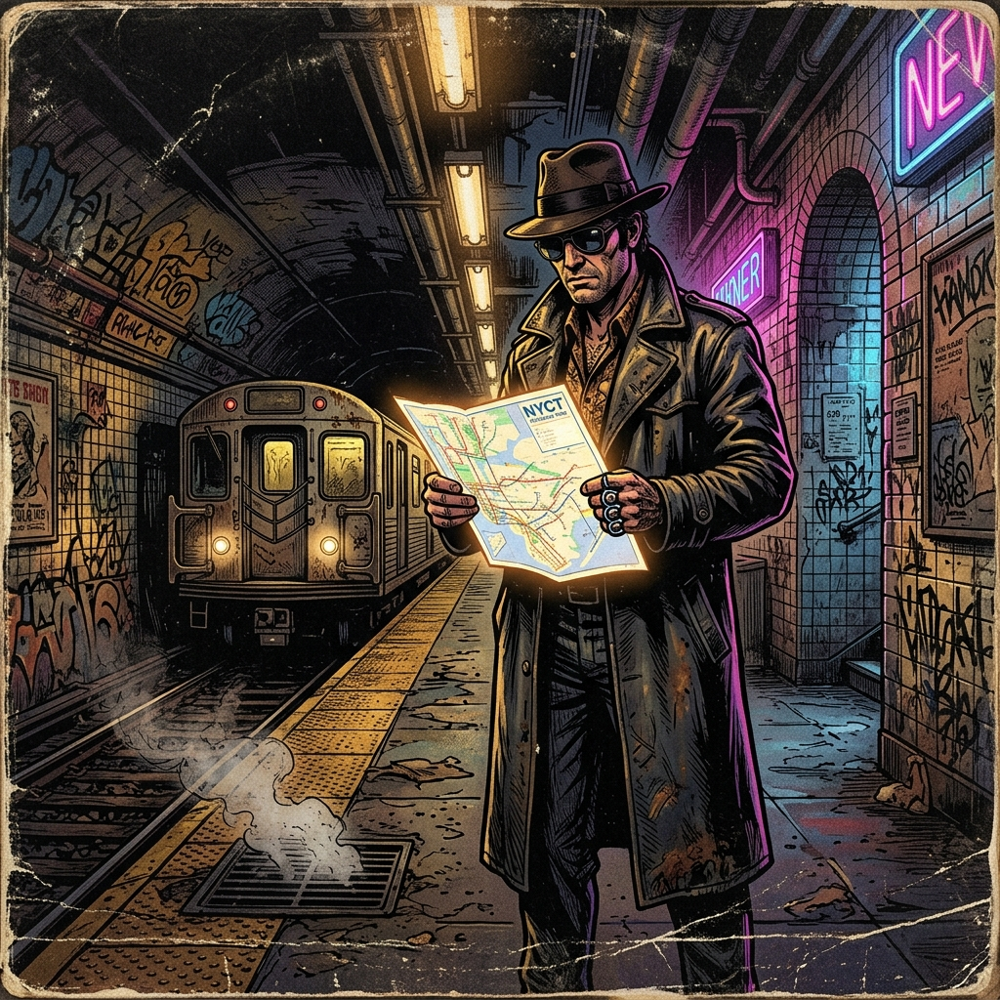
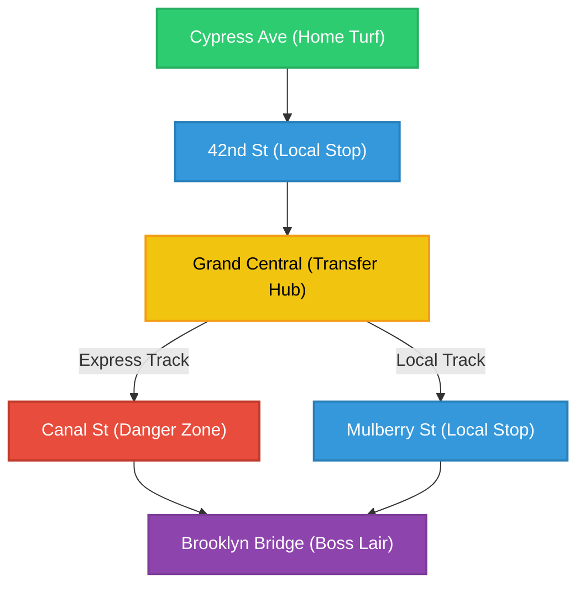
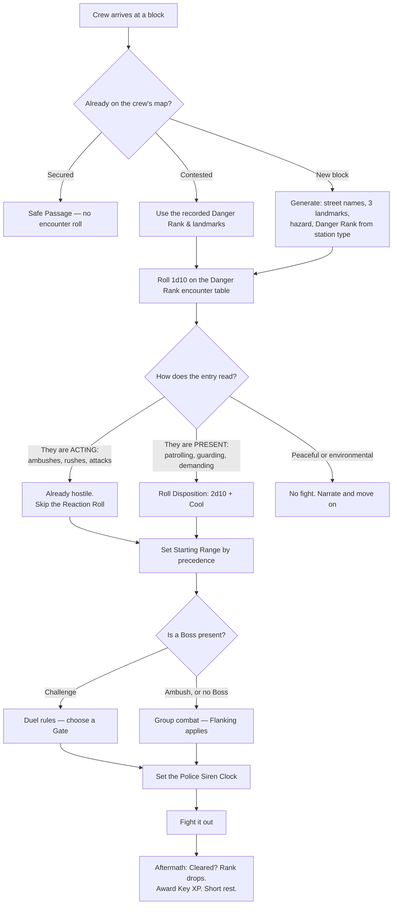

# Saturday Night Street Fight — Game Master's Guide

This guide provides the Game Master (GM) with setting guidelines, environmental generation tables, encounter building rules, and NPC stat blocks to run street-level brawls in a gritty, high-friction urban landscape.

---

## Table of Contents

1. [The Setting: 1975 Urban Decay](#the-setting-1975-urban-decay)
2. [Subway Traversal (The Station Crawl)](#subway-traversal-the-station-crawl)
3. [Block Generation System](#block-generation-system)
4. [Block Danger Ranks & Encounters](#block-danger-ranks--encounters)
5. [Turf Control & The Campaign Map](#turf-control--the-campaign-map)
6. [Encounter Building & Starting Range Matrix](#encounter-building--starting-range-matrix)
7. [Encounter Disposition (Reaction Roll)](#encounter-disposition-reaction-roll)
8. [NPC Stats & Threat Tiers](#npc-stats--threat-tiers)
9. [Group Combat Rules](#group-combat-rules)
10. [Duels & Boss Encounters](#duels--boss-encounters)
11. [Police Siren Clock & Shakedown Mechanics](#police-siren-clock--shakedown-mechanics)
12. [The Saturday Night Soundtrack (1970s Playlist)](#the-saturday-night-soundtrack-1970s-playlist)
13. [Brawler Name & Alias Database](#brawler-name--alias-database)

---

## The Setting: 1975 Urban Decay

> *"In the midst of chaos, there is also opportunity."* — Sun Tzu

The setting is set in 1970s Empire City—a blighted, financially broken metropolis during the mid-1970s. 
*   **The Vibe**: Steam rising from manholes, cracked asphalt, flickering neon signs, graffiti-covered subway cars, piles of uncollected garbage, and yellow cabs splashing through puddles under broken streetlights.
*   **The Conflict**: Power vacuums, street gangs defending blocks, turf wars, corrupt officials, and municipal services stretched to the breaking point.
*   **The Vigilante Patrol Hook**: Inspired by historical volunteer subway safety patrols (like the 1979 *Magnificent Thirteen*), the Player Characters form a volunteer **Vigilante Safety Patrol**. Wearing matching street insignia (red berets, armbands, or satin patrol jackets), this crew of martial artists from different dojos and disciplines rides the subway transit system and sweeps high-risk blocks—standing up as the only line of defense protecting innocent commuters and neighborhood residents from crime.

---

## Subway Traversal (The Station Crawl)

> *"Notice that the stiffest tree is most easily cracked, while the bamboo or willow survives by bending with the wind."* — Bruce Lee

Fighters move through the blighted city by riding the subway line. Traveling from neighborhood to neighborhood is a dangerous journey where every stop brings new threats.

### Traversal Loop
1.  **Select Destination**: Players choose their target neighborhood or destination station.
2.  **Riding the Rails**: The train travels through the underground tunnels. For each station the train passes through or stops at, the GM rolls on the **Subway Station Event Table** below.
3.  **Explore the Block (Station-Linked Danger)**: When players exit a station to the surface, the GM generates a new block using the **Block Generation System**. The block's **Danger Rank** is directly tied to the type of station they just exited:
    *   **Transit Safe House** (Event Roll 10) $\rightarrow$ Exits onto a **Danger Rank 1** block.
    *   **Transfer Hub** (Station Type 5-7) $\rightarrow$ Exits onto a **Danger Rank 1** (1-4 on 1d10) or **Danger Rank 2** (5-10 on 1d10) block.
    *   **Local Stop** (Station Type 1-4) $\rightarrow$ Exits onto a **Danger Rank 2** (1-6 on 1d10) or **Danger Rank 3** (7-10 on 1d10) block.
    *   **Danger Zone** (Station Type 8-9) $\rightarrow$ Exits onto a **Danger Rank 4** (1-6 on 1d10) or **Danger Rank 5** (7-10 on 1d10) block.
    *   **Final Station (Boss's Lair)** $\rightarrow$ Exits onto a **Danger Rank 5** block.

### Subway Station Event Table (Roll 1d10)
Whenever the train pulls into a station, roll to see what awaits the players on the platform:

| Roll | Station Event | Description & Rules |
| :--- | :--- | :--- |
| **1-3** | **Clear Platform** | The station is quiet, populated only by a few nervous commuters. Players can safely exit to the street (generating a new block) or rest to recover minor attribute damage. |
| **4-5** | **Local Gang Toll** | A group of **Standard Thugs (Tier 2)** guards the turnstiles, demanding a toll. Players can offer a street favor/bribe (**Cool Check DC 10**), fight, or bluff/intimidate past (**Contested Cool Check**). |
| **6-7** | **Ambush!** | The platform lights flicker out. A **Mob of Punks (Tier 1)** ambushes from the shadows at **Grapple Range**. Players must pass a **Cool Check (DC 10)** to keep their nerve; on a failure, the attackers gain **Advantage** on the first round. |
| **8-9** | **Rival Crew Turf** | A rival **Boss (Tier 3)** and their enforcers are waiting on the platform, looking to defend their turf from outsiders. |
| **10** | **Transit Safe House & Clinic Connection** | A friendly transit worker lets players hide in a breakroom. This station is directly connected to a **City Hospital** (players can immediately roll the **Admittance Cool Check [DC 12 / 15 / 18 by severity]** to get admitted for Severe Recovery within the 24-Hour emergency window without exiting to the surface). Restores Cool to maximum. |

### Procedural Subway Line Generator
To map out a transit line between the players' Home Turf and their target destination:
1.  **Roll Line Length**: Roll **1d10** to determine the number of intermediate stations on the line (1–3: 3 stations, 4–7: 5 stations, 8–10: 7 stations).
2.  **Generate Stations**: For each intermediate station, roll a **1d10** on the table below to determine its layout and routing choices:

| Roll (1d10) | Station Type | Description & Routing Rules |
| :--- | :--- | :--- |
| **1-4** | **Local Stop** | Standard station. Roll on the *Subway Station Event Table* normally when arriving. |
| **5-7** | **Transfer Hub** | Large intersecting station. Players can choose to switch to a different line, bypassing the next station on their current route but adding $+1$ station to their total trip. |
| **8-9** | **Danger Zone** | A gang-controlled choke point. Rolls on the *Subway Station Event Table* here are made with **Disadvantage**—roll twice and keep the **more dangerous** result, not the higher number. See [Advantage & Disadvantage on Random Tables](#c-advantage--disadvantage-on-random-tables). |
| **10** | **Express Line Bypass** | A fast-track tunnel. Allows the train to bypass the next scheduled station entirely, skipping an event roll. |

### Example Subway Campaign Map
Below is an example of a procedurally generated subway route connecting the players' starting neighborhood (**Cypress Ave**) to the final Syndicate Boss's lair (**Brooklyn Bridge**). 

At **Grand Central**, players are presented with a tactical routing choice: take the fast but high-danger Express track through the **Canal St Danger Zone** (guaranteeing a Danger Rank 4-5 street exit), or take the slower, safer Local track through the **Mulberry St Local Stop** (Danger Rank 2-3).

```mermaid
graph TD
    classDef home fill:#2ecc71,stroke:#27ae60,stroke-width:2px,color:#fff;
    classDef local fill:#3498db,stroke:#2980b9,stroke-width:2px,color:#fff;
    classDef hub fill:#f1c40f,stroke:#f39c12,stroke-width:2px,color:#000;
    classDef danger fill:#e74c3c,stroke:#c0392b,stroke-width:2px,color:#fff;
    classDef boss fill:#8e44ad,stroke:#7d3c98,stroke-width:2px,color:#fff;

    Start["Cypress Ave (Home Turf)"]:::home
    Stop1["42nd St (Local Stop)"]:::local
    Hub["Grand Central (Transfer Hub)"]:::hub
    Danger["Canal St (Danger Zone)"]:::danger
    Local2["Mulberry St (Local Stop)"]:::local
    Boss["Brooklyn Bridge (Boss Lair)"]:::boss

    Start --> Stop1
    Stop1 --> Hub
    
    %% Branching choices at the Transfer Hub
    Hub -->|Express Track| Danger
    Hub -->|Local Track| Local2
    
    Danger --> Boss
    Local2 --> Boss
```

---

## Block Generation System

> *"The general who wins the battle makes many calculations in his temple before the battle is fought."* — Sun Tzu

To generate the block where a fight takes place, the GM rolls on the following tables to create a distinct intersection, populate it with businesses, and add environmental hazards.

### Step 1: Street Name Generator (Roll 1d10 four times)
A block is an intersection that runs down to a second corner. Roll **1d10** on each column below, then roll both again: the first pair names the corner where the crew arrives, the second names the far end of the block.

| 1d10 | Street Prefix | Avenue & Street |
| :---: | :--- | :--- |
| **1** | Bowery | Canal Street |
| **2** | Delancey | Houston Street |
| **3** | Mulberry | 42nd Street |
| **4** | Cypress | Broadway |
| **5** | Orchard | Grand Street |
| **6** | Ludlow | Rivington Street |
| **7** | Lexington | Essex Street |
| **8** | St. Mark's | Avenue A |
| **9** | Greenwich | 8th Avenue |
| **10** | Clinton | Division Street |

*Example Roll: 3, 6, 8, 5 $\rightarrow$ The block is the corner of **Mulberry & Rivington**, stretching down to **St. Mark's & Grand**.*

> [!NOTE]
> **Why 1d10 and not 2d10**: Every generator in this game rolls a single ten-sided die, and that is not only for consistency—a 2d10 table is a bell curve, so its middle entries would come up ten times more often than its edges and the same two streets would haunt every block in Empire City. A flat 1d10 gives all 100 possible intersections an equal shot.

#### Expanded Name Pool
These names are not on the tables above. Swap any of them in to re-flavor a neighborhood, name a Home Turf, or keep a long campaign's map from repeating itself:

*   **Prefixes**: Mercer, Lafayette, Bleeker, Kenmare, Sullivan, Thompson, Waverly, Pitt, Broome
*   **Avenues & Streets**: St. Ann's Street, Madison Avenue, Hudson Street, MacDougal Street, Christopher Street, Allen Street, Chrystie Street, Eldridge Street, Forsyth Street

---

### Step 2: Populate the Block (Roll 1d10 three times)
Roll to determine the three primary landmarks on the block.

| Roll | Landmark / Business | Tactical Layout / Features |
| :--- | :--- | :--- |
| **1** | **Dive Bar** | Pool table (obstructs movement), jukebox, slippery spilled drinks. **Social Sanctuary**: Players can unwind here to fully restore Cool back to maximum. |
| **2** | **Pawn Shop** | Iron security gates (can be used to pin), glass display cases. |
| **3** | **Abandoned Movie Theater** | Littered lobby, broken ticket booth, heavy double doors. |
| **4** | **Greasy Spoon Diner** | High counter stools, hot coffee pots, narrow aisle-ways. **Social Sanctuary**: Players can eat hot meals and unwind here to fully restore Cool back to maximum. |
| **5** | **Tenement Steps & Stoop** | Elevated concrete steps, metal handrails, basement stairwell. |
| **6** | **Narrow Alleyway** | Dumpsters (can block exits), fire escapes, wooden pallets. |
| **7** | **Auto Repair Shop** | Tire stacks, motor oil slicks (Agility hazard), tool racks. |
| **8** | **Billiards Hall** | Narrow green tables, wooden cues. Anyone may spend an action taking up a cue to become **Armed (Improvised)** — including the players, at the cost of a faster Police Siren Clock. |
| **9** | **Subway Station Entrance** | Concrete stairs descending into darkness, metal turnstiles. |
| **10** | **County Hospital / Free Clinic** | Crowded emergency room, police guards, antiseptic smells. Required to treat Severe Recovery (attributes at 0). Getting admitted requires a **Cool Check** within the 24-hour emergency window, at a DC scaling with severity (**DC 12** / **15** / **18** for 1 / 2 / 3 zeroed attributes). Max 2 Admittance Checks; failure to get admitted within 24 hours results in **Street Death**. |

---

### Step 3: Environmental Hazards (Roll 1d10 for the block)
These hazards add mechanical friction to the brawls.

| Roll | Hazard | Mechanical Effect |
| :--- | :--- | :--- |
| **1-3** | **Steam Vent** | Blind spot. Any reaction-based action rolled near it has **Disadvantage**. |
| **4-5** | **Oil Slick / Wet Pavement** | Slippery. Any character moving or dodging must pass an **Agility Check (DC 10 — Easy)** or fall **Prone**. |
| **6-7** | **Broken Streetlight** | Low visibility. All Strike actions suffer a $-1$ penalty to rolls. |
| **8-9** | **Loose Garbage / Debris** | Footing hazard. Dodge and Footwork actions suffer a $-2$ penalty, and Taekwondo's *Outside Spacing* bonus does not apply on this block. |
| **10** | **Fire Escape Scaffolding** | Vertical space. Clambering up allows Strikes from above (gaining **Advantage**). |

---

## Block Danger Ranks & Encounters

> *"The ultimate weapon in any fight is a person's courage and composure."* — Joe Lewis *(1970s World Karate Champion)*

Every block in the city has a **Danger Rank** from **1 to 5** that reflects the presence of hostile gang control. When players arrive at a block, the GM determines the Danger Rank and rolls a **1d10** on the corresponding table below to generate the encounter:

### Danger Rank 1: Safe Zone / Home Turf
*Friendly neighborhoods, neutral territory, or heavily patrolled sectors.*
*   **1: Empty Street**: A quiet, peaceful night under the streetlights. No threats.
*   **2: Friendly Merchant**: A local vendor or street ally. Players can trade street rumors, get directions to local safe houses, or rest safely without threat of ambushes.
*   **3: Transit Police Patrol**: Active police presence. Brawling is forbidden; any combat actions rolled on this block immediately summon police enforcers.
*   **4: Local Informant**: A street contact. Players can roll a **Cool Check (DC 10)** to gather rumors, gaining **Advantage** on their next Subway Station Event roll on a success.
*   **5: Safe Alleyway**: A hidden, dry alcove to hide. Players can safely take a **10-Minute Short Rest** here, fully restoring physical attributes at 1 or higher (Cool is not restored — see *Healing & Recovery*).
*   **6: Minor Nuisance**: A single pickpocket (**Tier 1 Punk**) attempts a grab and run. They will immediately flee if the player wins a contested **Cool** (intimidation) or Reaction (chase) check.
*   **7: Corner Newsstand**: Commuters reading evening papers. Peaceful safe zone.
*   **8: Diner Window Seat**: Warm interior light shining onto the sidewalk. Safe resting spot.
*   **9: Off-Duty Brawler**: A retired veteran brawler offering combat advice (grants **Advantage** on your next stance read check).
*   **10: Street Musician**: A saxophone player playing a calm jazz melody; unwinds stress and restores Cool to maximum.

### Danger Rank 2: Low Danger / Disputed Blocks
*Fringe territory where low-level crews occasionally pick fights.*
*   **1: Quiet Corridor**: The block is quiet, but shadows flicker in the alleys. No immediate threats.
*   **2: Solitary Lookout**: A single **Tier 1 Lookout** stands guard. Players can sneak/take them down using contested Reaction, or bluff past them using a contested **Cool** check.
*   **3: Street Craps Game**: A group of locals gambling. Players can participate in a high-stakes street game by winning a contested **Cool** check against the dealer to earn **+1 XP** (representing street reputation and experience gained from high-stakes gambling).
*   **4: Foot Patrol**: Two **Tier 1 Punks** walking the beat. They will harass the players unless intimidated by a contested **Cool** check.
*   **5: Drunk Fighter**: A single **Tier 2 Thug** who is highly intoxicated and looking for a brawl. Due to their state, they roll all checks with **Disadvantage**.
*   **6: Shakedown**: A single **Tier 2 Thug** demands a turf toll. Players can fight or bluff past them by winning a contested **Cool** check.
*   **7: Tagging Crew**: Three **Tier 1 Punks** spray-painting gang slogans. They grow hostile if confronted.
*   **8: Narrow Alley Shortcut**: A dark alley starting at **Striking Range**.
*   **9: Debris Obstruction**: Loose wooden crates; requires an **Agility Check (DC 10 — Easy)** to cross without tripping.
*   **10: Stolen Vehicle**: A stripped car creating cover in the center of the block.

### Danger Rank 3: Medium Danger / Active Turf
*Core gang territory where members actively defend their blocks.*
*   **1: Watchful Eyes**: Gang watchmen occupy the rooftops. Crossing the block without panic requires a contested **Cool** check to blend into the shadows.
*   **2: Rival Patrol**: Two **Tier 2 Thugs** of the local style (e.g., Boxers if in Boxers' turf) patrolling.
*   **3: Heavy Hitter**: A single **Tier 2 Thug** who is **Armed (Improvised)** with a baseball bat or length of pipe. Their Strikes deal no extra damage—but every point they land is a **Wound** that will not heal on a short rest. Take the bat away and they are just another thug.
*   **4: Gang Rush**: A **Mob of Punks (Tier 1)** rushes the players, starting at Striking Range.
*   **5: Corner Defense**: Two **Tier 2 Thugs** guarding a business entry. They block passage until defeated.
*   **6: Alleyway Ambush**: A **Mob of Punks (Tier 1)** ambushes the players from the shadows, starting immediately at **Grapple Range**.
*   **7: Barroom Spillout**: Two **Tier 2 Thugs** crashing out of a dive bar onto the sidewalk.
*   **8: Guard Dog Handler**: A **Tier 2 Thug** with an aggressive guard dog enforcing gang turf lines.
*   **9: Chokepoint Fence**: A chainlink fence blocking the block, forcing **Grapple Range**.
*   **10: Street Standoff**: A hostile Mob of 3 Punks staring down the block at **Outside Range**.

### Danger Rank 4: High Danger / Contested Turf War
*War zones where rival factions are actively brawling or heavily fortified.*
*   **1: Fortified Blockade**: Barbwire and wooden crates block the street. Crossing requires a contested **Power** check against barricade defenders (**two Tier 2 Thugs**).
*   **2: Elite Enforcer**: A single **Tier 2 Thug** who has upgraded one of their style techniques to **Mastered Rank 2 ($+5$)** stands guard.
*   **3: Warlord Patrol**: Three **Tier 2 Thugs** patrolling. They fight with high coordination.
*   **4: The Pack**: A **Mob of Punks (Tier 1)** led by a **Tier 2 Thug** enforcer.
*   **5: Hit Squad**: Two **Tier 2 Thugs** who coordinate their attacks to specifically target the players' lowest attribute.
*   **6: Double Ambush**: Two separate **Mobs of Punks (Tier 1)** attack from both sides, catching the players in a crossfire (Flanking rules apply!).
*   **7: Arson Threat**: A **Tier 2 Thug** threatening to burn down a local storefront unless stopped immediately.
*   **8: Rooftop Bottle Throwers**: Gang scouts throwing bricks/bottles from above, giving enemies **Advantage** on the first round.
*   **9: Heavy Enforcer Duo**: Two **Tier 2 Thugs**, both **Armed (Improvised)** with lead pipes. Wounds pile up fast against two of them—disarm one early.
*   **10: Subway Stairs Chokepoint**: Ambush right at the subway exit stairs at **Grapple Range**.

### Danger Rank 5: Extreme Danger / Boss Territory
*Fortified syndicate headquarters or the personal turf of a gang leader.*
*   **1: Grime Trap**: Low visibility and steam vents cover the street. All action rolls on this block suffer a $-1$ penalty.
*   **2: The Elite Guard**: Two **Tier 3 Bosses** (built using full Character Creation rules) patrolling.
*   **3: Syndicate Patrol**: A **Mob of Punks (Tier 1)** led by an elite **Tier 3 Boss** enforcer.
*   **4: Style Champion**: A **Tier 3 Boss** with active style perks and multiple Mastered techniques ($+5$) issues a formal style challenge, fought as a **Duel** under a *Code Gate*. The Champion names the crew's **highest-Rank fighter** as the Challenger and will not accept a substitute—**no voluntary Tag-Out is permitted**, and a crewmate may only step up once the Challenger has been TKO'd.
*   **5: Death Alley Ambush**: Two **Tier 2 Thugs** and one **Tier 3 Boss** ambush the players immediately at **Grapple Range**.
*   **6: The Overlord**: The main Boss of the sector is present with a personal bodyguard of **two Tier 2 Thugs**.
*   **7: Syndicate Warband**: A Mob of 6 Punks led by two **Tier 2 Thugs**.
*   **8: Heavyweight Champion**: A **Tier 3 Boss** with maxed Power and Stamina (4).
*   **9: Iron Gate Trap**: Security gates lock behind the crew; forces a fight to the TKO!
*   **10: Final Showdown**: The Syndicate Leader challenges the crew at **Outside Range** under glowing neon lights.

---

## Turf Control & The Campaign Map

> *"You take a block, you hold a block. Ain't nobody handing it to you twice."*

A Danger Rank is not a fixed property of a block—it is a measure of **who currently controls it**. When a Vigilante Safety Patrol sweeps a corner and keeps sweeping it, that number goes down. When the syndicate pushes back, it goes up. Over a campaign, the crew's map becomes the scoreboard.

### 1. The Crew's Map
Keep one sheet of paper. **Only record blocks the crew has actually fought on**—everything else stays unwritten until they set foot there, and the zero-prep generators still handle it on the fly.

For each visited block, note four things: **cross streets**, **current Danger Rank**, **landmarks rolled**, and **status** (Contested or Secured).

> [!IMPORTANT]
> **A visited block is never re-rolled.** Once the crew has been somewhere, its Danger Rank and landmarks are fixed on the map and change only through Clearing and Pushback below. The station-to-Danger-Rank table in *Subway Traversal* generates **new** blocks only.

### 2. Home Turf
At campaign start the crew designates one station and its surrounding block as **Home Turf**. This is the patrol's base—the meeting hall, the walk-up basement, the corner where everyone knows the jackets.

*   Home Turf is permanently **Danger Rank 1** and **Secured**.
*   It provides a **Full Night's Rest** (clearing Wound damage), acts as a **Social Sanctuary** (restoring Cool), and is where **Dojo Founder** dojos are built.
*   Home Turf can still be attacked. Defending it against an intruding syndicate crew is the **1 XP** trigger for the *Key of Turf Loyalty*, and **losing** it is that Key's Buyoff.

### 3. Clearing a Block
A block is **Cleared** when the crew defeats every hostile in its encounter and nothing hostile remains standing on the street. At **Danger Rank 4–5** that is not enough on its own—those blocks are held up by a **Syndicate Operation**, which must also be dismantled (below).

*   **Effect**: The block's **Danger Rank drops by 1**, permanently, recorded on the map.
*   **Securing**: A block driven down to **Danger Rank 1** is **Secured**—it becomes crew territory and gains the benefits in section 5.

> [!NOTE]
> **Secured is earned, not generated.** A block the crew has never fought over can be *generated* at Danger Rank 1—a quiet corner off a Transfer Hub—without being Secured. Roll its encounter on the Danger Rank 1 table as normal; the crew has simply wandered somewhere peaceful, not taken it. Only a block the patrol has personally cleared down to Rank 1 becomes crew territory and earns **Safe Passage**.
*   **XP**: Clearing a block is the **1 XP** trigger for the *Key of Turf Loyalty*. Driving a syndicate Boss off a block entirely, or bringing a captured block back under crew control, is the **2 XP** trigger.

A Danger Rank 5 stronghold therefore takes several sweeps to become a safe corner. That is the campaign, and the crew does not need to make dedicated trips—blocks can be worn down a step at a time on the way through to somewhere else.

### 4. Syndicate Operations (Danger Rank 4–5)
High-rank blocks are dangerous *for a reason*. Roll **1d10** for what the syndicate is running there:

| 1d10 | Operation | Dismantling It |
| :--- | :--- | :--- |
| **1** | **Protection Racket** | Shopkeepers pay weekly. Drive off the collectors and convince one merchant to testify (**Cool, DC 12**). |
| **2** | **Mugger Den** | A basement crew works the subway stairs. Clear the den—expect a **Mob** at Grapple Range. |
| **3** | **Contraband Stash** | Stolen goods in a back room. Defeat the guards and destroy or surrender the stash to police. |
| **4** | **Numbers Bank** | The syndicate's book. Seize the ledger (**Reaction, DC 12** to find it before it burns). |
| **5** | **Chop Shop** | Stolen cars stripped in a garage. Beat the crew and torch the tools. |
| **6** | **Dope Corner** | Open-air dealing. Requires two separate sweeps—they come straight back the first time. |
| **7** | **Fence Front** | A pawn shop laundering stolen goods. Expose the owner (**Cool, DC 15**) or wreck the shop. |
| **8** | **Recruiting House** | Neighborhood kids pulled into the gang. Clearing it peacefully (no permanent scarring inflicted) also satisfies the *Key of the Vigilante Code*. |
| **9** | **Bag Man's Route** | Payoffs moving to a corrupt official. Intercept the courier—he runs, so a **chase** rather than a brawl. |
| **10** | **Lieutenant's Safe House** | A **Tier 3 Boss** headquarters. Fought as a **Duel** under an Entourage Gate. |

*   Dismantling an Operation is the **1 XP** trigger for the *Key of Vengeance*.
*   **Each Operation dismantled permanently reduces Syndicate Pressure by 1** (section 6). Wrecking the syndicate's business is how a crew makes the whole map easier to hold—not by garrisoning corners.

### 5. Holding Turf
Secured blocks are worth the trouble. Benefits depend on what the crew rolled on the landmark table when the block was generated, which quietly turns the **Block Generation System** into the campaign's infrastructure map:

| Secured Block Has… | Benefit |
| :--- | :--- |
| *(any Secured block)* | **Safe Passage**: no encounter roll when crossing. Short rests here are never interrupted. |
| **Subway Station Entrance** | Becomes a **Transit Safe House**—a network node the crew can start a Street Crawl from, and a stop that never rolls a hostile Station Event. |
| **Dive Bar** or **Greasy Spoon Diner** | Permanent **Social Sanctuary**: restores Cool to maximum. |
| **Tenement Steps & Stoop** | A friendly building with beds. Provides a **Full Night's Rest**, clearing Wound damage. |
| **County Hospital / Free Clinic** | Admittance Checks on this block are made at **one DC tier easier**—the nurses know the jackets. |
| **Pawn Shop**, **Auto Repair**, **Billiards Hall**, or **Newsstand** | **Informant Network**: **Advantage** on all Cool checks to gather rumors or spot ambushes on this block. |

### 6. Syndicate Pushback
Territory the crew does not defend does not stay theirs. **At the end of each Street Crawl session**, roll once:

$$\text{Pushback} = 1d10 + \text{Secured Blocks Held} - \text{Operations Dismantled}$$

*Home Turf does not count toward Secured Blocks Held*—a crew that has taken no ground yet starts at a flat 1d10.

| Result | Syndicate Response |
| :--- | :--- |
| **5 or lower** | **Quiet Night**. The syndicate is licking its wounds. Nothing changes. |
| **6–8** | **Probing Raid**. The crew's most exposed Secured block—the one furthest from Home Turf—rises **1 Danger Rank** and loses Secured status. |
| **9–11** | **Turf Grab**. That same block rises **2 Danger Ranks**. |
| **12–14** | **Coordinated Push**. Two blocks rise **1 Danger Rank** each, and the next session's first new block is generated one Rank higher than normal. |
| **15 or higher** | **The Syndicate Answers**. A **Tier 3 Boss** (or **Tier 4** in a late campaign) personally occupies the crew's most valuable Secured block. It jumps to **Danger Rank 4** and gains a new Syndicate Operation. |

*   **Nothing to Raid?** If the crew holds no Secured blocks besides Home Turf, any result of **6 or higher** instead sends the syndicate against **Home Turf itself**: next session opens with a hostile crew on the patrol's own corner. Home Turf's Danger Rank does not rise—but if the crew loses that fight, Home Turf **falls to Danger Rank 3** and the patrol is homeless until they take it back. Defending it is the *Key of Turf Loyalty*'s 1 XP trigger; letting it go is that Key's Buyoff.
*   **Reclaiming**: A block raised by Pushback is Cleared back down the ordinary way, one Rank per sweep.

> [!TIP]
> **The maths are the point.** Holding more turf makes Pushback worse; wrecking the syndicate's Operations makes it better. A crew that grabs corners without dismantling anything will find the map sliding back every week, while a crew that guts the rackets can hold a whole line. The equilibrium is deliberate—it keeps the map alive without the GM having to plot syndicate strategy.

### 7. The Campaign Arc
The subway line from **Home Turf** to the **Boss's Lair** is the campaign. Every station on it exits onto blocks, and every block is contested ground.

The crew wins when they have **Secured every block on the line and dismantled the Operation at the Lair**—the syndicate is out of the neighborhood, and the trains run clean from one end to the other. That is the moment to roll credits over "Across 110th Street."

---

## Encounter Building & Starting Range Matrix

> *"If you know the enemy and know yourself, you need not fear the result of a hundred battles."* — Sun Tzu

When building a street encounter or resolving a random event during the Street Crawl, combine the **Threat Tier** with the **Environmental Starting Range Table**:

### 1. The Encounter Sequence
Several tables in this guide can each set hostility and range, and left unordered they contradict one another—an entry that reads *"a Mob ambushes the players from the shadows"* does not want a Reaction Roll that comes back **Friendly**. Run every street or platform encounter in this order:

```mermaid
flowchart TD
    A["Crew arrives at a block"] --> B{"Already on the crew's map?"}
    B -->|"Secured"| C["Safe Passage — no encounter roll"]
    B -->|"Contested"| D["Use the recorded Danger Rank & landmarks"]
    B -->|"New block"| E["Generate: street names, 3 landmarks,<br/>hazard, Danger Rank from station type"]
    D --> F["Roll 1d10 on the Danger Rank encounter table"]
    E --> F
    F --> G{"How does the entry read?"}
    G -->|"They are ACTING:<br/>ambushes, rushes, attacks"| H["Already hostile.<br/>Skip the Reaction Roll"]
    G -->|"They are PRESENT:<br/>patrolling, guarding, demanding"| I["Roll Disposition: 2d10 + Cool"]
    G -->|"Peaceful or environmental"| J["No fight. Narrate and move on"]
    H --> K["Set Starting Range by precedence"]
    I --> K
    K --> L{"Is a Boss present?"}
    L -->|"Challenge"| M["Duel rules — choose a Gate"]
    L -->|"Ambush, or no Boss"| N["Group combat — Flanking applies"]
    M --> O["Set the Police Siren Clock"]
    N --> O
    O --> P["Fight it out"]
    P --> Q["Aftermath: Cleared? Rank drops.<br/>Award Key XP. Short rest."]
```

#### A. When to Roll Disposition
The **[Encounter Disposition](#encounter-disposition-reaction-roll)** roll answers *"how do these strangers react to us?"*—so it is only rolled when that question is genuinely open. Use this test on the encounter entry's wording:

*   **The entry describes them acting** (*ambushes, rushes, attacks, jumps the crew*): they are **already hostile**. Do not roll. Danger Rank 3 **#6** and Danger Rank 5 **#5** have made their decision.
*   **The entry describes them present** (*patrolling, guarding, standing watch, demanding a toll*): the question is open. **Roll Disposition.**
*   **The entry is peaceful or environmental** (*Empty Street, Friendly Merchant, Debris Obstruction*): no roll, no fight.

> [!NOTE]
> **Never roll Disposition twice for the same crew.** A gang the patrol has already brawled with is **hostile on sight**—the Reaction Roll is for strangers. Likewise, never roll it when the players start the fight; that question answers itself.

#### B. Starting Range Precedence
Four different rules can set the opening distance. **The most specific source wins**, so work down this ladder and stop at the first that applies:

| Priority | Source | Example |
| :---: | :--- | :--- |
| **1** | The **encounter entry** names a range outright. | *"Alleyway Ambush… starting immediately at Grapple Range."* |
| **2** | An **ambushing side** chooses it (see *Tactical Ambush & Stance Cues*). | A crew that successfully jumps a gang picks the distance. |
| **3** | The **Disposition result** names one. | *Hostile* forces Grapple Range; *Wary* opens at Outside Range. |
| **4** | Fall back to the **Environmental Starting Range Table** (1d10). | Nothing above applied—roll for the terrain. |

#### C. Advantage & Disadvantage on Random Tables
Several rules bend a table roll—a **Danger Zone** station, an informant's tip, a good stance read. These tables are written for flavour rather than sorted by threat, so **"higher" does not mean "worse"**: on the Subway Station Event Table a **10** is the *safest* result on the list, while **8–9** is the most dangerous.

Resolve them this way: **roll 1d10 twice.** With **Disadvantage**, keep the more dangerous outcome; with **Advantage**, keep the safer one. Where two results are genuinely hard to rank, the GM decides.

For the **Subway Station Event Table**, threat runs in this order, safest first:

> **10** (Safe House) → **1–3** (Clear Platform) → **4–5** (Gang Toll) → **6–7** (Mob Ambush) → **8–9** (Rival Boss)

The **Danger Rank** encounter tables are ordered loosely by threat within each Rank, but they are not strictly sorted either—read the two results and take the one that means more trouble.

#### D. Platform Encounters
Encounters from the **Subway Station Event Table** use this same sequence, simply beginning at the *"Roll the encounter"* step—there is no block to generate until the crew climbs the stairs to the street.

### 2. Threat Tier & XP Budget
*   **Tier 1: Punks / Lookouts (Minor Obstacle)**: Groups of 2–6 Punks using **Mob Punk Rules** (1 damage = 1 Punk TKO'd; all defeated at Mob Pool 0). Tuned as minor street hurdles (PC Win Rate ~90%).
*   **Tier 2: Thugs / Enforcers (Standard Encounter)**: 1–2 seasoned brawlers built on a **6 XP budget** (baseline Attributes 2, two Trained moves). Always individual combatants (PC Win Rate ~60%).
*   **Tier 3: Syndicate Boss (Climax Encounter)**: 1 Boss built on an **80 XP budget** (Attributes 3 across the board, 2 Mastered + 4 Trained moves, both style perks active). High-stakes duel (PC Win Rate ~50%).
*   **Tier 4: Syndicate Warlord / Master (End-Game Climax Boss)**: 1 Sector Warlord / Dojo Master built on a **150–170 XP budget** (Attributes 4, every Primary Style move Mastered, plus *Perfect Form* or *Dojo Founder* disciples). The floor is 150 XP because the Master Rank perk is gated at Rank 150. Climax endgame duel for veteran PCs (PC Win Rate ~55–65%).
*   **Tier 4+: Supreme Syndicate Overlord / Grandmaster (Ultimate Campaign Climax)**: 1 Supreme Leader / Grandmaster built on a **210–250 XP budget** (**Dual Style Mastery**: Secondary elevated to Primary, every move in both styles Mastered, all 4 style perks + 2nd Master Achievement). The exact cost depends on how much the two styles overlap. Designed as the ultimate challenge for maxed PCs.

> [!NOTE]
> **NPCs are built with the advancement rules, not the character creation rules.** The creation caps (Attributes $\le 3$, techniques $\le$ Trained) apply only to starting PCs. NPC budgets above assume the standard costs: **10 XP** per attribute step, **3 XP** to Train, **9 XP** total to Master (3 to Train $+$ 6 to upgrade), **15 XP** to cross-train a Secondary Style.

### 3. Environmental Starting Range Table
When an encounter begins, determine the starting range based on the location or roll **1d10**:

| 1d10 Roll | Location & Environment | Starting Range | Tactical Impact |
| :--- | :--- | :--- | :--- |
| **1–3** | **Open Ground**: Wide street block, parking lot, or subway platform sightlines. | **Outside Range (Long Range)** | Favors long-range kickers (*Push Kick, High Kick*); punches & throws are out of range. |
| **4–7** | **Standard Pocket**: Diner booth, alleyway square-up, or bar room floor. | **Striking Range (Medium Range)** | Default face-off distance; punches, kicks, and guards are all active. |
| **8–10** | **Close Quarters / Ambush**: Crowded subway car, elevator, narrow hallway, or sucker punch. | **Grapple Range (Close Range)** | Favors grapplers (*Clinch, Takedown, Hip Throw*); long strikes cannot be thrown. |

### 4. Tactical Ambush & Stance Cues
If a party successfully ambushes an enemy (or gets ambushed):
*   **Range Control**: The ambushing side chooses the initial **Starting Range** (Outside Range, Striking Range, or Grapple Range).
*   **Free Stance Read**: The ambushing side automatically gains a **Perfect Read** on Phase 1 (no roll needed), forcing the surprised defender to reveal their action card color first.

---

## Encounter Disposition (Reaction Roll)

> *"To know oneself is to study oneself in action with another person."* — Bruce Lee

When players encounter a **new** gang, mob of punks, or street NPC during a Street Crawl (or exiting a subway station), the GM or lead player rolls **2d10 + Cool** to determine the group's initial reaction, demeanor, and threat level:

> [!IMPORTANT]
> **Roll this only when the question is open.** Encounter entries that describe enemies *acting*—ambushing, rushing, jumping the crew—have already declared hostility, and gangs the patrol has fought before are hostile on sight. See [The Encounter Sequence](#1-the-encounter-sequence) for when this roll fires and how it ranks against other sources of Starting Range.

| 2d10 + Cool Total | Initial Disposition | Narrative & Tactical Outcome |
| :--- | :--- | :--- |
| **5 or lower** | **Hostile / Ambush** | Immediate attack! Enemies launch a surprise strike or force **Grapple Range**. |
| **6–10** | **Aggressive / Demand Turf Toll** | Unfriendly. They demand a street favor or provoke a brawl. Passing a **Cool Check (DC 12)** defuses the tension; failure triggers combat. |
| **11–15** | **Wary / Tense Standoff** | Sizing each other up at **Outside Range**. Fights only break out if provoked or if a stance read fails. |
| **16–19** | **Indifferent / Open to Talk** | Neutral. Willing to share street rumors, give directions, or allow safe passage through their block. |
| **20+** | **Friendly / Helpful** | Welcoming. Offers access to a **Transit Safe House**, street medical tips, or local backup. |

---

## NPC Stats & Threat Tiers

> *"There are no tough guys in the world. Just guys who haven't met someone who can beat 'em."* — Cus D'Amato

Not everyone on the streets is a martial arts master. The GM populates blocks with three distinct tiers of opponents.

### 1. Punks & Lookouts (Tier 1)
Street kids, pickpockets, or low-level lookouts. They are physically weak and untrained, looking for easy prey.
*   **Attributes**: Agility 1, Power 1, Reaction 1, Stamina 1, Cool 1.
*   **Techniques**: Untrained (Rank 0) in all martial techniques.
*   **Perks**: None.
*   **Tactics**: They only fight in groups using **Mob Punk Rules**. If isolated, they flee.

### 2. Standard Thugs & Soldiers (Tier 2)
Enforcers, muscle, or standard gang soldiers who know how to swing a bat or throw a punch.
*   **Attributes**: Agility 2, Power 2, Reaction 2, Stamina 2, Cool 2.
*   **Techniques**: Trained (Rank 1, $+3$ bonus) in **two** style-specific moves (e.g., Jab and High Guard).
*   **Perks**: None.
*   **Armed**: Any Thug may be given the **Armed (Improvised)** trait at no XP cost—a bat, a pipe, a tire iron. This grants no damage bonus; it converts the damage they land into **Wounds** that survive a short rest. It is the cheapest way to make a standard encounter leave a mark.
*   **Tactics**: Always individual combatants. Defensive when outnumbered, aggressive when having the upper hand.

### 3. Syndicate Bosses (Tier 3)
Neighborhood bosses who control local blocks and transit hubs.
*   **Creation**: Built using an **80 XP budget** (Attributes 3 across the board, 2 Mastered Rank 2 techniques with $+5$ bonus, 4 Trained).
*   **Style**: Primary Martial Arts Style with both style perks active.
*   **Sample Allocation** (*Boxer Boss, 80 XP exactly*):
    *   Attributes — Agility 3, Power 3, Reaction 3, Stamina 3, Cool 3 (**50 XP**)
    *   Mastered ($+5$) — Cross, Parry (**18 XP**)
    *   Trained ($+3$) — Jab, Hook, High Guard, Dodge (**12 XP**)
*   **Tactics**: Highly strategic, targeting the player's weakest attribute.

### 4. Syndicate Warlords & Masters (Tier 4)
Sector warlords, dojo masters, or syndicate leaders who rule entire districts.
*   **Creation**: Built using a **150–170 XP budget** (Attributes at 4, every Primary Style technique Mastered). The Master Rank perk requires Rank 150, so no Tier 4 warlord costs less than that.
*   **Style**: Primary Martial Arts Style with both style perks active.
*   **Master Perks**: Possesses a Master Rank perk—either **Perfect Form** (dice clash floor of 5) or **Dojo Founder** (accompanied by 1d10 Dojo Disciples Tier 1 Mob).
*   **Sample Allocation** (*Karate Warlord, 152 XP*):
    *   Attributes — Agility 4, Power 4, Reaction 4, Stamina 4, Cool 2 (**80 XP**)
    *   Mastered ($+5$) — all 8 Karate techniques: Jab, Cross, Hook, Low Kick, High Kick, Push Kick, High Guard, Parry (**72 XP**)
    *   Master Perk — *Perfect Form*
*   *Style Cost Note*: Muay Thai warlords run roughly 18 XP dearer, since Muay Thai carries 10 techniques rather than the usual 8.
*   **Tactics**: Relentless pressure, stance reading mastery, and devastating combo strings. Tuned for climax duels against veteran PCs.

### 5. Supreme Syndicate Overlords / Grandmasters (Tier 4+)
Endgame campaign bosses, syndicate supreme leaders, or legendary martial arts grandmasters who have unified two martial arts disciplines into a seamless dual-primary fighting system.
*   **Creation**: Built using a **210–250 XP budget** (Attributes maxed at 4, plus **every** technique across both styles Mastered—10 to 15 techniques depending on how far the two style lists overlap).
*   **Dual Style Elevation**: Elevated to hold **two Primary Styles** (Dual Style Mastery).
*   **Sample Allocation** (*Boxing / Wrestling Grandmaster, 232 XP*):
    *   Attributes — Agility 4, Power 4, Reaction 4, Stamina 4, Cool 4 (**100 XP**)
    *   Cross-Training — Wrestling adopted as Secondary Style (**15 XP**)
    *   Mastered ($+5$) — all 13 techniques across both lists: Jab, Cross, Hook, Uppercut, High Guard, Low Guard, Parry, Dodge, Clinch/Grab, Trip/Sweep, Takedown, Submission Hold, Ground & Pound (**117 XP**)
*   **Grandmaster Perks & Achievements**: Possesses **Dual Style Mastery** (gains **all 4 Style Perks**—2 from Style A + 2 from Style B!) and **two Master Achievements** (*Perfect Form* and/or *Dojo Founder* across both styles).
*   **Tactics**: High-friction stance reading, dual-style counterplay (e.g., Boxer Slip & Counter combined with Judo Throw Reversals), and devastating tactical endurance. Designed as the ultimate climax challenge for maxed PC crews.

---

## Group Combat Rules

> *"Do not allow yourself to be cornered or surrounded. Constant movement is survival."* — Chuck Norris

Use these rules when players are outnumbered or coordinating with allies.

### 1. Mob Punk Rules (Exclusive to Tier 1 Gangs)

> [!IMPORTANT]
> **Tier 1 Mob Rules**: Mob rules apply to Tier 1 Punks (minor street corner lackeys, pickpockets, or lookout groups) as well as PC-aligned **Dojo Disciples** (granted by the *Dojo Founder* Master perk). **Tier 2 Thugs** and **Tier 3 Bosses** are seasoned brawlers who always act as individual combatants with their own full attribute pools and cannot be grouped into Mobs.

*   **Shared Mob Pool**: A group of Tier 1 Punks acts as a single collective entity called a **Mob**. The Mob has a **Mob Count** equal to the total number of punks in the group (e.g., a Mob of 4 Punks).
*   **One-Hit TKO**: Every point of attribute damage dealt to the Mob instantly TKOs **1 Punk** from the gang (1 damage = 1 Punk defeated).
    *   *Example*: A Boxer hits a 4-Punk Mob with a Cross dealing **3 Reaction damage**. 3 Punks are immediately knocked out! The Mob Count drops from 4 down to 1.
*   **Mob Group Bonus**: On its turn, the Mob rolls a single shared action check, adding a **$+1$ bonus per active Punk** remaining in the Mob (up to the standard $+10$ Modifier Cap).

#### A. The Mob Roll
Punks have **1 in every attribute** and are **Untrained** in every technique, so a Mob never needs an attribute or mastery lookup. Every check a Mob makes—attacking, defending, or holding its nerve—uses one formula:

$$\text{Mob Roll} = 2d10 + 1 + \text{Mob Count}$$

A Mob of 6 rolls at $+7$ and genuinely threatens a starting brawler. That same Mob at a count of 2 rolls at $+3$ and is barely an obstacle. **The Mob's numbers are its entire skill**—as punks drop, the crowd's nerve and coordination collapse with them, and the fight tips fast.

> [!IMPORTANT]
> **One Roll Against Everyone**: A Mob makes **a single Mob Roll per round**, and that one total is compared separately against each fighter opposing it. The GM never rolls once per punk. This is also why a crowd is brittle—when the Mob rolls badly, it rolls badly against the *whole crew at once*, and half the gang can hit the pavement in a single exchange.

#### B. Mob Actions & Swarm Damage
A Mob commits **one action per round** as a single entity, taking part in the counter wheel like any other combatant. Roll **1d10** to choose its stance, or simply pick one:

| 1d10 | Stance | Mob Technique | Effect on a Win |
| :--- | :--- | :--- | :--- |
| **1–5** | 🔴 **Strike** | **Swarm Strike** — a flurry of wild punches, boots, and thrown bottles. | **2 Reaction damage**. |
| **6–7** | ⚪ **Block** | **Cover Up** — the crowd crushes together behind raised arms. | Acts as a Guard (Mitigation Rating 2). |
| **8–10** | ⚫ **Throw** | **Grab & Drag** — hands seize your jacket and haul you off your feet. | **1 Agility damage** and the target is knocked **Prone**. |

*   **Thinning the Swarm**: A Mob reduced to a **Mob Count of 2 or fewer** is no longer a crowd. Its Swarm Strike deals only **1 damage**, and its Grab & Drag knocks Prone but deals none.
*   **Target Priority**: A Mob swarms whichever fighter hurt it most in the previous round—punks mob the threat. If nobody has struck it yet, it goes for the most isolated fighter. A PC can deliberately pull a Mob onto themselves with a successful **Taunt**, which is exactly the play the *Key of the Iron Shield* rewards.
*   **Armed Mobs**: A Mob may be **Armed (Improvised)**—bottles, chains, stickball bats. Its Swarm Strike deals the same damage, but as **Wounds**. A crew that wades through an armed mob early in the night carries it for the rest of the crawl.
*   **Splitting the Mob**: A Mob of 4 or more may divide into two smaller Mobs, each with its own Mob Count and its own action. Each half is far weaker than the whole—use this for pincer encounters like Danger Rank 4 **#6 Double Ambush**.

#### C. Breaking & Scattering
Punks are opportunists, not soldiers. They fold well before the last of them is unconscious:

*   **Sudden Losses**: If a Mob loses **half or more of its Mob Count in a single round**, it must immediately pass a **Mob Roll vs. DC 12** or scatter into the alleys. One devastating opening strike really can break a gang.
*   **The Last Punk**: When the Mob Count drops to **1**, the survivor flees automatically. No isolated Tier 1 Punk stands and fights.
*   **Total Defeat**: When the Mob Count reaches **0**, all Punks in the Mob are defeated and any survivors scatter.

> [!NOTE]
> **Dojo Disciples** (from the *Dojo Founder* Master perk) use these rules unchanged, swarming and scattering exactly as street punks do—though a Mob fighting on its own dojo's turf is a fine candidate to ignore the morale checks above.

### 2. Flanking & Third-Party Intervention
If a fighter is double-teamed by multiple opponents:
*   The defender must choose one attacker to be their **Primary Threat** and roll against them normally.
*   Against any **secondary (flanking) attackers**, the defender rolls with **Disadvantage** (roll 3d10, keep the two lowest dice) and cannot choose Dodge/Evasion or Parry.

> [!NOTE]
> **Bosses are the exception.** A Tier 3+ Boss fought as a **Challenge** is resolved one-on-one and is immune to Flanking while the duel holds—see [Duels & Boss Encounters](#duels--boss-encounters). Flanking applies to a Boss only in an **Ambush**, or once the crew has broken the Gate and poured into the circle.

---

## Duels & Boss Encounters

> *"A fight is not won by one punch or kick. Either learn to endure or hire a bodyguard."* — Bruce Lee

The combat engine of **Saturday Night Street Fight** is built for one fighter facing one fighter: a blind stance commit, a counter wheel, a single contested roll. A **Mob** collapses into that structure neatly, because a Mob is one collective entity. A **Syndicate Boss does not**—four PCs swinging at one Boss would either bury them under the action economy or force the GM to run four secret commits a round.

So Bosses are not fought as a scrum. They are fought as **Duels**.

### 1. Challenge or Ambush?
Before running a Boss encounter, ask one question: **does this Boss want to be *seen* winning?**

*   **Challenge (use Duel rules)**: The Boss knows the crew is coming and has turf pride, reputation, or an audience of their own gang to perform for. *Examples: Danger Rank 5 entries **#3** Syndicate Patrol, **#4** Style Champion, **#6** The Overlord, **#8** Heavyweight Champion, **#10** Final Showdown.*
*   **Ambush (use standard Group Combat)**: The Boss is trying to win, not to perform. Everyone piles in, and **Flanking & Third-Party Intervention** applies normally. *Examples: **#5** Death Alley Ambush, **#9** Iron Gate Trap.*

### 2. The Duel Circle
*   **One PC is the Challenger.** The Boss and the Challenger resolve rounds using the **standard Contested Round Structure**, entirely unchanged—stance reads, blind commits, the counter wheel, ranges, and conditions all work exactly as written in the core rules.
*   While the Duel holds, the rest of the crew **cannot attack the Boss and cannot be attacked by it**.
*   **Flanking does not apply to a Boss inside the circle.** That rule exists to punish a fighter who has been surrounded; a Boss who has imposed a duel has not been surrounded.

### 3. Gates (Why the Crew Stays Out)
A Duel needs a reason to hold, and that reason is the **Gate**. Choose one to fit the block:

| Gate | The Fiction | How It Breaks |
| :--- | :--- | :--- |
| **Entourage Gate** *(default)* | The Boss's Thugs and Punks intercept the rest of the crew. | The entourage is defeated. The crew pours into the circle, and **Flanking now applies to the Boss.** |
| **Terrain Gate** | A chokepoint—alley mouth, fence gap, stairwell, iron gate—admits only one fighter at Striking Range. | A PC spends a full round and passes an **Environmental Check (DC 15 — Hard)** to force a way through. |
| **Code Gate** | Honor, dojo pride, or a watching gang holds the ring. | Any crew member intervenes. The watching gang immediately joins the fight as hostiles, **and the whole crew takes 1 Cool damage** for the loss of face. |

> [!TIP]
> **Sizing the Entourage**: The entourage is the dial that sets how long your Challenger stands alone. Against three PCs, a **Mob of 4** is cleared in about **two rounds** and a **Mob of 6** in about **three**—and a lone fighter left to face that Mob of 6 without help is knocked out roughly a quarter of the time. If you want the duelist isolated longer than three rounds, add a **Tier 2 Thug** to the entourage or split it into two Mobs, rather than inflating a single Mob Count. *(These figures assume the crew is mixing guards into their attacks; a crew that only swings clears faster and takes far more punishment doing it.)*

> [!IMPORTANT]
> **The Entourage Gate is the one to reach for**, because it turns a spectator problem into a race. The other three PCs fight the Mob under normal Group Combat rules **in lockstep with the duel, round for round**—every round they spend clearing punks is a round their Challenger is alone with the Boss. Clear the Mob fast and you rescue your duelist; clear it slow and you are stepping over their body. Danger Rank 5 entries **#3**, **#6**, and **#7** are already built for exactly this.

### 4. The Gauntlet (Tag-In Rules)
A Boss beats most lone brawlers. The crew's real weapon is that there are more of them, spent one at a time.

*   **Stepping Up**: When the Challenger is TKO'd (any physical attribute reduced to 0), the next crew member may step into the circle and the Duel continues.
*   **The Boss Does Not Recover**: All attribute damage, Cool damage, and status conditions the Boss has accumulated **carry over in full**. There is no short rest, no breather, and no reset between Challengers. Attrition across the crew is how a Boss falls.
*   **Fresh Challenger**: The incoming fighter enters standing (never Prone or Pinned) at the encounter's Starting Range, with whatever attribute scores they currently have. Stepping into the circle heals nobody.
*   **Voluntary Tag-Out**: On your action, declare **Footwork (Retreat)** as your Block Stance action. **Win or tie**, you break the engagement and a crewmate steps in. **Lose**, and you are held in the circle while the Boss's action resolves against you normally.
*   **One Entry Each**: A fighter who leaves the circle—TKO'd or tagged out—**cannot re-enter that Duel**. The gauntlet is capped at the size of the crew, and a crew cannot cycle fresh bodies through forever to chip a Boss down for free.

### 5. Cornerman Actions
In a pure Duel with no entourage to fight (**#4**, **#8**, **#10**), the crew works the corner. Each non-dueling PC may take **one Cornerman action per Duel**. These resolve alongside the duel round and do not consume the Challenger's action:

| Cornerman Action | Check | Effect |
| :--- | :--- | :--- |
| **Shout the Read** | Cool (DC 12) | The Challenger gains **Advantage** on their next Phase 1 stance read. |
| **Call the Opening** | Reaction (DC 12) | You spot a tell from outside the pocket. The Challenger learns **1 stance color the Boss is NOT playing** this round (a Partial Tell). |
| **Steady the Nerve** | Cool (DC 12) | Restore **1 Cool** to the Challenger. |

### 6. Tuning Expectations
A Tier 3 Boss carries roughly $+8$ on its best techniques (Attribute 3 $+$ Mastered 5) against a Rank 50 PC's $+6$. That edge compounds: **a Boss beats a lone starting brawler around two times in three.** This is intended. The Duel is not meant to be won by the first fighter into the circle—it is meant to be won by the crew, one body at a time.

Expect one or two PCs to be TKO'd in a Tier 3 climax, and expect the **Hospitalization, Discharge, and Permanent Scarring** rules to finally carry weight. A won Duel should cost somebody a week in a county hospital bed.

> [!NOTE]
> **Duels and the Police Siren Clock**: Danger Rank 5 blocks have **No Police**, which is what lets a gauntlet run its full length. If you stage a Duel on a lower-Rank block, the Siren Clock still runs—and a Duel cut short by arriving squad cars is an *unresolved* Duel. The Boss walks, and they remember the face of whoever was standing in the circle.

---

## Police Siren Clock & Shakedown Mechanics

> *"You hear that in the distance? That ain't thunder, kid. That's precinct sirens. We got two minutes before this block is crawling with squad cars."*

In 1970s Empire City, brawls in public spaces draw police attention. The **Police Siren Clock** acts as a tactical battlefield timer that forces combatants to win quickly, protect injured comrades, and vanish before precinct officers arrive.

### 1. Police Siren Clock (Response Timer)
When a brawl breaks out in a public or commercial location (Subway Platform, Commercial Street, Diner, Transit Hub), the GM sets the **Police Siren Clock** based on the block's **Danger Rank**:

| Block Danger Rank | Location Type | Police Siren Clock | Tactical Impact |
| :---: | :--- | :---: | :--- |
| **Danger Rank 1** | Transit Hub / Main Street | **3 Rounds** | Fast response; high police presence. Finish or retreat quickly! |
| **Danger Rank 2–3** | Commercial Street / Diner | **4 Rounds** | Moderate response time; 4 rounds to resolve duel. |
| **Danger Rank 4** | Dark Alley / Dive Bar | **5 Rounds** | Delayed response; sirens echo in the distance. |
| **Danger Rank 5** | Abandoned Warehouse / Gang Turf | **No Police** | No-Go Zone; police refuse to enter. Fight to TKO. |

*   **Counting Down**: At the end of each combat round, reduce the Police Siren Clock by 1. **If any player character is Armed, reduce it by 2 instead**—a call about men swinging pipes moves to the top of the dispatch queue.
*   **Round 2 Warning**: When the clock reaches 2, the GM announces: *"Sirens wail three blocks away!"*

### 2. Police Arrival & Resolution
When the Siren Clock hits **0**, two squad cars pull up with flashing lights and precinct officers spill out with nightsticks drawn. The brawl immediately ends and remaining combatants choose one of two options:

*   🏃 **Scram & Vanish (Agility or Cool Check — DC 12)**:
    *   Fighters attempt to sprint down subway vents, climb fire escapes, or melt into dark alleyways.
    *   *Success*: The brawler vanishes cleanly into the night.
    *   *Failure*: The brawler is cornered and subjected to a Police Shakedown.
*   🚔 **Police Shakedown (Cool Check — DC 12)**:
    *   Precinct officers view vigilante safety patrols with suspicion. Brawlers can attempt to bluff innocence, leverage patrol reputation, or bribe officers via a **Cool Check (DC 12 — Medium)**.
    *   *Success*: Officers let the fighter go with a warning (*"Get off my block before I change my mind"*).
    *   *Failure (Lockup)*: **Central Booking (1 Night in Lockup)**. The fighter loses 1 day of campaign time. To make bail they must **Burn 2 Cool** (calling in a favor from outside), or sit it out—an uncooled night in the tank costs a **second** day of campaign time and the crew crawls without them.

---

## The Saturday Night Soundtrack (1970s Playlist)

> *"Rhythm is everything in fighting. Every move you make starts with your heart, and that's in rhythm or you're in trouble."* — Sugar Ray Robinson

To set the mood at your table, roll a **1d10** on the tables below to select a track during session exploration or brawls:

### Gritty Exploration & Mood (Subways & Wet Asphalt)

| Roll (1d10) | Song | Artist & Year |
| :--- | :--- | :--- |
| **1** | "Across 110th Street" | Bobby Womack (1972) |
| **2** | "Walk on the Wild Side" | Lou Reed (1972) |
| **3** | "Summer in the City" | Quincy Jones (1973) |
| **4** | "Papa Was a Rollin' Stone" | The Temptations (1972) |
| **5** | "Inner City Blues (Make Me Wanna Holler)" | Marvin Gaye (1971) |
| **6** | "Living for the City" | Stevie Wonder (1973) |
| **7** | "Nightclubbing" | Iggy Pop (1977) |
| **8** | "Pusherman" | Curtis Mayfield (1972) |
| **9** | "Riders on the Storm" | The Doors (1971) |
| **10** | "Low Rider" | War (1975) |

### High-Energy Street Brawls

| Roll (1d10) | Song | Artist & Year |
| :--- | :--- | :--- |
| **1** | "The Payback" | James Brown (1973) |
| **2** | "Blitzkrieg Bop" | Ramones (1976) |
| **3** | "Search and Destroy" | The Stooges (1973) |
| **4** | "Theme from Shaft" | Isaac Hayes (1971) |
| **5** | "Superstition" | Stevie Wonder (1972) |
| **6** | "Rock and Roll All Nite" | Kiss (1975) |
| **7** | "Ballroom Blitz" | Sweet (1973) |
| **8** | "Born to Run" | Bruce Springsteen (1975) |
| **9** | "White Riot" | The Clash (1977) |
| **10** | "Kung Fu Fighting" | Carl Douglas (1974) |

---

## Brawler Name & Alias Database

When generating PCs or GMing NPCs on the fly, use the official [Brawler Name & Alias Database](names.md) to generate authentic 1970s street names across diverse cultural backgrounds:

*   **Asian Brawler Names**: East Asian, Southeast Asian, and South Asian given names and surnames (*Kenji Chen*, *Mei-Ling Sato*, *Somchai Prasert*).
*   **Latino & Hispanic Brawler Names**: Nuyorican, Dominican, Mexican, and South American given names and surnames (*Hector Vega*, *Carmen Morales*, *Tito Ortiz*).
*   **European & Anglo Brawler Names**: Italian, Irish/Anglo, and Eastern European given names and surnames (*Vinnie Gambini*, *Mickey O'Neill*, *Ivan Petrov*).
*   **African & African-American Brawler Names**: 1970s Urban, Diaspora, and West/East African given names and surnames (*Cassius Jackson*, *Pamela Mercer*, *Kwame Mensah*).
*   **Street Monikers & Alias Generator**: Roll 1d10 (Prefix) + 1d10 (Combat Moniker) to generate street titles like *Iron Viper*, *Slick Hammer*, *Razor Tiger*, or *Thunder Brawler*.
*   **Vigilante Patrol & Street Crew Generator**: Roll 1d10 (Patrol Prefix) + 1d10 (Unit Title) to generate patrol crew titles like *The Guardian Angels*, *The Night Patrol*, *The Crimson Defenders*, or *The Metro Enforcers*.
