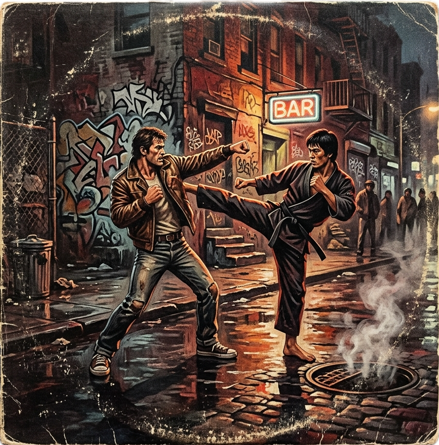

# Saturday Night Street Fight

---

## Table of Contents

1. [Fighter Creation](#fighter-creation)
2. [Attributes & Technique Masteries](#attributes--technique-masteries)
3. [Martial Arts Styles](#martial-arts-styles)
4. [Combat Stances & Counter Dynamics](#combat-stances--counter-dynamics)
5. [Action Stances & Martial Techniques](#action-stances--martial-techniques)
6. [Attribute Damage & Defeat](#attribute-damage--defeat)
7. [Mechanics & Resolution](#mechanics--resolution)
8. [Range & Movement](#range--movement)
9. [Status Conditions](#status-conditions)
10. [Healing & Recovery](#healing--recovery)
11. [Campaign Progression & The Street Crawl](#campaign-progression--the-street-crawl)
12. [Experience & Character Growth (XP Keys)](#experience--character-growth-xp-keys)

---

## Fighter Creation

> *"I fear not the man who has practiced 10,000 kicks once, but I fear the man who has practiced one kick 10,000 times."* — Bruce Lee

To build a fighter, follow these three simple steps:

### 1. Choose a Martial Arts Style
Select **one** Martial Arts Style (Boxing, Muay Thai, Judo, Wrestling, Karate, Kung Fu, or Taekwondo). 
*   This grants you your Style Perks and dictates which techniques you are allowed to perform (see **Martial Arts Styles** below).

### 2. Spend Starting XP
Every fighter starts as a blank slate with a baseline of **2** in all five Attributes (Agility, Power, Reaction, Stamina, and Cool) and **Untrained (Rank 0)** in all techniques.

You have **50 Experience Points (XP)** to customize your fighter. Spend them using the same costs as character progression:

#### A. Allocate Combat Attributes
*   **Attributes**: Agility, Power, Reaction, Stamina, and Cool.
*   **Cost**: Costs **10 XP** to increase an attribute by $+1$ (starting at 2).
*   **Limit**: No attribute can be higher than **3** at character creation.

#### B. Train Technique Masteries
You have **Untrained (Rank 0)** in all techniques by default.
You can train in any techniques allowed by your chosen style:
*   **Trained (Rank 1)** ($+3$ bonus): Costs **3 XP** per technique.
*   **Mastered (Rank 2)** ($+5$ bonus): Costs **6 XP** (requires Rank 1 first, for a total of 9 XP).

---

### Fighter Creation Example
A Boxer starts with Agility 2, Power 2, Reaction 2, Stamina 2, Cool 2. They spend their **50 XP** as follows:
*   **Attributes** (Spent 30 XP):
    *   Increase Reaction to 3 (costs 10 XP).
    *   Increase Power to 3 (costs 10 XP).
    *   Increase Stamina to 3 (costs 10 XP).
    *   *Resulting stats: Agility 2, Power 3, Reaction 3, Stamina 3, Cool 2.*
*   **Techniques** (Spent 18 XP):
    *   Master Hook (costs 3 XP to Train, 6 XP to Master = 9 XP).
    *   Train Jab (costs 3 XP).
    *   Train Dodge (costs 3 XP).
    *   Train Parry (costs 3 XP).
*   **Remaining XP**: 2 XP unspent (saved for campaign play).

---

## Attributes & Technique Masteries

> *"It is not important to be better than someone else, but to be better than you were yesterday."* — Jigoro Kano

A character's capabilities are defined by five core Attributes and their specific training in various martial techniques, called Technique Masteries.

### Combat Attributes
*   **Agility**: Movement speed, footwork, evasive positioning, leg sweeps, and lower-body dexterity.
*   **Power**: Physical structure, strength, balance, heavy slams, takedowns, and leverage.
*   **Reaction**: Perception, reaction speed, precision, head punches/kicks, and counter-strike detection.
*   **Stamina**: Cardiorespiratory endurance, wind, lung recovery, and execution of heavy/exhausting maneuvers.
*   **Cool**: Charisma, street swagger, negotiation, intimidation, and composure under pressure. Used for all non-fighting checks.

### 1. Technique Masteries
Technique Masteries represent specialized training in specific strikes, blocks, or throws. Masteries add a flat bonus to your dice roll whenever you execute that specific technique in combat:
*   **Untrained (Rank 0)**: You receive no bonus (roll $2\text{d}10 + \text{Attribute}$).
*   **Trained (Rank 1)**: You gain a $+3$ bonus to your roll.
*   **Mastered (Rank 2)**: You gain a $+5$ bonus to your roll.

### Attribute Mapping
Each technique is governed by a specific Attribute representing the physical capacity required to execute it:

| Martial Technique | Governing Attribute | Action Stance | Description |
| :--- | :--- | :--- | :--- |
| **Jab** | **Reaction** | Strike | Speed and reaction-based entry. |
| **Cross** | **Reaction** | Strike | Straight rear punch delivered with alignment and timing. |
| **Hook** | **Reaction** | Strike | Flanking angle punch targeting sightline and reaction. |
| **Uppercut** | **Power** | Strike | Explosive vertical power punch delivering upward momentum. |
| **Low Kick** | **Agility** | Strike | Quick leg sweep/strike using lower-body agility. |
| **Body Kick** | **Stamina** | Strike | Heavy torso strike draining target's wind. |
| **High Kick** | **Stamina** | Strike | High-impact flexibility and explosive stamina. |
| **Push Kick (Teep)** | **Agility** | Strike | Spacing thrust, agility, and foot placement. |
| **Taunt** | **Cool** | Strike | Verbal or physical psychological mock. |
| **Ground & Pound** | **Power** | Strike | Heavy top-control striking on a downed opponent. |
| **High Guard** | **Power** | Block | Standing upper-body power structure and stance. |
| **Low Guard** | **Power** | Block | Crouching posture and lower-body stability base. |
| **Parry** | **Reaction** | Block | Hand deflection and reaction timing. |
| **Dodge / Evasion** | **Agility** | Block | Lateral footwork and evasive movement using agility. |
| **Stand Up** | **Agility** | Block | Recovering footwork from Prone stance using agility. |
| **Clinch / Grab** | **Reaction** | Throw | Securing collars or wrists with rapid reflexes. |
| **Trip / Sweep** | **Agility** | Throw | Leg hook and agility footwork sweep. |
| **Hip / Shoulder Throw** | **Power** | Throw | Redirection lift using hips and structural power. |
| **Takedown (Double Leg)** | **Power** | Throw | Explosive double-leg drive and penetration slam. |
| **Submission Hold** | **Power** | Throw | Joint lock or chokehold applied on a Prone/Pinned target. |

---

## Martial Arts Styles

> *"Styles separate men. If you have no style, you just say, 'Here I am as a human being, how can I express myself?'"* — Bruce Lee

Characters can adopt a specific Martial Arts Style, which dictates their available techniques and provides unique mechanical perks:

### 1. Boxing (The Sweet Science)
*   **Focus**: Punches & Head Movement.
*   **Allowed Actions**:
    *   *Strikes*: Jab, Cross, Hook, Uppercut (No Kicks).
    *   *Blocks*: High Guard, Parry, Dodge/Evasion (No Low Guard).
    *   *Throws*: Clinch/Grab only (No Trip, Hip Throw, or Takedown).
*   **Style Perks**:
    *   **Slip & Counter**: Successfully defending with Dodge/Evasion grants **Advantage ($3\text{d}10$)** on your next Strike action in the following round.
    *   **Iron Chin**: High Guard mitigates $+1$ damage against Punches (for a total of 3 damage mitigated, neutralizing Jabs, Crosses, and Hooks).

### 2. Muay Thai (Art of Eight Limbs)
*   **Focus**: Bone-breaking Kicks & Clinch Grappling.
*   **Allowed Actions**:
    *   *Strikes*: Jab, Hook, Clinch Knee, and all Kicks (Low, Body, High, Push).
    *   *Blocks*: High Guard, Parry (No Low Guard or Dodge).
    *   *Throws*: Clinch/Grab only (No Trip, Hip Throw, or Takedown).
*   **Style Perks**:
    *   **Thai Clinch**: Unlocks the exclusive **Clinch Knee** technique (Strike Stance, Reaction-based, High Impact 3 damage to Reaction or Stamina) usable while holding an opponent in a Clinch/Grab.
    *   **Heavy Leg Kicks**: Low Kicks deal 2 Agility damage as normal, but inflict **Hobbled** and also prevent the target from selecting **Dodge/Evasion** on their next Stance Check.

### 3. Judo (The Gentle Way)
*   **Focus**: Redirection & High-Impact Throws.
*   **Allowed Actions**:
    *   *Strikes*: Jab, Ground & Pound (only vs. Prone/Pinned targets).
    *   *Blocks*: High Guard, Parry (No Low Guard or Dodge).
    *   *Throws*: Clinch/Grab, Trip/Sweep, Hip/Shoulder Throw, Submission Hold (only vs. Prone/Pinned targets).
*   **Style Perks**:
    *   **Kuzushi (Off-Balance)**: If you successfully parry a Strike (White vs. Red), you can immediately attempt a Hip/Shoulder Throw or Trip/Sweep as a free reaction check.
    *   **Sweeping Reversal**: Your Trip/Sweep gains Advantage against opponents performing a High Kick.

### 4. Wrestling (Ground Dominance)
*   **Focus**: Clinches & Power Takedowns.
*   **Allowed Actions**:
    *   *Strikes*: Jab, Ground & Pound (only vs. Prone/Pinned targets).
    *   *Blocks*: High Guard, Low Guard (No Parry or Dodge).
    *   *Throws*: Clinch/Grab, Trip/Sweep, Takedown (Double Leg), Submission Hold (only vs. Prone/Pinned targets).
*   **Style Perks**:
    *   **Shooter**: Double Leg Takedowns can be executed directly from **Striking Range** (bypassing the need to Clinch first) and gain a **$+2$ bonus** if the target chose a Strike Stance.
    *   **Ground Control**: Winning a Grapple Struggle (Black vs. Black) automatically knocks the opponent prone and pins them, preventing them from choosing a Strike next turn.

### 5. Karate (The Way of the Empty Hand)
*   **Focus**: Precision Strikes & Iron Discipline.
*   **Allowed Actions**:
    *   *Strikes*: Jab, Cross, Hook, Low Kick, High Kick, Push Kick (Teep).
    *   *Blocks*: High Guard, Parry (No Low Guard or Dodge).
    *   *Throws*: None.
*   **Style Perks**:
    *   **Ikken Hissatsu (One Strike, One Kill)**: When you land a Critical Hit (margin $\ge 5$ or Natural 20), the attack deals an additional $+1$ attribute damage on top of the normal critical bonus (for a total of $+2$ bonus damage on crits).
    *   **Kiai Shout**: Once per fight, after landing a successful Strike, you may let out a devastating Kiai — the defender must pass a **DC 12 Cool check** or suffer **1 Cool damage AND the Staggered condition** (Disadvantage next turn).

### 6. Kung Fu (The Martial Way)
*   **Focus**: Flowing Combos & Trapping Hands.
*   **Allowed Actions**:
    *   *Strikes*: Jab, Cross, Low Kick, High Kick, Push Kick (Teep).
    *   *Blocks*: Parry, Dodge/Evasion (No High Guard or Low Guard).
    *   *Throws*: Trip/Sweep only (No Clinch, Hip Throw, or Takedown).
*   **Style Perks**:
    *   **Chain Strike**: If you successfully landed a Strike last round, your next Strike this round gains a $+2$ bonus (representing flowing combo sequences).
    *   **Flowing Redirect**: When you successfully Parry a Strike, you trap the opponent's limbs—they suffer the **Staggered** condition and your next Strike against them gains **Advantage ($3\text{d}10$)**.

### 7. Taekwondo (The Way of the Foot and Fist)
*   **Focus**: Agile Footwork & High Kicks.
*   **Allowed Actions**:
    *   *Strikes*: Jab, Cross, and all Kicks (Low, Body, High, Push).
    *   *Blocks*: High Guard, Dodge/Evasion (No Low Guard or Parry).
    *   *Throws*: None.
*   **Style Perks**:
    *   **Spinning Kicks**: A High Kick gains a $+2$ bonus if performed immediately following a successful Push Kick (Teep).
    *   **Outside Spacing**: Evasion/Dodge actions gain a $+2$ bonus if you are at Outside Range.

### 8. Martial Arts Cross-Training (Secondary Styles)

Fighters who survive the street crawl often cross-train in other martial arts disciplines to eliminate tactical blind spots (e.g., a Boxer learning Wrestling takedowns, or a Muay Thai kicker learning Judo throws).

*   **XP Adoption Cost**: Spend **15 XP** at any time on the fly to adopt a **Secondary Martial Arts Style**.
*   **Technique Access**: You permanently unlock the technique list of your Secondary Style, allowing you to spend XP to train and master its moves (e.g., a Boxer who cross-trains Wrestling unlocks *Double Leg Takedown* and *Submission Hold*).
*   **Secondary Perk Selection**: Upon adopting a Secondary Style, choose **1 Style Perk** from that style's perk list. You gain that perk's benefit in combat.
*   **Style Capacity**: A fighter can hold a maximum of **1 Secondary Style** (Total 2 Styles: Primary + Secondary). You cannot adopt a 3rd style.

---

## Combat Stances & Counter Dynamics

> *"Be water, my friend. Empty your mind. Be formless, shapeless, like water. You put water into a cup, it becomes the cup."* — Bruce Lee

Fighters adopt one of three tactical combat stances during each exchange: **Strike Stance (Red)**, **Block Stance (White)**, or **Throw Stance (Black)**. Combat dominance follows a natural rock-paper-scissors counter relationship:

*   **Strike Stance** beats **Throw Stance** ($\text{Strike} > \text{Throw}$): Fast offensive strikes interrupt grappling entries and takedowns before leverage can be established.
*   **Block Stance** beats **Strike Stance** ($\text{Block} > \text{Strike}$): High/low defensive guards deflect or absorb incoming punches and kicks.
*   **Throw Stance** beats **Block Stance** ($\text{Throw} > \text{Block}$): A passive defensive guard leaves a fighter vulnerable to sweeps, clinches, and projections.

---

## Action Stances & Martial Techniques

> *"Everyone has a plan until they get punched in the mouth."* — Mike Tyson

When adopting a combat stance, you must also select one of its martial techniques. Each technique offers tactical trade-offs in speed, power, and secondary effects.

### 1. Strikes
Strikes aim to inflict damage and interrupt throws.

#### A. Punches
*   **Jab**: Fastest punch. High accuracy, low damage. Interrupts slower actions.
*   **Cross**: Straight power punch. Moderate speed, high damage. Standard damage-dealer.
*   **Hook**: Looping power punch. Slower speed, high damage. Targets the body; successful hits deal **Stamina** or **Power** damage (rib and liver shots), gaining a damage bonus if the opponent also chose a Strike.
*   **Uppercut**: Vertical power punch. Slow speed, massive damage. Targets alignment; successful hits deal **Power** damage (chin lift). Bypasses low guards/crouching stances, but highly vulnerable to fast punches.

#### B. Kicks
*   **Low Kick**: Fast leg strike. Targets stability; successful hits inflict **Agility** attribute damage and apply the **Hobbled** status condition.
*   **Body Kick**: Mid-height power kick. Focuses on windedness; successful hits inflict **Stamina** attribute damage and apply the **Winded** status condition.
*   **High Kick**: High-impact head kick. Very slow speed, massive damage. High chance to stun or knock out the opponent, but easily parried or caught.
*   **Push Kick (Teep)**: Straight thrusting kick. Fast speed, low damage. Pushes the opponent back, resetting combat to neutral range and canceling throw/clinch attempts.

#### C. Special Strikes
*   **Taunt**: A verbal or physical psychological mock. Takes the place of a **Strike Stance (Red)** action. Governed by the **Cool** attribute. Deals no physical damage, but a successful check inflicts **1 Cool damage** on the target.
*   **Ground & Pound**: Striking a downed opponent on the canvas. Governed by **Power** or **Reaction**. Deals **Power** or **Stamina** damage. Can only be selected against **Prone** or **Pinned** targets. *(Allowed for Wrestling and Judo).*

---

### 2. Blocks
Blocks aim to mitigate damage from incoming strikes.

*   **High Guard**: Standard standing block protecting the head and torso. Negates most punch damage and high/mid kicks. Vulnerable to low kicks and easily bypassed by Throws.
*   **Low Guard**: Crouching or dropped block protecting the legs. Negates low kicks and leg attacks. Vulnerable to high strikes and easily bypassed by Throws.
*   **Parry**: High-skill deflection. Low passive defense, but if successful against a Strike, it staggers the opponent and allows a guaranteed fast counter-strike (e.g., a Jab) on the next action.
*   **Dodge / Evasion**: Dynamic movement to completely avoid attacks. Completely avoids any Strike regardless of height. Succeeding grants a movement or positioning advantage.
*   **Stand Up**: Special defensive maneuver used only while **Prone**. Attempting to stand up and reset to a neutral standing stance.

---

### 3. Throws
Throws aim to bypass blocks, control the opponent, and force them to the ground.

*   **Clinch / Grab**: Simple entry grapple to hold the opponent. Deals no initial damage, but prevents the opponent from backing away and sets up advanced grappling.
*   **Trip / Sweep**: Quick attack on the opponent's base/balance. Fast speed, low damage. Knocks opponent prone. Especially effective against High Guards.
*   **Hip / Shoulder Throw**: High-impact projection throw. Moderate speed, high damage. Knocks the opponent prone and stuns them for a turn.
*   **Takedown (Double Leg)**: Power drive to force the opponent down. Bypasses High Guards entirely, but highly vulnerable to fast Strikes like Uppercuts or Jabs.
*   **Submission Hold**: Joint lock or chokehold applied on the mat. Governed by **Power**. Deals High Impact (3 damage) to **Stamina** (choke/joint pressure). Can only be selected against **Prone** or **Pinned** targets. *(Allowed for Wrestling and Judo).*

---

## Attribute Damage & Defeat

> *"A champion is someone who gets up when they can't."* — Jack Dempsey

Instead of tracking numerical hitpoints, combatants suffer direct damage to their core **Attributes** (Agility, Power, Reaction, and Stamina). This damage degrades their rolls in real-time, representing fatigue and cumulative physical trauma.

### 1. The Defeat Condition & Instant Death
A combatant is defeated (knocked out, submits, or suffers a referee stoppage) immediately when **any single physical attribute is reduced to 0 (or below)**:
*   **Reaction reaches 0**: Knocked Out (concussion KO, loss of consciousness).
*   **Power reaches 0**: Structural TKO (broken ribs, physical collapse, or submission).
*   **Agility reaches 0**: Mobility TKO (broken leg, blown knee, unable to stand).
*   **Stamina reaches 0**: Exhaustion TKO (complete cardiorespiratory failure/collapse).

> [!CAUTION]
> **Catastrophic Systemic Trauma (Instant Street Death)**: If a combatant suffers relentless punishment such that **ALL FOUR physical attributes (Reaction, Power, Agility, AND Stamina) are reduced to 0 simultaneously**, their body suffers total systemic collapse (massive brainstem trauma, internal hemorrhage, and cardiac failure). The fighter dies **instantly on the spot**. No hospital check, short rest, or triage can save them—their story ends on the asphalt (**Character Death**).

### 2. Inflicting Attribute Damage
When an attack connects, it deals direct damage to a specific attribute based on the strike's target and impact level.

> [!NOTE]
> The **governing attribute** (listed in the Attribute Mapping table) is the attribute the *attacker* rolls to execute the action. The **attribute damage** type (listed below) is the attribute the *defender* loses on a successful hit.

*   **Reaction Damage** (Head & Face strikes): Jab, Cross, High Kick.
*   **Power Damage** (Core/Structure strikes & slams): Uppercut, Hip/Shoulder Throw, Ground & Pound (can also target Stamina).
*   **Agility Damage** (Leg strikes & sweeps): Low Kick, Trip/Sweep, Takedown.
*   **Stamina Damage** (Wind/lung blows & chokes): Hook (can also target Power), Body Kick, Push Kick (Teep), Ground & Pound (can also target Power), Submission Hold.

#### Base Damage by Impact Level:
*   **Low Impact (1 damage)**: Jab.
*   **Medium Impact (2 damage)**: Cross, Hook, Low Kick, Push Kick (Teep), Trip/Sweep, Ground & Pound.
*   **High Impact (3 damage)**: Uppercut, Body Kick, High Kick, Hip/Shoulder Throw, Takedown (Double Leg), Submission Hold.
*   *Note: Successful Throws also knock the target **Prone**.*

#### Success Modifier
*   **Critical Success**: If the attacker wins the clash with a margin of 5 or more (Winner Total - Loser Total $\ge 5$), the attribute damage is increased by $+1$.
*   **The Overkill Rule (Natural 20)**: If a combatant rolls a **Natural 20** (double 10s on their dice roll), their action automatically becomes an **Overkill Critical Hit** ($+1$ attribute damage and secondary critical effects) regardless of scores. In addition, the adrenaline spike grants a **Momentum Surge**: the attacker instantly restores **$+1$ Stamina or Cool** (up to their starting maximum).

### 3. Mitigation (Blocking & Dodging)
If a defender successfully blocks or dodges, they subtract their defense rating from the incoming attack's base damage:
*   **High/Low Guard**: Mitigates 2 damage.
*   **Dodge / Evasion**: Mitigates 3 damage.
*   **Parry**: If the parry check succeeds, it mitigates 100% of incoming damage and staggers the attacker.

*Example: A combatant is hit by a High Kick (Base 3 Reaction damage) while using a High Guard (Mitigates 2). The defender takes 1 Reaction damage (3 - 2 = 1), reducing their Reaction attribute by 1.*

### 4. Mob Punk Rules (Tier 1 Gangs)

> [!NOTE]
> **Game Master Rules**: Group combat against minor Tier 1 Punks (lookouts, pickpockets, and street-corner lackeys) uses **Mob Rules** (Shared Mob Pools, 1-Hit TKOs, and Mob Group Bonuses) managed by the Game Master. See **[Game Master's Guide: Group Combat Rules](gm.md#1-mob-punk-rules-exclusive-to-tier-1-gangs)** for full specifications.

---

## Mechanics & Resolution

> *"There is timing in everything. Timing in strategy cannot be mastered without much practice."* — Miyamoto Musashi

### Contested Round Structure
Combat is played in simultaneous **Rounds** resolved by a single **Contested Roll**:

1. **Phase 1: Reading the Stance (Telegraphing)**
   * Before committing action cards, combatants can attempt to read each other's body language and telegraph cues.
   * **The Roll**: Both roll a contested check ($2\text{d}10 + \text{Reaction}$ or $\text{Cool}$). The reader rolls **Reaction** (spotting muscle movement) or **Cool** (reading intention). The defender rolls **Cool** (feints/poker face) or **Reaction** (masking entries).
   * **Margin Thresholds** ($\text{Margin} = \text{Winner Total} - \text{Loser Total}$):
     * **Margin 0–3 (Unclear / Feinted)**: Body language is unreadable or successfully feinted. Both combatants commit their action cards **secretly and simultaneously** in Phase 2.
     * **Margin 4–6 (Partial Tell)**: The reader spots a subtle tell! The reader learns **1 stance color the defender is NOT taking** (e.g., *"He's NOT Blocking"*), narrowing the defender's stance down to 2 choices before the reader commits their card.
     * **Margin 7+ or Natural 20 (Perfect Read)**: The reader gets a flawless read! The defender must commit and reveal their exact action card color (Red for **Strike**, White for **Block**, Black for **Throw**) before the reader commits their card.

2. **Phase 2: Commit & Reveal (Declaration)**
   * Combatants choose their action type (Red, White, or Black) along with their specific technique (e.g., *Red / Hook*) using cards, tokens, or written notes. If a fighter achieved a **Perfect Read (Margin 7+)** in Phase 1, the defender must reveal their card color first. If a fighter achieved a **Partial Tell (Margin 4–6)**, the defender reveals 1 color they are NOT playing first. Otherwise, both commit secretly and reveal simultaneously.
   * Both combatants reveal their choices simultaneously.

3. **Phase 3: Roll & Resolve (Contested Roll-Off)**
   * Now that the action matchup is revealed, combatants roll their dice:
     * **Dominant Stance (Counter Winner)**: Rolls with **Advantage** (roll $3\text{d}10$, keep the two highest dice).
     * **Exposed Stance (Counter Loser)**: Rolls their standard $2\text{d}10$ check.
     * **Matched Stances** (e.g., Strike vs. Strike): Both roll their standard $2\text{d}10$ check normally.
   * Each combatant calculates their **Roll Total**:
     $$\text{Roll Total} = \text{Dice Result} + \text{Governing Attribute} + \text{Technique Mastery Bonus}$$
   * In a counter matchup or grapple struggle, the combatant with the **higher Roll Total wins the check**, executing their action while interrupting the opponent's. In a **Strike vs. Strike** matchup, both fighters trade blows—the fighter with the **higher Roll Total applies their damage first**. If the lower roller is knocked out (any attribute reduced to 0), their strike is interrupted and fails. If the lower roller survives, their strike connects and deals full damage back.
   * *Note: The dominant stance is statistically favored to win the contest, but a high-rolling exposed stance can still overcome the disadvantage and win the round.*

---

1. **Stance Counter Resolution**

*   **Opposing Stances (Counter Check)**: If the revealed stances form a counter pair (e.g., Block Stance vs. Strike Stance):
    *   The **Dominant Stance** (counter winner) rolls with **Advantage**.
    *   The **Exposed Stance** (counter loser) rolls normally.
    *   **Winner-Take-All**: Only the winner of the contested roll executes their action; the loser's action is completely interrupted and fails (dealing no damage or secondary effects).
    *   *Example 1 (Block Stance vs. Strike Stance)*: Block beats Strike. The Blocker rolls with Advantage.
        *   If the **Blocker wins**, the block succeeds and subtracts its mitigation rating from the strike's Attribute Damage (e.g., High Guard mitigates 2 damage, completely absorbing a 2-damage Cross, but letting 1 chip damage through from a 3-damage Uppercut).
        *   If the **Striker wins** (overcoming the guard's advantage), the strike bypasses the guard entirely, dealing full, unmitigated Attribute Damage.
    *   *Example 2 (Strike Stance vs. Throw Stance)*: Strike beats Throw. The Striker rolls with Advantage.
        *   If the **Striker wins**, the strike connects, dealing Attribute Damage and interrupting the throw.
        *   If the **Grappler wins** (overcoming the striker's advantage), the grappler successfully clinches or throws the opponent; the strike is completely interrupted and deals 0 damage.
*   **Matched Stances (Same Stance Rolls)**:
    *   **Strike vs. Strike**: Sequential Trade! Both roll normally ($2\text{d}10$). The fighter with the higher Roll Total lands their strike **first**. If the lower roller is knocked out (any attribute drops to 0), they collapse and their strike is interrupted. If the lower roller survives, their strike lands and deals full damage back. Outrolling the opponent by a margin of 5 or more (or rolling a Natural 20) upgrades your strike to a **Critical Hit** ($+1$ damage).
    *   **Block vs. Block**: No contest is needed. Both combatants remain passive in guard. Standoff; the round resets to neutral.
    *   **Throw vs. Throw**: A grapple struggle. Both roll off normally using either **Power** or **Reaction**. The higher total wins the check, securing a Clinch or a throw.

### 2. The 3 Action Check Types
To make combat timing and perk follow-ups crystal clear, all checks in **Saturday Night Street Fight** are categorized into 3 distinct Action Check types:

*   **Stance Check (Primary Action Roll)**: The primary contested roll of Phase 3 in a combat round, committed simultaneously using Action Cards (**Strike Stance**, **Block Stance**, **Throw Stance**). Temporary status penalties like **Staggered**, **Hobbled**, and **Winded** specifically apply their penalty/Disadvantage to your **very next Stance Check**.
*   **Perk Reaction Check (Immediate Special Follow-up)**: A free, immediate bonus check triggered by a style perk upon landing a strike or executing a parry (e.g., *Judo Kuzushi Sweeping Reversal*, *Karate Kiai Shout*). Perk Reaction Checks resolve instantly within the same round, do not consume your stance card, and do not clear Stance Check conditions.
*   **Environmental Check (Hazard / Reaction Roll)**: A roll triggered by street hazards, subway trains, or ambient conditions ($2\text{d}10 + \text{Agility}$ or $\text{Cool}$).

### 3. Die Roll Architecture (Strictly d10 System)
All mechanics and random tables in **Saturday Night Street Fight** strictly use ten-sided dice (d10):

*   **Standard Checks (2d10)**: Roll **$2\text{d}10 + \text{Attribute} + \text{Technique Mastery} + \text{Modifiers}$** vs Target DC or Opponent's Roll Total. Used for all combat actions, attribute checks, and out-of-combat challenges.
*   **Advantage Checks (3d10 Keep 2 Highest)**: Rolled when in a **Dominant Stance**, executing a stealth ambush, holding high ground, or exploiting a target's vulnerability. Roll $3\text{d}10$ and sum the two highest dice.
*   **Disadvantage Checks (3d10 Keep 2 Lowest)**: Rolled when in an **Exposed Stance**, fighting in blind spots/steam vents, being flanked, or defending while Prone/Pinned. Roll $3\text{d}10$ and sum the two lowest dice.
*   **Natural 20 (Double 10s)**: Rolling double 10s on action dice is a **Natural 20 (Overkill)**. Guarantees an automatic Critical Hit ($+1$ damage and critical status) + **Momentum Surge** ($+1$ Stamina or Cool recovery).
*   **Reaction Rolls (2d10 + Cool)**: Rolled when encountering new street gangs or NPCs to determine initial disposition ($2\text{d}10 + \text{Cool}$).
*   **Table & Generator Rolls (1d10)**: All procedural tables (environmental starting ranges, subway events, street names, landmarks, environmental hazards, block danger rank encounters, and 1970s soundtracks) roll a single **$1\text{d}10$**.

### 3. Action Roll Resolution & Modifiers
To resolve a contested roll, combatants calculate their totals using the following:
*   **Action Roll**: Roll the chosen $2\text{d}10$ (or $3\text{d}10$ if rolling with Advantage or Disadvantage).
*   **Attribute Modifier**: Add the governing Attribute (**Agility**, **Power**, **Reaction**, or **Stamina**).
*   **Mastery Modifier**: Add the Technique Mastery bonus (**$+3$** if Trained, **$+5$** if Mastered).
*   **The Modifier Cap**: The sum of all flat modifiers (Attribute + Mastery + style/situational bonuses) applied to any check can **never exceed $+10$**.
*   **Temporary Status Penalties**: Temporary combat conditions (e.g., **Hobbled** or **Winded**) degrade your attribute modifiers for rolls next round, but **can never reduce an attribute below 1 for checks, and never trigger defeat/TKO**.
*   **Compare Totals**:
    *   **Success**: Have the higher Roll Total.
    *   **Critical Success**: Succeeding by a margin of 5 or more (Winner Total - Loser Total $\ge 5$) activates secondary weapon/style/critical effects, and increases incoming damage by $+1$ attribute damage.
    *   **The Overkill Rule (Natural 20)**: Rolling double 10s on your action dice is a **Natural 20 (Overkill)**. It guarantees an automatic Critical Hit ($+1$ damage and critical secondary effects) regardless of scores, and grants a **Momentum Surge** (instantly restoring $+1$ Stamina or Cool to the attacker).

### 4. Ties and Clashes (Identical Roll Totals)
If both combatants calculate the exact same Roll Total, the round is resolved as follows based on the action matchup:
*   **Strike vs. Strike Clash (Red vs. Red)**: Simultaneous connection! Both strikes hit and deal full, unmitigated Attribute Damage to both fighters.
*   **Strike vs. Block Clash (Red vs. White)**: The defense holds. The block successfully mitigates the strike's damage, but the Blocker is **Staggered** next turn from the impact.
*   **Throw vs. Throw Clash (Black vs. Black)**: A wrestling stalemate. Both fighters struggle for leverage and reset to a neutral standing stance.
*   **All Other Matches**: A neutral standoff. The round resets.

---

## Range & Movement

> *"Float like a butterfly, sting like a bee."* — Muhammad Ali

Combat takes place across three fluid **Ranges**. Combatants control the distance by using their actions to advance, retreat, or push their opponent back.

### 1. The Three Combat Ranges

*   **Outside Range (Long Range)**: Spaced out, circling outside reach.
    *   *Allowed Actions*: Only long Strikes (Low Kick, Body Kick, High Kick, Push Kick). Punches and Throws are out of range.
    *   *Mobility Perk*: **Dodge / Evasion** (Agility-based) is highly effective at this range.
*   **Striking Range (Medium Range)**: The pocket, exchange range.
    *   *Allowed Actions*: All Strikes (Punches & Kicks) and Guards. Throws are out of range.
*   **Grapple Range (Close Range)**: Tied up, body-to-body grappling.
    *   *Allowed Actions*: All Throws (Clinch/Grab, Trip, Hip Throw, Takedown) and close strikes (Uppercut, Thai Clinch knees). Long kicks and standard punches cannot be used.

### 2. Starting Encounter Range
The initial distance when combat begins depends on the environment and encounter context:

*   **Standard Face-Off (Striking Range)**: Most standard street brawls, alley square-ups, and bar confrontations default to **Striking Range**. Both fighters start within reach of punches, kicks, and guards.
*   **Open Ground / Long Sightlines (Outside Range)**: Wide open parking lots, street blocks, or spotting an enemy across a subway station platform starts at **Outside Range**, favoring long-range kickers.
*   **Ambush / Close Quarters (Grapple Range)**: Fights inside crowded subway cars, elevators, narrow hallways, or ambushes from behind start at **Grapple Range**, giving grapplers immediate entry leverage.

### 3. Controlling the Distance
Fighters change range by winning clashes with specific techniques:

#### A. Advancing (Closing the Distance)
To move closer, perform a **Throw Stance (Black)** action:
*   **Clinch / Grab** or **Takedown**: Winning the check moves you forward one range step (e.g., Striking Range $\rightarrow$ Grapple Range).
*   *Critical Success*: Advancing with a Critical Success allows you to move two range steps (e.g., Outside Range $\rightarrow$ Grapple Range).

#### B. Retreating (Creating Distance)
To step back safely, perform an evasive **Block Stance (White)** action:
*   **Dodge / Evasion**: Winning the check allows you to retreat one range step (e.g., Grapple Range $\rightarrow$ Striking Range).
*   *Note: If the check fails, the attacker keeps you trapped at the closer range.*

#### C. Forcing Distance (Pushing Back)
To actively push an opponent away, perform a specialized **Strike Stance (Red)** action:
*   **Push Kick (Teep)**: A successful hit pushes the opponent back one range step (e.g., Grapple Range $\rightarrow$ Striking Range).

---

## Status Conditions

Street fights are chaotic and brutal. Combatants can inflict or suffer various temporary physical states:

### 1. Prone (Lying on the Ground)
Fighters are knocked **Prone** when hit by a throwing action (Trip/Sweep, Hip/Shoulder Throw, Takedown) or when knocked down. While Prone:
*   **Duration**: Lasts until you successfully execute a **Stand Up** check (win or tie).
*   **Action Limitation**: You cannot choose **Strike Stance (Red)** actions or Dodge/Evasion.
*   **Ground Disadvantage**: You roll with **Disadvantage** (roll $3\text{d}10$, keep the two lowest dice) on defensive checks while lying on the ground (Guards, Parries, or Ground Throws).
*   **Getting Up (Neutral Roll)**: To stand back up, you declare the **Stand Up** technique (resolved as a **Block / White** action, governed by **Agility**). Unlike ground defense, the **Stand Up check is a standard $2\text{d}10$ check** (it does NOT suffer Disadvantage). If you win or tie the contested check, you stand back up and remove the Prone condition! If you lose the contest, you remain Prone.

### 2. Pinned (Trapped on the Canvas)
Fighters are **Pinned** when an opponent wins a Grapple Struggle (Black vs. Black) on the ground (e.g., via Wrestling's *Ground Control* perk). While Pinned:
*   **Duration**: Lasts until you successfully execute an **Escape** check (win = Clean Break, tie = Partial Break).
*   **Action Limitation**: You cannot select **Strike Stance (Red)** or **Dodge/Evasion**.
*   **Ground Disadvantage**: You roll with **Disadvantage** (roll $3\text{d}10$, keep the two lowest dice) on defensive checks while remaining pinned on the ground (Guards or Parries).
*   **Dual Escape Paths (Neutral Roll)**: To escape a Pin, you choose either:
    *   **Power Escape (Bridge & Roll)**: Declare **Clinch/Grab** (Throw / Black, governed by **Power**).
    *   **Agility Escape (Hip Scramble / Guard Recovery)**: Declare **High Guard / Low Guard** (Block / White, governed by **Agility**).
    *   Unlike ground defense, an **Escape check is a standard $2\text{d}10$ check** (it does NOT suffer Disadvantage).
*   **Escape Resolution**:
    *   **Win**: **Clean Break!** Removes **both Pinned and Prone** (you stand right back up to your feet!).
    *   **Tie**: **Partial Break!** Removes **Pinned** (reducing your position to Prone).
    *   **Loss**: The Pin is maintained.

### 3. Staggered (Off-Balance)
Fighters are **Staggered** temporarily when their attack is successfully parried, or due to specific style effects.
*   **Duration**: Lasts for 1 Stance Check (until the end of your next Stance Check).
*   **Effect**: You roll with **Disadvantage** (roll $3\text{d}10$, keep the two lowest dice) on your next Stance Check.

### 4. Stunned (Dazed)
Fighters are **Stunned** when hit by a high-impact head blow (like a Critical High Kick) or projected hard (like a Judo Hip Throw).
*   **Duration**: Lasts for 1 round.
*   **Action Limitation**: You are dazed and cannot choose **Strike Stance (Red)** or **Throw Stance (Black)** actions. You can only choose **High Guard** or **Low Guard** (Block / White) to cover up.
*   **Instinctive Guard (Neutral Roll)**: Covering up with High Guard or Low Guard is a **standard $2\text{d}10$ check** (it does NOT suffer Disadvantage). This allows your guard to function and mitigate 2 damage if hit.

### 5. Shaken (Cool 0)
Fighters are **Shaken** when their Cool attribute is reduced to 0. Cool damage is taken by losing a contested **Cool** check (e.g. from street encounters/gambling) or by being hit by a **Taunt** combat action.
*   **Duration**: Lasts until Cool is restored to 1 or higher at a **Social Sanctuary** (Dive Bar, Diner, Safe House).
*   **Effect**: You roll with **Disadvantage** (roll $3\text{d}10$, keep the two lowest dice) on all **Reaction Stance Checks** in combat (due to hesitation/panic) and on all non-combat checks.
*   **Perk Suspension**: You cannot use style perks that require calm or precision (such as Boxer's *Slip & Counter* or Judo's *Kuzushi*).

### 6. Hobbled (Leg Damage)
Fighters are **Hobbled** when hit by a successful low leg attack (like a **Low Kick**).
*   **Duration**: Lasts for 1 Stance Check (until the end of your next Stance Check).
*   **Effect**: You roll with **Disadvantage** (roll $3\text{d}10$, keep the two lowest dice) on all **Agility-based Stance Checks** (*Dodge, Low Kick, Push Kick, Trip, Stand Up*).

### 7. Winded (Body Blow)
Fighters are **Winded** when hit by a successful body blow (like a **Body Kick** or **Hook** body shot).
*   **Duration**: Lasts for 1 Stance Check (until the end of your next Stance Check).
*   **Effect**: You roll with **Disadvantage** (roll $3\text{d}10$, keep the two lowest dice) on all **Stamina and Power-based Stance Checks** (*High Kick, Body Kick, Throws, Takedowns, Clinches*).

---

## Healing & Recovery

> *"Fall down seven times, stand up eight."* — Japanese Proverb

### 1. Attribute Restoration & Resting Rules
Fighters recover their damaged attributes through short breathers and medical treatment:

*   **10-Minute Short Rest (Catch Your Breath)**: Between street encounters, fighters can spend **10 minutes** resting in a relatively safe location (a quiet alleyway, subway platform, or transit bench) to catch their wind and patch minor physical wounds.
    *   **Physical Attributes Only (Reaction, Power, Agility, Stamina at 1+)**: Fully restores physical attributes back to their maximum scores.
    *   **Cool Exclusion**: Short rests in dangerous territory **do NOT restore Cool**. Psychological stress and street shock cannot be shaken off in a cold alleyway.
    *   **TKO Restriction**: A 10-minute short rest **cannot** heal any physical attribute that was reduced to **0** (see Severe Damage & Hospitalization below).
*   **Social Sanctuary & Unwinding (Cool Restoration)**: Restoring **Cool** back to its maximum score requires visiting a social sanctuary—such as a **Dive Bar**, **Greasy Spoon Diner**, **Transit Safe House**, or returning to **Home Turf**—to unwind, drink, listen to music, and regain street composure.
*   **Severe Damage & Hospitalization (Attributes at 0)**: If any physical attribute (Reaction, Power, Agility, Stamina) is reduced to **0**, the fighter suffers a physical TKO (concussion, broken bone, ligament tear). **They are physically incapacitated and cannot heal via short rests.**
    *   **Catastrophic Trauma (Instant Street Death)**: If **all four physical attributes** (Reaction, Power, Agility, and Stamina) are reduced to 0 simultaneously, the fighter suffers total systemic collapse and dies **instantly on the spot**. No hospital admittance check or triage can save them.
    *   **Admittance Check**: To begin recovery for non-fatal TKOs (1-3 attributes at 0), the fighter must reach a **Hospital or Free Clinic** landmark (on a street block or subway station) and pass a **Cool Check (DC 12)** to get admitted (representing overcrowded 1970s urban emergency rooms). An uninjured companion can roll this check on the patient's behalf.
    *   **The 24-Hour Emergency Ticking Clock (Street Death)**: An incapacitated fighter (0 attribute) has **24 Hours (a maximum of 3 Admittance Checks)** to reach emergency medical care. If 24 hours elapse without admittance (or if 3 checks fail without winning a **Contested Cool Check** to pull street strings and bypass triage lines), untreated internal trauma, concussions, or exposure result in **Street Death (Character Death)**!
    *   **Recovery Rate**: Once admitted, hospital treatment requires **1 week of complete bed rest per zeroed attribute** (e.g., 1 zeroed attribute = 1 week; 2 zeroed attributes = 2 weeks).
    *   **Discharge Check (Permanent Maximum Cap Reduction)**: At the end of hospital recovery, the fighter must pass a **Power Check (DC 12)** to test their body's long-term healing resilience.
        *   **Success**: All attributes are fully restored to their maximum scores.
        *   **Failure (Permanent Scarring)**: The **Attribute Maximum Cap** for that specific attribute permanently drops by **$-1$** (e.g., Max Agility Cap drops from $4 \rightarrow 3$).
        *   **Capped-Down Current Score**: If the fighter's current attribute score was above the new lower Maximum Cap, their current attribute score is **immediately capped down** to match the new Maximum Cap (e.g., if current score was restored to 3, but the cap dropped to 2, their current score becomes 2).
        *   **Career-Ending Retirement (Cap 1)**: If any attribute's Maximum Cap is ever reduced to **1**, the brawler suffers a career-ending permanent injury (since a single point of damage would reduce them to 0 TKO) and must retire from street fighting (**Forced Retirement**).

### 2. Permanent Scarring Table
If a fighter fails their recovery check, their **Attribute Maximum Cap** permanently drops by $-1$ and their current score is capped down to match. Use the table below for narrative description and roleplay prompts:

| Attribute | Scarring Effect | Mechanical Impact | Narrative & Roleplay Examples |
| :--- | :--- | :--- | :--- |
| **Reaction** | **Orbital Trauma / Brain Fog** | **Max Reaction Cap $-1$** | Slow reaction speed, orbital scar tissue, lingering brain fog, or delayed parry response. |
| **Power** | **Structural Instability** | **Max Power Cap $-1$** | Chronic back alignment issues, shoulder joint laxity, or a collarbone that braced poorly. |
| **Agility** | **Blown Ligaments** | **Max Agility Cap $-1$** | Blown knee ligaments (ACL/MCL), stiff ankles, or sluggish lateral agility. |
| **Stamina** | **Cardiorespiratory Damage** | **Max Stamina Cap $-1$** | Chronic shortness of breath, cracked ribs that healed misaligned, or reduced lung capacity. |

---

## Campaign Progression & The Street Crawl

A single campaign session of **Saturday Night Street Fight** is structured as a **Street Crawl**—a self-contained procedural run through the blighted city streets and subways.

### 1. The Street Crawl Session Loop
Every game session follows a structured four-phase loop representing one night on the streets:

1.  **Phase 1: The Briefing (Select Target)**: Players start in their **Home Turf** (or a previously secured safe house) and choose a destination block or station.
2.  **Phase 2: Riding the Rails (Transit Crawl)**: Players traverse the subway line. The GM generates the line length and stop types, rolling on the *Subway Station Event Table* for each platform.
3.  **Phase 3: Navigating the Blocks (Street Crawl)**: When exiting a station, the GM generates the block's layout, landmarks, and hazards, setting its **Danger Rank**. Players resolve any street encounters using the procedural rules in the [Game Master's Guide](gm.md#encounter-building--starting-range-matrix).
4.  **Phase 4: Session End & Recovery**: A session ends when the fighters complete their street run, reach a Transit Safe House, return home, or get admitted to a Hospital. Players can spend earned Experience Points (XP) **instantly on the fly at any time** or bank it in their pool for future breakthroughs.

---

## Experience & Character Growth (XP Keys)

Fighters grow stronger not just by surviving brawls, but by acting out their personal street code, brawler motivations, and martial arts philosophy. 

Rather than flat combat XP, **Saturday Night Street Fight** uses **XP Keys**. Keys drive character advancement and award Experience Points (XP) during play whenever your fighter fulfills their motivations or overcomes personal obstacles.

### 1. Character Rank & Available XP
*   **Available XP (Bank)**: The unspent XP sitting in your pool ready to spend on technique masteries, attribute conditioning, or cross-training.
    *   **Instant On-The-Fly Spending**: Available XP can be spent **INSTANTLY AT ANY TIME**—in the middle of a duel, between rounds, during street exploration, or while resting on Home Turf.
        *   **Attribute Conditioning Boost (10 XP)**: Instantly increases both your **current attribute score** and **maximum attribute score** by $+1$ (providing an immediate 1-point heal that can save a fighter from TKO!).
        *   **Technique Training (3 XP / 6 XP)**: Instantly unlocks or upgrades a move mastery, applying its $+3$ (Trained) or $+5$ (Mastered) bonus to your very next exchange.
        *   **Instant Cross-Training (15 XP)**: Instantly unlocks a Secondary Style and 1 Secondary Perk mid-fight or mid-crawl.
    *   *At Character Creation*: Starting 50 XP budget (e.g., 48–50 XP spent; any unspent XP remains banked in your Available XP pool).
*   **Character Rank (= Total Spent XP)**: Your fighter's overall power level, street reputation, and total XP investment.
    *   *At Character Creation*: Rank equals starting 50 XP budget (e.g., **Rank 50**).
    *   *In Play*: Whenever you spend XP on training or conditioning attributes, your **Character Rank increases by the exact amount spent!** *(e.g., Spending 3 XP to train a move increases your Rank from 50 to 53).*

### 2. Character Rank Achievements & Milestones

As fighters invest XP and train their discipline, their rising **Character Rank** unlocks key campaign milestones, martial titles, and legendary perks:

| Rank Tier | Required Spent XP | Mastery Requirement | Title & Unlocks |
| :--- | :--- | :--- | :--- |
| **Street Brawler** | **Rank 50** | Baseline creation moves | Starting character (2 active Key slots). |
| **Street Veteran** | **Rank 60** | Spent ~10 XP in play | **3rd Active Key Slot Unlocked** (Maximum 3 active Keys). |
| **Style Master** | **Rank 150** | Mastered (Rank 2) all techniques in Primary Style | **Master Title** + Select 1 **Mastery Perk** (*Dojo Founder* or *Perfect Form*). |
| **Grandmaster** | **Rank 200+** | Mastered (Rank 2) all techniques in Primary & Secondary Styles | **Grandmaster Title** + **Dual Discipline Mastery** (All 4 style perks active!). |

#### A. Master Rank (Rank 150)
Upon reaching **Rank 150** and mastering every technique in your Primary Style, you earn the title **Master of [Style Name]** *(e.g., "Master of Boxing", "Master of Judo")* and choose **1 Mastery Perk**:
*   **Dojo Founder**: You establish your own martial arts dojo on Home Turf (acting as a **Danger Rank 1 Safe Zone**). You gain a loyal crew of **$1\text{d}10$ Dojo Disciples (Tier 1 Mob)** who guard your dojo and can accompany your crew on street crawl runs (using GM Mob Rules). If any disciples fall in battle, new students enroll at your dojo when resting, restoring your disciple Mob count back to $1\text{d}10$.
*   **Perfect Form**: Your execution of primary style moves becomes flawless. When performing a Mastered technique from your Primary Style, your clash die roll cannot be lower than 5 (any $1\text{d}10$ die result of 1–4 counts as 5).

#### B. Grandmaster Rank (Rank 200+)
Upon reaching **Rank 200+** and mastering every technique across both your Primary and Secondary Styles, you achieve the ultimate street title of **Grandmaster / Street Legend**:
*   **Dual Discipline Mastery**: You permanently unlock the **2nd Style Perk** of your Secondary Martial Arts Style! You now gain the active benefits of **all 4 Style Perks** (2 from your Primary Style + 2 from your Secondary Style).

### 3. How Keys & Unlocks Work
*   **Starting Keys**: At character creation (**Rank 50**), select **2 Keys** from the list below.
*   **Unlocking 3rd Key Slot**: When your fighter's **Character Rank reaches 60** (after spending ~10 XP in campaign play), you permanently unlock your **3rd active Key slot** (Maximum 3 active Keys).
*   **Key Counter / Buyoff**: Every Key has a **Buyoff / Counter**—a pivotal moment where your character goes against their code, forgives an enemy, or evolves. When you trigger a Key's Counter in play, you choose one of two options:
    *   **Option A**: Gain 0 XP for the encounter (you act against your code, forfeiting XP gains from that Key).
    *   **Option B (Buyoff)**: Gain a **+3 XP lump sum** (enough to immediately train 1 new Rank 1 technique!) and permanently remove the Key, opening a slot to select a new Key!

---

### 3. The Martial Arts XP Keys List

#### A. Key of Dojo Pride (Style Honor)
*Your character lives to prove that their martial arts style (Boxing, Judo, Karate, Kung Fu, Muay Thai, Wrestling, Taekwondo) is superior to all others.*
*   **1 XP**: Defeat an opponent who practices a different martial arts style in a 1v1 duel.
*   **2 XP**: Defeat a rival Tier 3 Boss who publicly mocks or discredits your style.
*   **Buyoff / Counter**: Publicly admit that another style is superior to yours or abandon your primary style. *(Gain +3 XP, remove Key).*

#### B. Key of Turf Loyalty (Neighborhood Defender)
*Your character is fiercely protective of your home turf, neighborhood, and local crew.*
*   **1 XP**: Defend your home block or transit safe house from an intruding gang.
*   **2 XP**: Reclaim a lost block or drive a rival Syndicate Boss completely off your neighborhood's turf.
*   **Buyoff / Counter**: Abandon your home turf to save yourself, or sell out your block to a rival syndicate. *(Gain +3 XP, remove Key).*

#### C. Key of the Iron Fist (The Challenger)
*Your character seeks out the toughest enforcers and syndicate bosses on the street to test their physical limits.*
*   **1 XP**: Challenge the strongest opponent in an encounter to a 1v1 duel.
*   **2 XP**: Defeat a Tier 3 Syndicate Boss in single combat without receiving assistance from allies.
*   **Buyoff / Counter**: Refuse a direct challenge from a rival brawler, or flee from a fight you could have won. *(Gain +3 XP, remove Key).*

#### D. Key of the Street Code (Brawler Honor)
*Your character abides by a strict code of street honor: no sucker punches, no jumping isolated fighters, and protecting the weak.*
*   **1 XP**: Allow a defeated opponent to walk away without executing a finishing blow or inflicting permanent scarring.
*   **2 XP**: Refuse to break your street code even when doing so results in taking severe damage or losing a fight.
*   **Buyoff / Counter**: Execute a dishonorable sucker punch, or abandon an innocent to save your own skin. *(Gain +3 XP, remove Key).*

#### E. Key of the Hustler (Street Favors & Bets)
*You are in it for the street leverage—gambling, extortion, favor trading, and raw survival hustle.*
*   **1 XP**: Win a street craps gamble, extortion roll, or land a favorable favor/information trade via a **Cool check**.
*   **2 XP**: Secure control of a high-value commercial landmark (like a Pawn Shop or Transit Hub) for your crew.
*   **Buyoff / Counter**: Do a major street favor or give up valuable leverage to a stranger for free without leveraging a **Cool check**. *(Gain +3 XP, remove Key).*

#### F. Key of Vengeance (The Grudge)
*You hold a deep, burning grudge against a specific rival syndicate, gang leader, or corrupt official who wronged you.*
*   **1 XP**: Hurt or humiliate a member or lackey of the targeted syndicate.
*   **2 XP**: Defeat the syndicate leader or bring down their primary stronghold.
*   **Buyoff / Counter**: Forgive your sworn enemy, or let the syndicate leader go free when you have them at your mercy. *(Gain +3 XP, remove Key).*

#### G. Key of the Underdog (Rising Grit)
*You love proving the doubters wrong, thriving when the odds are stacked against you.*
*   **1 XP**: Enter a brawl while already suffering from 1 or more attribute damage.
*   **2 XP**: Win an encounter while at least two of your attributes are reduced to 1 point.
*   **Buyoff / Counter**: Give up mid-fight or surrender to an opponent when you still have fight left in you. *(Gain +3 XP, remove Key).*

#### H. Key of the Mentor (Protecting the Crew)
*You care about bringing up the next generation of street brawlers and protecting your crew's rookies.*
*   **1 XP**: Offer tactical advice or spend a 10-minute short rest conditioning a companion.
*   **2 XP**: Save a companion from taking a severe attribute TKO (0) by placing yourself directly in harm's way.
*   **Buyoff / Counter**: Abandon your student/protégé in the middle of a brawl to save yourself. *(Gain +3 XP, remove Key).*
