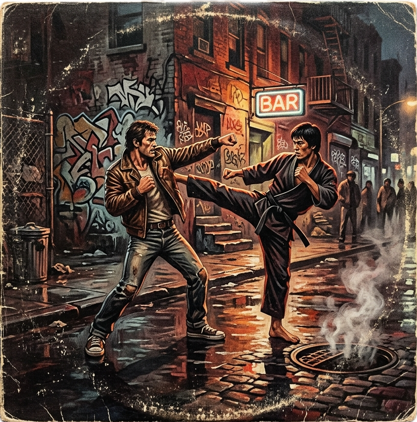

# Saturday Night Street Fight

---

## Table of Contents

1. [Fighter Creation](#1-fighter-creation)
2. [Attributes & Technique Masteries](#2-attributes--technique-masteries)
3. [Martial Arts Styles](#3-martial-arts-styles)
4. [Combat Stances & Counter Dynamics](#4-combat-stances--counter-dynamics)
5. [Combat Stances & Martial Techniques](#5-combat-stances--martial-techniques)
6. [Attribute Damage & Defeat](#6-attribute-damage--defeat)
7. [Mechanics & Resolution](#7-mechanics--resolution)
8. [Range & Movement](#8-range--movement)
9. [Status Conditions](#9-status-conditions)
10. [Healing & Recovery](#10-healing--recovery)
11. [Campaign Progression & The Street Crawl](#11-campaign-progression--the-street-crawl)
12. [Character Advancement & XP](#12-character-advancement--xp)
13. [Quick Reference Glossary & Index](#13-quick-reference-glossary--index)

---

## 1. Fighter Creation

> *"I fear not the man who has practiced 10,000 kicks once, but I fear the man who has practiced one kick 10,000 times."* — Bruce Lee

### Campaign Premise: The Vigilante Safety Patrol
Player Characters form a volunteer **Vigilante Safety Patrol**—a crew of trained martial artists from different disciplines (Boxing, Judo, Muay Thai, Karate, Kung Fu, Wrestling, Taekwondo) who patrol Empire City's subways and dark blocks to fight crime and protect citizens. Inspired by historical volunteer patrols like the 1979 *Magnificent Thirteen*, your crew wears matching street insignia (red berets, armbands, or custom patrol jackets) and operates out of a designated Home Turf station.

To build a fighter, follow these simple steps:

### 1. Choose a Martial Arts Style
Select **one** Martial Arts Style (Boxing, Muay Thai, Judo, Wrestling, Karate, Kung Fu, or Taekwondo). 
*   This grants you your Style Perks and dictates which techniques you are allowed to perform (see **Martial Arts Styles** below).

### 2. Spend Starting XP
Every fighter starts as a blank slate with a baseline of **2** in all five Attributes (Agility, Power, Reaction, Stamina, and Cool) and **Untrained (Rank 0)** in all techniques.

You have **50 Experience Points (XP)** to customize your fighter. Spend them using the same costs as character progression:

#### A. Allocate Combat Attributes
*   **Attributes**: Agility, Power, Reaction, Stamina, and Cool.
*   **Cost**: Costs **10 XP** to increase an attribute by $+1$ (starting at 2).
*   **Limit**: No attribute can be higher than **3** at character creation. The lifetime **Attribute Cap is 4**, and that fourth point must be earned in play.

#### B. Train Technique Masteries
You have **Untrained (Rank 0)** in all techniques by default.
You can train in any techniques allowed by your chosen style:
*   **Trained (Rank 1)** ($+3$ bonus): Costs **3 XP** per technique.
*   **Mastered (Rank 2 Cap)**: Technique masteries are capped at **Trained (Rank 1)** at character creation. Upgrading a technique to **Mastered (Rank 2)** ($+5$ bonus, 6 XP upgrade) is unlocked during campaign play after character creation.

### 3. Choose 2 Character Keys
Select **2 Keys** from [The Martial Arts XP Keys System](#3-the-martial-arts-xp-keys-system) (such as *Key of Dojo Pride*, *Key of Turf Loyalty*, *Key of the Iron Fist*, etc.).
*   **XP & Advancement**: Keys drive your character advancement and award Experience Points (XP) during play whenever your fighter fulfills their motivations or overcomes personal obstacles.
*   **Key Slots**: Starting at **Rank 50 (Martial Disciple / Soldier)**, you have 2 active Key slots. (Reaching **Rank 60** permanently unlocks your 3rd active Key slot).

### 4. Choose Name & Rank Title Focus
Give your brawler a unique street name and select your starting **Rank Title Focus** at Rank 50:
*   **Martial Focus Title**: **Martial Disciple** (for traditionalists, dojo disciples, and martial purists).
*   **Street Focus Title**: **Soldier** (for gang enforcers, street brawlers, and neighborhood defenders).
*   *Progression*: As your character spends XP and advances in rank, your rank title upgrades automatically (e.g. Rank 60 *Martial Adept* or *Enforcer*; Rank 150 *Master* or *Captain*; Rank 200+ *Grandmaster* or *Street Legend*). See [Character Rank Achievements & Milestones](#2-character-rank-achievements--milestones).

---

### Fighter Creation Example
A Boxer starts with Agility 2, Power 2, Reaction 2, Stamina 2, Cool 2. They build their character as follows:
*   **Step 1: Choose Style**: Boxing (*Slip & Counter*, *Iron Chin* perks).
*   **Step 2: Spend 50 XP**:
    *   **Attributes** (Spent 30 XP): Reaction 3 (10 XP), Power 3 (10 XP), Stamina 3 (10 XP). *Resulting stats: Agility 2, Power 3, Reaction 3, Stamina 3, Cool 2.*
    *   **Techniques** (Spent 18 XP): Train Hook (3 XP), Train Cross (3 XP), Train Jab (3 XP), Train Dodge (3 XP), Train Parry (3 XP), Train High Guard (3 XP).
*   **Step 3: Choose 2 Keys**:
    *   *Key of Dojo Pride* (Defeat rival styles in 1v1 duels for 1 XP).
    *   *Key of Turf Loyalty* (Defend home block or transit safe house for 1 XP).
*   **Step 4: Name & Title Focus**: "Jack 'Iron Jab' Mercer", Rank 50 Title Focus: **Soldier**.
*   **Remaining XP**: 2 XP unspent (saved for campaign play).

---

## 2. Attributes & Technique Masteries

> *"It is not important to be better than someone else, but to be better than you were yesterday."* — Jigoro Kano

A character's capabilities are defined by five core Attributes and their specific training in various martial techniques, called Technique Masteries.

### 1. Combat Attributes
*   **Agility**: Movement speed, footwork, evasive positioning, leg sweeps, and lower-body dexterity.
*   **Power**: Physical structure, strength, balance, heavy slams, takedowns, and leverage.
*   **Reaction**: Perception, reaction speed, precision, head punches/kicks, and counter-strike detection.
*   **Stamina**: Cardiorespiratory endurance, wind, lung recovery, and execution of heavy/exhausting maneuvers.
*   **Cool**: Charisma, street swagger, negotiation, intimidation, and composure under pressure. Used for all non-fighting checks.

### 2. Attribute Scores, Maximums & The Cap

Every attribute is tracked at three levels. Keeping them straight matters, because damage moves one, training moves another, and permanent injury moves the third.

| Layer | What It Is | How It Moves |
| :--- | :--- | :--- |
| **Current Score** | What you have *right now*. Every roll uses this number. | Falls as you take attribute damage; returns with rest. |
| **Maximum Score** | What rest restores you to. Begins at **2** for every attribute. | Rises $+1$ per **Attribute Conditioning Boost** (10 XP). |
| **Attribute Cap** | The hard ceiling your Maximum Score can never exceed. **4 for every fighter.** | Only ever falls—$-1$ per **Permanent Scarring** from a failed Discharge Check. |

*   **The Cap Is 4**: No amount of XP, training, or street legend raises an attribute's Maximum Score above **4**. A Grandmaster and a first-night rookie have the same ceiling; what separates them is technique mastery, not raw physique.
*   **At Character Creation**: Maximum Scores start at 2 and may be raised to a limit of **3** (see [Fighter Creation](#1-fighter-creation)). The fourth point is earned in play.
*   **Cool Is Capped Too**: Cool follows the same ceiling of 4. Because the [Permanent Scarring](#2-permanent-scarring-table) table covers only the four *physical* attributes, a fighter's **Cool Cap can never be reduced**—a broken body does not make you less charming.
*   **Damage Is a Deficit**: Both ordinary damage and **Wound damage** are tracked as a deficit *against* your Maximum Score, never as a rewrite of it—$\text{Current} = \text{Maximum} - \text{ordinary damage} - \text{Wounds}$. This is why raising your Maximum lifts your Current Score with it while healing nothing at all.
*   **Why a Ceiling Exists**: Attributes are this game's hit points. An uncapped attribute would be uncapped health, and every damage number in this book—strikes, Wounds, swarms, submissions—is tuned against a pool that tops out at 4. The **Modifier Cap** of $+10$ makes the point from the other direction: at Attribute 4 plus a Mastered technique you are already at $+9$, so further raw attribute would barely register on a roll anyway.

> [!NOTE]
> **When Everything Is Maxed**: A veteran who has Mastered every technique and reached Cap on every attribute has nothing left to buy—and that is intended. Late-game progression lives in the **Rank milestones** (Master perks at Rank 150, Dual Style Mastery at Rank 200+). Beyond those, banked XP keeps its worth as an emergency reserve: it is the last thing standing between a dying crewmate and **Street Death** when nobody has the Cool left to burn.

### 3. Technique Masteries
Technique Masteries represent specialized training in specific strikes, blocks, or throws. Masteries add a flat bonus to your dice roll whenever you execute that specific technique in combat:
*   **Untrained (Rank 0)**: You receive no bonus (roll 2d10 + Attribute).
*   **Trained (Rank 1)**: You gain a $+3$ bonus to your roll.
*   **Mastered (Rank 2)**: You gain a $+5$ bonus to your roll.

### 4. Attribute Mapping & Masteries Table
Each technique is governed by a specific Attribute representing the physical capacity required to execute it:

| Martial Technique | Governing Attribute | Combat Stance | Description |
| :--- | :--- | :--- | :--- |
| **Jab** | **Reaction** | Strike | Speed and reaction-based entry. |
| **Cross** | **Reaction** | Strike | Straight rear punch delivered with alignment and timing. |
| **Hook** | **Reaction** | Strike | Flanking angle punch targeting sightline and reaction. |
| **Uppercut** | **Power** | Strike | Explosive vertical power punch delivering upward momentum. |
| **Low Kick** | **Agility** | Strike | Quick leg sweep/strike using lower-body agility. |
| **Body Kick** | **Stamina** | Strike | Heavy torso strike draining target's wind. |
| **High Kick** | **Stamina** | Strike | High-impact flexibility and explosive stamina. |
| **Push Kick (Teep)** | **Agility** | Strike | Spacing thrust, agility, and foot placement. |
| **Taunt** | **Cool** | Strike | Verbal or physical psychological mock. |
| **Ground & Pound** | **Power** | Strike | Heavy top-control striking on a downed opponent. |
| **High Guard** | **Power** | Block | Standing upper-body power structure and stance. |
| **Low Guard** | **Power** | Block | Crouching posture and lower-body stability base. |
| **Parry** | **Reaction** | Block | Hand deflection and reaction timing. |
| **Dodge / Evasion** | **Agility** | Block | Lateral footwork and evasive movement using agility. |
| **Stand Up** | **Agility** | Block | Recovering footwork from Prone stance using agility. |
| **Footwork** | **Agility** | Block | Advancing or retreating one range step. Universal to all styles. |
| **Clinch / Grab** | **Reaction** | Throw | Securing collars or wrists with rapid reflexes. |
| **Trip / Sweep** | **Agility** | Throw | Leg hook and agility footwork sweep. |
| **Hip / Shoulder Throw** | **Power** | Throw | Redirection lift using hips and structural power. |
| **Takedown (Double Leg)** | **Power** | Throw | Explosive double-leg drive and penetration slam. |
| **Submission Hold** | **Power** | Throw | Joint lock or chokehold applied on a Prone/Pinned target. |

---

## 3. Martial Arts Styles

> *"Styles separate men. If you have no style, you just say, 'Here I am as a human being, how can I express myself?'"* — Bruce Lee

Characters can adopt a specific Martial Arts Style, which dictates their available techniques and provides unique mechanical perks:

### 1. Boxing (The Sweet Science)
*   **Focus**: Punches & Head Movement.
*   **Allowed Actions**:
    *   *Strikes*: Jab, Cross, Hook, Uppercut (No Kicks).
    *   *Blocks*: High Guard, Parry, Dodge/Evasion (No Low Guard).
    *   *Throws*: Clinch/Grab only (No Trip, Hip Throw, or Takedown).
*   **Style Perks**:
    *   **Slip & Counter**: Successfully defending with Dodge/Evasion grants **Advantage (3d10)** on your next Strike action in the following round.
    *   **Iron Chin**: Your High Guard's **Mitigation Rating** rises by $+1$ against Punches (a total of 3 absorbed), meaning a Jab, Cross, or Hook that beats your guard still fails to hurt you.

### 2. Muay Thai (Art of Eight Limbs)
*   **Focus**: Bone-breaking Kicks & Clinch Grappling.
*   **Allowed Actions**:
    *   *Strikes*: Jab, Hook, Clinch Knee, and all Kicks (Low, Body, High, Push).
    *   *Blocks*: High Guard, Parry (No Low Guard or Dodge).
    *   *Throws*: Clinch/Grab only (No Trip, Hip Throw, or Takedown).
*   **Style Perks**:
    *   **Thai Clinch**: Unlocks the exclusive **Clinch Knee** technique (Strike Stance, Reaction-based, High Impact 3 damage to Reaction or Stamina) usable while holding an opponent in a Clinch/Grab.
    *   **Heavy Leg Kicks**: Low Kicks deal 2 Agility damage as normal, but inflict **Hobbled** and also prevent the target from selecting **Dodge/Evasion** on their next Action Roll.

### 3. Judo (The Gentle Way)
*   **Focus**: Redirection & High-Impact Throws.
*   **Allowed Actions**:
    *   *Strikes*: Jab, Ground & Pound (only vs. Prone/Pinned targets).
    *   *Blocks*: High Guard, Parry (No Low Guard or Dodge).
    *   *Throws*: Clinch/Grab, Trip/Sweep, Hip/Shoulder Throw, Submission Hold (only vs. Prone/Pinned targets).
*   **Style Perks**:
    *   **Kuzushi (Off-Balance)**: If you successfully parry a Strike (White vs. Red), you can immediately attempt a Hip/Shoulder Throw or Trip/Sweep as a free reaction check.
    *   **Sweeping Reversal**: Your Trip/Sweep gains Advantage against opponents performing a High Kick.

### 4. Wrestling (Ground Dominance)
*   **Focus**: Clinches & Power Takedowns.
*   **Allowed Actions**:
    *   *Strikes*: Jab, Ground & Pound (only vs. Prone/Pinned targets).
    *   *Blocks*: High Guard, Low Guard (No Parry or Dodge).
    *   *Throws*: Clinch/Grab, Trip/Sweep, Takedown (Double Leg), Submission Hold (only vs. Prone/Pinned targets).
*   **Style Perks**:
    *   **Shooter**: Double Leg Takedowns can be executed directly from **Striking Range** (bypassing the need to Clinch first) and gain a **$+2$ bonus** if the target chose a Strike Stance.
    *   **Ground Control**: Winning a Grapple Struggle (Black vs. Black) automatically knocks the opponent prone and pins them, preventing them from choosing a Strike next turn.

### 5. Karate (The Way of the Empty Hand)
*   **Focus**: Precision Strikes & Iron Discipline.
*   **Allowed Actions**:
    *   *Strikes*: Jab, Cross, Hook, Low Kick, High Kick, Push Kick (Teep).
    *   *Blocks*: High Guard, Parry (No Low Guard or Dodge).
    *   *Throws*: None.
*   **Style Perks**:
    *   **Ikken Hissatsu (One Strike, One Kill)**: When you land a Critical Hit (margin $\ge 5$ or Natural 20), the attack deals an additional $+1$ attribute damage on top of the normal critical bonus (for a total of $+2$ bonus damage on crits).
    *   **Kiai Shout**: Once per fight, after landing a successful Strike, you may let out a devastating battle cry. Roll a contested **Cool Check** (2d10 + Cool vs. 2d10 + Cool). If you win, the defender suffers **1 Cool damage AND the Staggered condition** (Disadvantage on their next Action Roll).

### 6. Kung Fu (The Martial Way)
*   **Focus**: Flowing Combos & Trapping Hands.
*   **Allowed Actions**:
    *   *Strikes*: Jab, Cross, Low Kick, High Kick, Push Kick (Teep).
    *   *Blocks*: Parry, Dodge/Evasion (No High Guard or Low Guard).
    *   *Throws*: Trip/Sweep only (No Clinch, Hip Throw, or Takedown).
*   **Style Perks**:
    *   **Chain Strike**: If you successfully landed a Strike last round, your next Strike this round gains a $+2$ bonus (representing flowing combo sequences).
    *   **Flowing Redirect (Trapping Hands)**: Your hands never stop moving, and a Kung Fu parry deflects even when it fails. Your **Parry** has a **Mitigation Rating of 2**—the defensive floor that other styles get from a guard. When your Parry *wins* the clash, you also trap the opponent's limbs: your next Strike against them gains **Advantage (3d10)**, on top of the Stagger every successful Parry already inflicts.

### 7. Taekwondo (The Way of the Foot and Fist)
*   **Focus**: Agile Footwork & High Kicks.
*   **Allowed Actions**:
    *   *Strikes*: Jab, Cross, and all Kicks (Low, Body, High, Push).
    *   *Blocks*: High Guard, Dodge/Evasion (No Low Guard or Parry).
    *   *Throws*: None.
*   **Style Perks**:
    *   **Spinning Kicks**: A High Kick gains a $+2$ bonus if performed immediately following a successful Push Kick (Teep).
    *   **Outside Spacing**: Evasion/Dodge actions gain a $+2$ bonus if you are at Outside Range.

### 8. Martial Arts Cross-Training (Secondary Styles)

Fighters who survive the street crawl often cross-train in other martial arts disciplines to eliminate tactical blind spots (e.g., a Boxer learning Wrestling takedowns, or a Muay Thai kicker learning Judo throws).

*   **XP Adoption Cost**: Spend **15 XP** at any time on the fly to adopt a **Secondary Martial Arts Style**.
*   **Technique Access**: You permanently unlock the technique list of your Secondary Style, allowing you to spend XP to train and master its moves (e.g., a Boxer who cross-trains Wrestling unlocks *Double Leg Takedown* and *Submission Hold*).
*   **Secondary Perk Selection**: Upon adopting a Secondary Style, choose **1 Style Perk** from that style's perk list. You gain that perk's benefit in combat.
*   **Style Capacity**: A fighter can hold a maximum of **1 Secondary Style** (Total 2 Styles: Primary + Secondary). You cannot adopt a 3rd style.

### 9. Universal Techniques (All Styles)

Three techniques sit outside the style system. **Every fighter may perform them regardless of style**, and they can be trained and mastered with XP like any other technique:

*   **Footwork** (Block / White, governed by **Agility**): Advance or retreat one range step. See [Range & Movement](#8-range--movement).
*   **Stand Up** (Block / White, governed by **Agility**): Recover from the **Prone** condition. See [Status Conditions](#9-status-conditions).
*   **Taunt** (Strike / Red, governed by **Cool**): Psychological mockery inflicting 1 Cool damage. See [Special Strikes](#c-special-strikes).

> [!NOTE]
> Universal techniques do **not** count toward the "master every move in your style" requirement for the **Rank 150 Master** and **Rank 200+ Grandmaster** milestones.

---

## 4. Combat Stances & Counter Dynamics

> *"Be water, my friend. Empty your mind. Be formless, shapeless, like water. You put water into a cup, it becomes the cup."* — Bruce Lee

Fighters adopt one of three tactical combat stances during each exchange: **Strike Stance (Red)**, **Block Stance (White)**, or **Throw Stance (Black)**. Combat dominance follows a natural rock-paper-scissors counter relationship:

*   **Strike Stance** beats **Throw Stance** ($\text{Strike} > \text{Throw}$): Fast offensive strikes interrupt grappling entries and takedowns before leverage can be established.
*   **Block Stance** beats **Strike Stance** ($\text{Block} > \text{Strike}$): High/low defensive guards deflect or absorb incoming punches and kicks.
*   **Throw Stance** beats **Block Stance** ($\text{Throw} > \text{Block}$): A passive defensive guard leaves a fighter vulnerable to sweeps, clinches, and projections.

---

## 5. Combat Stances & Martial Techniques

> *"Everyone has a plan until they get punched in the mouth."* — Mike Tyson

When adopting a combat stance, you must also select one of its martial techniques. Each technique offers tactical trade-offs in speed, power, and secondary effects.

### 1. Strikes
Strikes aim to inflict damage and interrupt throws.

#### A. Punches
*   **Jab**: Fastest punch. High accuracy, low damage. Interrupts slower actions.
*   **Cross**: Straight power punch. Moderate speed, high damage. Standard damage-dealer.
*   **Hook**: Looping power punch. Slower speed, high damage. Targets the body; successful hits deal **Stamina** or **Power** damage (rib and liver shots), gaining a damage bonus if the opponent also chose a Strike.
*   **Uppercut**: Vertical power punch. Slow speed, massive damage. Targets alignment; successful hits deal **Power** damage (chin lift). Bypasses low guards/crouching stances, but highly vulnerable to fast punches.

#### B. Kicks
*   **Low Kick**: Fast leg strike. Targets stability; successful hits inflict **Agility** attribute damage and apply the **Hobbled** status condition.
*   **Body Kick**: Mid-height power kick. Focuses on windedness; successful hits inflict **Stamina** attribute damage and apply the **Winded** status condition.
*   **High Kick**: High-impact head kick. Very slow speed, massive damage. High chance to stun or knock out the opponent, but easily parried or caught.
*   **Push Kick (Teep)**: Straight thrusting kick. Fast speed, low damage. Pushes the opponent back, resetting combat to neutral range and canceling throw/clinch attempts.

#### C. Special Strikes
*   **Taunt**: A verbal or physical psychological mock. Takes the place of a **Strike Stance (Red)** action. Governed by the **Cool** attribute. Deals no physical damage, but a successful check inflicts **1 Cool damage** on the target.
*   **Ground & Pound**: Striking a downed opponent on the canvas. Governed by **Power** or **Reaction**. Deals **Power** or **Stamina** damage. Can only be selected against **Prone** or **Pinned** targets. *(Allowed for Wrestling and Judo).*

---

### 2. Blocks
Blocks aim to mitigate damage from incoming strikes.

*   **High Guard**: Standard standing block protecting the head and torso. Negates most punch damage and high/mid kicks. Vulnerable to low kicks and easily bypassed by Throws.
*   **Low Guard**: Crouching or dropped block protecting the legs. Negates low kicks and leg attacks. Vulnerable to high strikes and easily bypassed by Throws.
*   **Parry**: High-skill deflection. Low passive defense, but if successful against a Strike, it staggers the opponent and allows a guaranteed fast counter-strike (e.g., a Jab) on the next action.
*   **Dodge / Evasion**: Dynamic movement to completely avoid attacks. Completely avoids any Strike regardless of height. Succeeding grants a movement or positioning advantage.
*   **Stand Up**: Special defensive maneuver used only while **Prone**. Attempting to stand up and reset to a neutral standing stance.
*   **Footwork**: Universal repositioning step available to every style. Rather than defending in place, you advance or retreat one range step. Carries no Mitigation Rating—you are moving, not covering. See [Range & Movement](#8-range--movement).

---

### 3. Throws
Throws aim to bypass blocks, control the opponent, and force them to the ground.

*   **Clinch / Grab**: Simple entry grapple to hold the opponent. Deals no initial damage, but prevents the opponent from backing away and sets up advanced grappling.
*   **Trip / Sweep**: Quick attack on the opponent's base/balance. Fast speed, low damage. Knocks opponent prone. Especially effective against High Guards.
*   **Hip / Shoulder Throw**: High-impact projection throw. Moderate speed, high damage. Knocks the opponent prone and stuns them for a turn.
*   **Takedown (Double Leg)**: Power drive to force the opponent down. Bypasses High Guards entirely, but highly vulnerable to fast Strikes like Uppercuts or Jabs.
*   **Submission Hold**: Joint lock or chokehold applied on the mat. Governed by **Power**. Deals High Impact (3 damage) to **Stamina** (choke/joint pressure). Can only be selected against **Prone** or **Pinned** targets. *(Allowed for Wrestling and Judo).*

---

## 6. Attribute Damage & Defeat

> *"A champion is someone who gets up when they can't."* — Jack Dempsey

Instead of tracking numerical hitpoints, combatants suffer direct damage to their core **Attributes** (Agility, Power, Reaction, and Stamina). This damage degrades their rolls in real-time, representing fatigue and cumulative physical trauma.

### 1. The Defeat Condition & Instant Death
A combatant is defeated (knocked out, submits, or suffers a referee stoppage) immediately when **any single physical attribute is reduced to 0 (or below)**:
*   **Reaction reaches 0**: Knocked Out (concussion KO, loss of consciousness).
*   **Power reaches 0**: Structural TKO (broken ribs, physical collapse, or submission).
*   **Agility reaches 0**: Mobility TKO (broken leg, blown knee, unable to stand).
*   **Stamina reaches 0**: Exhaustion TKO (complete cardiorespiratory failure/collapse).

> [!CAUTION]
> **Catastrophic Systemic Trauma (Instant Street Death)**: If a combatant suffers relentless punishment such that **ALL FOUR physical attributes (Reaction, Power, Agility, AND Stamina) are reduced to 0 simultaneously**, their body suffers total systemic collapse (massive brainstem trauma, internal hemorrhage, and cardiac failure). The fighter dies **instantly on the spot**. No hospital check, short rest, or triage can save them—their story ends on the asphalt (**Character Death**).

### 2. Inflicting Attribute Damage
When an attack connects, it deals direct damage to a specific attribute based on the strike's target and impact level.

> [!NOTE]
> The **governing attribute** (listed in the Attribute Mapping table) is the attribute the *attacker* rolls to execute the action. The **attribute damage** type (listed below) is the attribute the *defender* loses on a successful hit.

*   **Reaction Damage** (Head & Face strikes): Jab, Cross, High Kick.
*   **Power Damage** (Core/Structure strikes & slams): Uppercut, Hip/Shoulder Throw, Ground & Pound (can also target Stamina).
*   **Agility Damage** (Leg strikes & sweeps): Low Kick, Trip/Sweep, Takedown.
*   **Stamina Damage** (Wind/lung blows & chokes): Hook (can also target Power), Body Kick, Push Kick (Teep), Ground & Pound (can also target Power), Submission Hold.

#### Base Damage by Impact Level:
*   **Low Impact (1 damage)**: Jab.
*   **Medium Impact (2 damage)**: Cross, Hook, Low Kick, Push Kick (Teep), Trip/Sweep, Ground & Pound.
*   **High Impact (3 damage)**: Uppercut, Body Kick, High Kick, Hip/Shoulder Throw, Takedown (Double Leg), Submission Hold.
*   *Note: Successful Throws also knock the target **Prone**.*

#### Success Modifier
*   **Critical Success**: If the attacker wins the clash with a margin of 5 or more (Winner Total - Loser Total $\ge 5$), the attribute damage is increased by $+1$.
*   **The Overkill Rule (Natural 20)**: If a combatant rolls a **Natural 20** (double 10s on their dice roll), their action automatically becomes an **Overkill Critical Hit** ($+1$ attribute damage and secondary critical effects) regardless of scores. In addition, the adrenaline spike grants a **Momentum Surge**: the attacker instantly restores **$+1$ Stamina or Cool** (up to their Maximum Score, and **ordinary damage only**—a surge never closes a Wound).

### 3. Mitigation (Blocking & Dodging)
Block Stance actions resolve in two steps. **Winning** the clash interrupts the strike outright, exactly as Winner-Take-All demands. **Losing** the clash means the strike gets through—but a guard held under fire still absorbs punishment, and that residual absorption is the block's **Mitigation Rating**:

| Block | If You **Win** the Clash | If You **Lose** the Clash |
| :--- | :--- | :--- |
| **High / Low Guard** | Strike fully interrupted. No damage. | Strike lands, but the guard absorbs **2 damage**. |
| **Dodge / Evasion** | Strike fully avoided regardless of height. You may retreat one range step. | Caught flush mid-movement. **No mitigation**—full damage. |
| **Parry** | Strike fully deflected. The attacker is **Staggered**. | The deflection fails completely. **No mitigation**—full damage. |

*Example: A combatant is hit by a High Kick (Base 3 Reaction damage) while using a High Guard, and **loses** the clash. The guard absorbs 2, so the defender takes 1 Reaction damage (3 - 2 = 1). Had they won the clash, the kick would have been interrupted for no damage at all.*

> [!IMPORTANT]
> **Mitigation never applies against Throws.** A guard is structure, and a throw is designed to defeat structure—this is precisely why Throw beats Block on the counter wheel. A fighter who turtles up against a grappler eats the throw in full.

This gives the three blocks distinct risk profiles rather than a strict power ranking. **Guards** are the low-variance choice: unspectacular on a win, forgiving on a loss. **Dodge** and **Parry** are high-variance: superb on a win (evasion plus repositioning; deflection plus a Stagger), and catastrophic on a loss.

> [!NOTE]
> **Style perks can rewrite these numbers.** Boxing's *Iron Chin* raises its High Guard to **3** against punches, and Kung Fu's *Flowing Redirect* gives its Parry a Mitigation Rating of **2**—which is how a style with no guard in its list still has a defensive floor. Always use your style's modified rating.

### 4. Armed Attackers & Wound Damage

Empire City is full of people who did not come to the block empty-handed. A bat, a length of pipe, a snapped-off cue—weapons in a street fight do not make a thug hit *harder*. They make the damage **follow you home**.

*   **The Armed Trait**: A combatant holding a weapon is **Armed**. Their successful **Strikes** deal **Wound damage** instead of ordinary attribute damage. Throws and grapples are unaffected—you cannot stab someone with leverage.
*   **No Damage Bonus**: An Armed attacker deals the *same* numbers as an unarmed one. Base damage, mitigation, and critical bonuses are all unchanged.
*   **Wound Damage**: Wounds reduce attributes exactly like ordinary damage and trigger TKO at 0 in exactly the same way. The difference is entirely in recovery—**a 10-Minute Short Rest cannot restore Wound damage.** Record Wounds separately from ordinary damage (circling the pips works well). See [Healing & Recovery](#10-healing--recovery).

*   **Wounds Are Physical Only**: Only the four physical attributes can carry Wounds. **Cool damage is never a Wound**—an Armed fighter's *Taunt* is still just a Taunt, and Burning Cool never leaves one behind.
*   **Instant Recoveries Do Not Close Wounds**: The game's two mid-fight recoveries treat the damage deficit differently, and neither one treats an injury:
    *   **Momentum Surge** (Natural 20) restores **ordinary damage only**. Adrenaline gets your wind back; it does not close a split scalp. If the attribute you would restore carries nothing but Wounds, take the **Cool** option instead or lose the surge.
    *   **Attribute Conditioning Boost** (10 XP) raises your **Maximum Score**, and your Current Score rises with it. It still buys a wounded fighter that one point of breathing room, and can still pull them back from the edge of a TKO—but it treats nothing. The Wound deficit sits there underneath, still waiting on a night's sleep.

*Example: A brawler with Reaction 3 takes 1 ordinary damage and 1 Wound, dropping to Reaction 1. A short rest in an alleyway restores the ordinary point only, bringing them back to Reaction 2. That last point does not return until they sleep somewhere safe. If they instead spend 10 XP on a Conditioning Boost, their Maximum rises to 4 and their Current to 2—they are still carrying the Wound, they simply have more room above it.*

#### Improvised vs. Lethal Weapons
| Weapon Grade | Examples | Effect |
| :--- | :--- | :--- |
| **Improvised** | Baseball bat, lead pipe, billiard cue, bottle, trash can lid | Strikes deal **Wound damage**. |
| **Lethal** | Knife, straight razor, chain, zip gun | Strikes deal **Wound damage**. On a **Critical Hit**, the Wound is **Grievous**: if that attribute is ever driven to 0, the **Discharge Check** to avoid permanent scarring is made at **one DC tier harder**. |

#### Taking Up a Weapon
Any fighter may snatch up a weapon lying within reach—a cue off the rack, a pipe dropped by a disarmed thug. **Doing so costs your entire action for the round**, and you gain the Armed trait until you lose the weapon.

> [!CAUTION]
> **A Vigilante Patrol Carries Nothing.** Your crew's legitimacy is the only thing standing between you and the precinct. An **Armed player character** makes the **Police Siren Clock tick down 2 per round instead of 1**—squad cars prioritize reports of men with pipes. Winning a brawl with a **Lethal** weapon triggers the Buyoff for the *Key of the Vigilante Code*.

#### Losing a Weapon (Disarming)
A weapon is a problem to be solved, not merely damage to be absorbed. There are three ways to take one away:

*   **Knocked Prone (Automatic)**: An Armed fighter knocked **Prone** by any throw **drops their weapon automatically**. It lands on the ground within reach at Grapple Range. This is why grapplers are the natural answer to an armed opponent.
*   **Disarm from a Block**: When you **win a clash against an Armed attacker's Strike** using any Block Stance action, you may immediately attempt a **Disarm** as a free follow-up: a contested **2d10 + Reaction** against their **2d10 + Power**. Win, and the weapon clatters away out of reach. *(A **Parry** is the ideal setup, since it also leaves the attacker Staggered.)*
*   **Disarm from a Clinch**: While you hold an Armed opponent in a **Clinch/Grab**, you may declare **Disarm** as your Throw Stance action that round, using the same contested roll.

*Recovering a dropped weapon costs a full action, and a weapon knocked away by a Disarm is out of reach entirely—somebody has to cross the block for it.*

---

### 5. Mob Punk Rules (Tier 1 Gangs)

> [!NOTE]
> **Game Master Rules**: Group combat against minor Tier 1 Punks (lookouts, pickpockets, and street-corner lackeys) uses **Mob Rules** (Shared Mob Pools, 1-Hit TKOs, Mob Group Bonuses, Swarm Attacks, and morale/scattering) managed by the Game Master. See **[Game Master's Guide: Group Combat Rules](gm.md#1-mob-punk-rules-exclusive-to-tier-1-gangs)** for full specifications.

---

## 7. Mechanics & Resolution

> *"There is timing in everything. Timing in strategy cannot be mastered without much practice."* — Miyamoto Musashi

### 1. Contested Round Structure
Combat is played in simultaneous **Rounds** resolved by a single **Contested Roll**:

1. **Phase 1: Reading the Stance (Telegraphing)**
   * Before committing action cards, combatants can attempt to read each other's body language and telegraph cues.
   * **The Roll**: Both roll a contested check (2d10 + Reaction or Cool). The reader rolls **Reaction** (spotting muscle movement) or **Cool** (reading intention). The defender rolls **Cool** (feints/poker face) or **Reaction** (masking entries).
   * **Margin Thresholds** ($\text{Margin} = \text{Winner Total} - \text{Loser Total}$):
     * **Tie / Loss (Unclear / Feinted)**: Body language is unreadable or successfully feinted. Both combatants commit their action cards **secretly and simultaneously** in Phase 2.
     * **Win, Margin 1–4 (Partial Tell)**: The reader spots a subtle tell! The reader learns **1 stance color the defender is NOT taking** (e.g., *"He's NOT Blocking"*), narrowing the defender's stance down to 2 choices before the reader commits their card.
     * **Critical Success, Margin 5+ or Natural 20 (Perfect Read)**: The reader gets a flawless read! The defender must commit and reveal their exact action card color (Red for **Strike**, White for **Block**, Black for **Throw**) before the reader commits their card.

2. **Phase 2: Commit & Reveal (Declaration)**
   * Combatants choose their action type (Red, White, or Black) along with their specific technique (e.g., *Red / Hook*) using cards, tokens, or written notes. If a fighter achieved a **Perfect Read** in Phase 1, the defender must reveal their card color first. If a fighter achieved a **Partial Tell**, the defender reveals 1 color they are NOT playing first. Otherwise, both commit secretly and reveal simultaneously.
   * Both combatants reveal their choices simultaneously.

3. **Phase 3: Roll & Resolve (Contested Roll-Off & Stance Counter Resolution)**
   * Now that the action matchup is revealed, combatants roll their dice:
     * **Dominant State (Counter Winner)**: Rolls with **Advantage** (roll 3d10, keep the two highest dice).
     * **Exposed State (Counter Loser)**: Rolls their standard 2d10 check.
     * **Matched Stances** (e.g., Strike vs. Strike): Both roll their standard 2d10 check normally.
   * Each combatant calculates their **Roll Total**:
     $$\text{Roll Total} = \text{Dice Result} + \text{Governing Attribute} + \text{Technique Mastery Bonus}$$
   * **Opposing Stances (Counter Check)**: If the revealed stances form a counter pair (e.g., Block Stance vs. Strike Stance):
     * The **Dominant State** (counter winner) rolls with **Advantage**.
     * The **Exposed State** (counter loser) rolls normally.
     * **Winner-Take-All**: Only the winner of the contested roll executes their action; the loser's action is completely interrupted and fails (dealing no damage or secondary effects).
     * *Example 1 (Block Stance vs. Strike Stance)*: Block beats Strike. The Blocker rolls with Advantage. If the **Blocker wins**, the strike is interrupted outright for no damage, and the block's own effect triggers (Parry staggers, Dodge repositions). If the **Striker wins**, the strike lands—reduced only by the block's **Mitigation Rating**, which is 2 for a Guard and nothing at all for a failed Dodge or Parry. See [Mitigation](#3-mitigation-blocking--dodging).
     * *Example 2 (Strike Stance vs. Throw Stance)*: Strike beats Throw. The Striker rolls with Advantage. If the **Striker wins**, the strike connects and interrupts the throw. If the **Grappler wins**, the grappler throws the opponent and interrupts the strike.
   * **Matched Stances (Same Stance Rolls)**:
     * **Strike vs. Strike**: Sequential Trade! Both roll normally (2d10). The fighter with the higher Roll Total lands their strike **first**. If the lower roller is knocked out, their strike is interrupted. If the lower roller survives, their strike lands and deals full damage back.
     * **Block vs. Block**: No contest needed **unless** at least one fighter declared **Footwork** or a retreating **Dodge**. If neither did, both combatants remain passive in guard—standoff, and the round resets to neutral. If either declared a range change, both roll normally (2d10); the winner's declared movement takes effect and the loser's does not. *(This is what allows a pressure fighter to walk down an opponent who keeps backing off.)*
     * **Throw vs. Throw**: Grapple struggle! Both roll off normally using **Power** or **Reaction**. The higher total wins the check, securing a Clinch or throw.

### 2. The 3 Action Check Types
To make combat timing and perk follow-ups crystal clear, all checks in **Saturday Night Street Fight** are categorized into 3 distinct Action Check types:

*   **Action Roll (Primary Combat Action)**: The primary contested roll of Phase 3 in a combat round, committed simultaneously using Action Cards (**Strike Stance**, **Block Stance**, **Throw Stance**). Temporary status penalties like **Staggered**, **Hobbled**, and **Winded** specifically apply their penalty/Disadvantage to your **very next Action Roll**.
*   **Perk Reaction (Immediate Special Follow-up)**: A free, immediate bonus check triggered by a style perk upon landing a strike or executing a parry. Perk Reactions resolve instantly within the same round, do not consume a stance card, and do not clear Action Roll conditions. A Perk Reaction rolls against either:
    *   **Immediate Contested Physical Roll**: Roll against an immediate opponent reaction roll (2d10 + Agility or Power) to land a follow-up reversal (e.g., Judo *Kuzushi* sweeping throw).
    *   **Immediate Contested Mental Roll**: Roll a contested **Cool Check** (2d10 + Cool vs. 2d10 + Cool) to shake an opponent's spirit (e.g., Karate *Kiai Shout*).
*   **Environmental Check (Hazard / Reaction Roll)**: A roll triggered by street hazards, subway trains, or ambient conditions (2d10 + Agility or Cool).

### 3. Die Roll Architecture (Strictly d10 System)
All mechanics and random tables in **Saturday Night Street Fight** strictly use ten-sided dice (d10):

*   **Standard Checks (2d10)**: Roll **2d10 + Attribute + Technique Mastery + Modifiers** vs Target DC or Opponent's Roll Total. Used for all combat actions, attribute checks, and out-of-combat challenges.
*   **Advantage Checks (3d10 Keep 2 Highest)**: Rolled when in a **Dominant State**, executing a stealth ambush, holding high ground, or exploiting a target's vulnerability. Roll 3d10 and sum the two highest dice.
*   **Disadvantage Checks (3d10 Keep 2 Lowest)**: Rolled when in an **Exposed State**, fighting in blind spots/steam vents, being flanked, or defending while Prone/Pinned. Roll 3d10 and sum the two lowest dice.
*   **Natural 20 (Double 10s)**: Rolling double 10s on action dice is a **Natural 20 (Overkill)**. Guarantees an automatic Critical Hit ($+1$ damage and critical status) + **Momentum Surge** ($+1$ Stamina or Cool recovery).
*   **Reaction Rolls (2d10 + Cool)**: Rolled when encountering new street gangs or NPCs to determine initial disposition (2d10 + Cool).
*   **Table & Generator Rolls (1d10)**: All procedural tables (environmental starting ranges, subway events, street names, landmarks, environmental hazards, block danger rank encounters, and 1970s soundtracks) roll a single **1d10**.

#### Standardized Target DC Tiers (Non-Combat & Environmental Checks)
For non-combat environmental obstacles, street hazards, and hospital triage checks where no opponent is actively rolling back, difficulty is governed by 5 standardized Target DC tiers:

| Tier | Difficulty Level | Target DC | Average Brawler (Attr 2) Success | Recommended Usage |
| :--- | :--- | :---: | :---: | :--- |
| 🟢 **Easy** | Minor Obstacle | **DC 10** | **79%** | Gathering street rumors, jumping over low debris, street navigation |
| 🟡 **Medium** | Standard Challenge | **DC 12** | **64%** | Hospital ER triage admittance, 1-Attribute Discharge check, turnstile bribes |
| 🔴 **Hard** | Severe Challenge | **DC 15** | **36%** | 2-Attribute Discharge check, picking heavy locks, razor wire fence |
| 🟣 **Very Hard** | Extremely Tough | **DC 18** | **15%** | 3-Attribute Discharge check, leaping across rooftop alley gaps, bank vaults |
| 💀 **Impossible** | Nearly Impossible | **DC 20** | **6%** | Surviving a collapsing building structure, performing miraculous feats |

*Note: Rolling double 10s (**Natural 20**) automatically succeeds on any check regardless of target DC!*

#### The Cool Economy (Favors, Face & Money)
**Saturday Night Street Fight has no money.** Nobody tracks bills, nobody keeps a ledger, and there is no equipment list to shop from. Empire City in 1975 runs on favors, face, and who owes whom—and all of that is **Cool**.

Wherever another game would ask what is in your pocket, this one asks **what your word is worth on this block**. A turnstile bribe, an ER nurse moving you up the list, a desk sergeant losing your paperwork, a fence keeping quiet: every one of them is a Cool problem. When an expense comes up, you have two ways to meet it:

*   **Talk Your Way Through (Cool Check)**: Roll **2d10 + Cool** against the expense's Target DC. Success costs you nothing at all. Failure means you do not get it—and the door usually does not open twice.
*   **Burn Cool (Automatic)**: Skip the roll and **spend Cool points directly**, reducing your current Cool score exactly as Cool damage would. You call in a marker, trade on the patrol's name, or promise somebody something. It always works, and it always costs.

| Expense | Cool Check DC | Burn Cost |
| :--- | :---: | :---: |
| **Minor** — turnstile bribe, a hot meal, a street toll, a name from a stoop kid | **DC 10** | **1 Cool** |
| **Standard** — ER admittance, bail at Central Booking, a fence's silence | **DC 12** | **2 Cool** |
| **Serious** — a doctor who files no paperwork, a cop who forgets a face entirely | **DC 15** | **3 Cool** |
| **Desperate** — an ER that admits a dying man with no questions asked, a precinct captain called off | **DC 18** | **4 Cool** |

*   **The Crew Pays Together**: Any crew member may burn Cool on another's behalf, and a single expense may be **split across any number of them**—no starting brawler carries 4 Cool alone. Somebody always knows somebody.
*   **Going Broke**: Burning your last point of Cool leaves you **Shaken** (see [Status Conditions](#9-status-conditions))—and a Shaken brawler rolls all non-combat checks at **Disadvantage**. A fighter who has spent every favor they had cannot talk their way into anything until they unwind at a **Social Sanctuary**. That is what being broke looks like here.
*   **Cool Is Your Wallet**: This makes Cool a genuine build decision rather than a dump stat. XP spent raising Cool is XP spent on being the crew member who can always get a door opened.

> [!NOTE]
> **What Cool Cannot Buy**: Cool never purchases XP, techniques, attribute increases, or weapons. It buys *access, silence, and goodwill*—the things a martial artist cannot punch their way to.

### 4. Action Roll Resolution & Modifiers
To resolve a contested roll, combatants calculate their totals using the following:
*   **Action Roll**: Roll the chosen 2d10 (or 3d10 if rolling with Advantage or Disadvantage).
*   **Attribute Modifier**: Add the governing Attribute (**Agility**, **Power**, **Reaction**, or **Stamina**).
*   **Mastery Modifier**: Add the Technique Mastery bonus (**$+3$** if Trained, **$+5$** if Mastered).
*   **The Modifier Cap**: The sum of all flat modifiers (Attribute + Mastery + style/situational bonuses) applied to any check can **never exceed $+10$**.
*   **Temporary Status Penalties**: Temporary combat conditions (e.g., **Hobbled** or **Winded**) degrade your attribute modifiers for rolls next round, but **can never reduce an attribute below 1 for checks, and never trigger defeat/TKO**.
*   **Compare Totals**:
    *   **Success**: Have the higher Roll Total.
    *   **Critical Success**: Succeeding by a margin of 5 or more (Winner Total - Loser Total $\ge 5$) activates secondary weapon/style/critical effects, and increases incoming damage by $+1$ attribute damage.
    *   **The Overkill Rule (Natural 20)**: Rolling double 10s on your action dice is a **Natural 20 (Overkill)**. It guarantees an automatic Critical Hit ($+1$ damage and critical secondary effects) regardless of scores, and grants a **Momentum Surge** (instantly restoring $+1$ Stamina or Cool to the attacker—ordinary damage only, never a Wound).

### 5. Ties and Clashes (Identical Roll Totals)
If both combatants calculate the exact same Roll Total, the round is resolved as follows based on the action matchup:
*   **Strike vs. Strike Clash (Red vs. Red)**: Simultaneous connection! Both strikes hit and deal full, unmitigated Attribute Damage to both fighters.
*   **Strike vs. Block Clash (Red vs. White)**: The defense holds—the strike is **interrupted for no damage**, exactly as a won block. But the block's own effect does **not** trigger (no Stagger from a Parry, no reposition from a Dodge), and the Blocker is **Staggered** next turn from the sheer impact.
*   **Throw vs. Throw Clash (Black vs. Black)**: A wrestling stalemate. Both fighters struggle for leverage and reset to a neutral standing stance.
*   **Win-or-Tie Maneuvers**: **Footwork**, **Stand Up**, and **Pin Escapes** succeed on a tie by their own rules. A tie resolves in the mover's favour no matter what the opponent declared—these are the exceptions to the standoff below.
*   **All Other Matches**: A neutral standoff. The round resets.

---

## 8. Range & Movement

> *"Float like a butterfly, sting like a bee."* — Muhammad Ali

Combat takes place across three fluid **Ranges**. Combatants control the distance by using their actions to advance, retreat, or push their opponent back.

### 1. The Three Combat Ranges

*   **Outside Range (Long Range)**: Spaced out, circling outside reach.
    *   *Strikes*: Long kicks only (Low Kick, Body Kick, High Kick, Push Kick). Punches cannot reach.
    *   *Throws*: None. A grappler must first close to Striking Range.
    *   *Blocks*: Any Block allowed by your style.
    *   *Mobility Perk*: **Dodge / Evasion** (Agility-based) is highly effective at this range.
*   **Striking Range (Medium Range)**: The pocket, exchange range.
    *   *Strikes*: All Strikes (Punches & Kicks).
    *   *Throws*: **Clinch / Grab only**, used as a grappling entry that closes to Grapple Range. Every other throw requires Grapple Range. *(Exception: Wrestling's **Shooter** perk permits a Takedown directly from Striking Range.)*
    *   *Blocks*: Any Block allowed by your style.
*   **Grapple Range (Close Range)**: Tied up, body-to-body grappling.
    *   *Strikes*: Close strikes only (Uppercut, Muay Thai's Clinch Knee, and Ground & Pound against Prone/Pinned targets). Long kicks and standard punches cannot be used.
    *   *Throws*: All Throws (Clinch/Grab, Trip, Hip Throw, Takedown, Submission Hold).
    *   *Blocks*: Any Block allowed by your style.

> [!IMPORTANT]
> **No fighter is ever left without a legal action.** At every range you may adopt a **Block Stance** using any block your style allows, or declare **Footwork** to change the distance. A style that cannot attack at the current range is not trapped there—it is being out-positioned, and it closes or breaks away with Footwork.

### 2. Starting Encounter Range
The initial distance when combat begins depends on the environment and encounter context:

*   **Standard Face-Off (Striking Range)**: Most standard street brawls, alley square-ups, and bar confrontations default to **Striking Range**. Both fighters start within reach of punches, kicks, and guards.
*   **Open Ground / Long Sightlines (Outside Range)**: Wide open parking lots, street blocks, or spotting an enemy across a subway station platform starts at **Outside Range**, favoring long-range kickers.
*   **Ambush / Close Quarters (Grapple Range)**: Fights inside crowded subway cars, elevators, narrow hallways, or ambushes from behind start at **Grapple Range**, giving grapplers immediate entry leverage.

### 3. Controlling the Distance
Fighters change range by winning clashes with specific techniques:

#### A. Footwork (Universal Range Change)
**Footwork** is available to every fighter regardless of style (see [Universal Techniques](#9-universal-techniques-all-styles)). It is declared as a **Block Stance (White)** action governed by **Agility**, and you name the direction—**Advance** or **Retreat**—when you commit your card.
*   **Win or Tie**: You move one range step in the declared direction.
*   **Loss**: You hold position and your opponent dictates the distance this round.
*   **Critical Success (margin $\ge 5$)**: You cover two range steps (e.g., Outside Range $\rightarrow$ Grapple Range).
*   *Tactical Note*: Because Footwork is a Block Stance action, it beats Strikes and loses to Throws. Walking down a kicker is safe; walking down a grappler is not.
*   *Restriction*: You must be standing. A **Prone** or **Pinned** fighter must first Stand Up or Escape.

#### B. Advancing with a Grappling Entry
Fighters with grappling in their style can close and seize control in a single motion using a **Throw Stance (Black)** action:
*   **Clinch / Grab**: From Striking Range, winning the check closes to **Grapple Range** and holds the opponent there, preventing them from backing away.
*   *Wrestling's Shooter perk*: Permits a **Takedown (Double Leg)** launched directly from Striking Range, closing the distance and scoring the throw in one action.
*   *Critical Success*: A grappling entry won with a Critical Success also leaves the opponent unable to retreat on their following action.

#### C. Retreating (Creating Distance)
*   **Footwork (Retreat)**: The universal option, available to every style.
*   **Dodge / Evasion**: Styles that possess Dodge may retreat one range step as part of a successful Dodge—evading the strike and creating distance in the same action.
*   *Note: If the check fails, the attacker keeps you trapped at the closer range.*

#### D. Forcing Distance (Pushing Back)
To actively push an opponent away, perform a specialized **Strike Stance (Red)** action:
*   **Push Kick (Teep)**: A successful hit pushes the opponent back one range step (e.g., Grapple Range $\rightarrow$ Striking Range).
*   *At Outside Range*: There is no further step to give. The Teep deals its damage normally but does not move the target.

---

## 9. Status Conditions

Street fights are chaotic and brutal. Combatants can inflict or suffer various temporary physical states:

### 1. Prone (Lying on the Ground)
Fighters are knocked **Prone** when hit by a throwing action (Trip/Sweep, Hip/Shoulder Throw, Takedown) or when knocked down. While Prone:
*   **Duration**: Lasts until you successfully execute a **Stand Up** check (win or tie).
*   **Action Limitation**: You cannot choose **Strike Stance (Red)** actions or Dodge/Evasion.
*   **Ground Disadvantage**: You roll with **Disadvantage** (roll 3d10, keep the two lowest dice) on defensive checks while lying on the ground (Guards, Parries, or Ground Throws).
*   **Getting Up (Neutral Roll)**: To stand back up, your action for the round must be the **Stand Up** technique (resolved as a **Block / White** action, governed by **Agility**). Unlike ground defense, the **Stand Up check is a standard 2d10 check** (it does NOT suffer Disadvantage). If you win or tie the contested check, you stand back up and remove the Prone condition! If you lose the contest, you remain Prone.

### 2. Pinned (Trapped on the Canvas)
Fighters are **Pinned** when an opponent wins a Grapple Struggle (Black vs. Black) on the ground (e.g., via Wrestling's *Ground Control* perk). While Pinned:
*   **Duration**: Lasts until you successfully execute an **Escape** check (win = Clean Break, tie = Partial Break).
*   **Action Limitation**: You cannot select **Strike Stance (Red)** or **Dodge/Evasion**.
*   **Ground Disadvantage**: You roll with **Disadvantage** (roll 3d10, keep the two lowest dice) on defensive checks while remaining pinned on the ground (Guards or Parries).
*   **Dual Escape Paths (Neutral Roll)**: To escape a Pin, your action for the round must be one of the following:
    *   **Power Escape (Bridge & Roll)**: A **Throw Stance (Black)** action governed by **Power**.
    *   **Agility Escape (Hip Scramble / Guard Recovery)**: A **Block Stance (White)** action governed by **Agility**.
    *   Unlike ground defense, an **Escape check is a standard 2d10 check** (it does NOT suffer Disadvantage).
*   **Escapes Are Universal**: Both escape paths are available to **every fighter regardless of style**—a pinned brawler scrambles with whatever they have. If your style trains the matching technique (**Clinch/Grab** for the Power Escape, **High/Low Guard** for the Agility Escape), add its Mastery bonus; otherwise you roll untrained. Note that the governing attributes above deliberately override the Attribute Mapping table: escaping a pin is raw hips and leverage, not clean technique.
*   **Escape Resolution**:
    *   **Win**: **Clean Break!** Removes **both Pinned and Prone** (you stand right back up to your feet!).
    *   **Tie**: **Partial Break!** Removes **Pinned** (reducing your position to Prone).
    *   **Loss**: The Pin is maintained.

### 3. Staggered (Off-Balance)
Fighters are **Staggered** temporarily when their attack is successfully parried, or due to specific style effects.
*   **Duration**: Lasts for 1 Round (until the end of the next round).
*   **Effect**: You roll with **Disadvantage** (roll 3d10, keep the two lowest dice) on your next Action Roll.

### 4. Stunned (Dazed)
Fighters are **Stunned** when hit by a high-impact head blow (like a Critical High Kick) or projected hard (like a Judo Hip Throw).
*   **Duration**: Lasts for 1 Round (until the end of the next round).
*   **Action Limitation**: You are dazed and cannot choose **Strike Stance (Red)** or **Throw Stance (Black)** actions. You can only cover up with a **Block Stance (White)** action, using any block your style allows at its normal **Mitigation Rating**.
*   **Instinctive Guard (Neutral Roll)**: Covering up is a **standard 2d10 check** (it does NOT suffer Disadvantage), so your block still functions and absorbs damage normally if it is beaten.
*   **Too Rattled for Finesse**: While Stunned you cannot take any **free follow-up**—no Disarm attempt, no Perk Reaction—even off a block that wins its clash. You may cover up, and nothing more.
*   **No Walking It Off**: **Footwork** is a Block Stance action, but a dazed fighter cannot use it to change range. You are covering up, not moving.

### 5. Shaken (Cool 0)
Fighters are **Shaken** when their Cool attribute is reduced to 0. Cool is lost by **Burning Cool** to cover an expense (see [The Cool Economy](#the-cool-economy-favors-face--money))—far and away the most common route—by losing a contested **Cool** check (e.g. from street encounters/gambling), or by being hit by a **Taunt** combat action.
*   **Duration**: Lasts until Cool is restored to 1 or higher at a **Social Sanctuary** (Dive Bar, Diner, Safe House).
*   **Effect**: You roll with **Disadvantage** (roll 3d10, keep the two lowest dice) on all **Reaction-governed Action Rolls** in combat (due to hesitation/panic) and on all non-combat checks.
*   **Perk Suspension**: You cannot use style perks that require calm or precision (such as Boxer's *Slip & Counter* or Judo's *Kuzushi*).

### 6. Hobbled (Leg Damage)
Fighters are **Hobbled** when hit by a successful low leg attack (like a **Low Kick**).
*   **Duration**: Lasts for 1 Round (until the end of the next round).
*   **Effect**: You roll with **Disadvantage** (roll 3d10, keep the two lowest dice) on all **Agility-based Action Rolls** (*Dodge, Low Kick, Push Kick, Trip, Stand Up*).

### 7. Winded (Body Blow)
Fighters are **Winded** when hit by a successful body blow (like a **Body Kick** or **Hook** body shot).
*   **Duration**: Lasts for 1 Round (until the end of the next round).
*   **Effect**: You roll with **Disadvantage** (roll 3d10, keep the two lowest dice) on all **Stamina and Power-based Action Rolls** (*High Kick, Body Kick, Throws, Takedowns, Clinches*).

---

## 10. Healing & Recovery

> *"Fall down seven times, stand up eight."* — Japanese Proverb

### 1. Attribute Restoration & Resting Rules
Fighters recover their damaged attributes through short breathers and medical treatment:

*   **10-Minute Short Rest (Catch Your Breath)**: Between street encounters, fighters can spend **10 minutes** resting in a relatively safe location (a quiet alleyway, subway platform, or transit bench) to catch their wind and patch minor physical wounds.
    *   **Physical Attributes Only (Reaction, Power, Agility, Stamina at 1+)**: Fully restores physical attributes back to their maximum scores.
    *   **Cool Exclusion**: Short rests in dangerous territory **do NOT restore Cool**. Psychological stress and street shock cannot be shaken off in a cold alleyway.
    *   **TKO Restriction**: A 10-minute short rest **cannot** heal any physical attribute that was reduced to **0** (see Severe Damage & Hospitalization below).
    *   **Wound Restriction**: A 10-minute short rest **cannot** restore **Wound damage** dealt by an Armed attacker (see Full Night's Rest below).
*   **Full Night's Rest (Wound Recovery)**: **Wound damage**—inflicted by [Armed attackers](#4-armed-attackers--wound-damage)—cannot be shaken off between encounters. Clearing Wounds requires a genuine night's sleep somewhere safe: **Home Turf**, a **Transit Safe House**, or a hospital bed. A full night's rest restores **all Wound damage** (and any ordinary damage along with it) to attributes at 1 or higher.
    *   *Why It Matters*: This is the middle gear of the recovery system. Fists are shrugged off in ten minutes; steel and lumber cost you a night; a zeroed attribute costs you weeks. A crew that keeps running into armed enforcers will limp into the back half of a street crawl carrying real damage—which is exactly when the *Key of the Underdog* starts paying out.
*   **Social Sanctuary & Unwinding (Cool Restoration)**: Restoring **Cool** back to its maximum score requires visiting a social sanctuary—such as a **Dive Bar**, **Greasy Spoon Diner**, **Transit Safe House**, or returning to **Home Turf**—to unwind, drink, listen to music, and regain street composure.
*   **Severe Damage & Hospitalization (Attributes at 0)**: If any physical attribute (Reaction, Power, Agility, Stamina) is reduced to **0**, the fighter suffers a physical TKO (concussion, broken bone, ligament tear). **They are physically incapacitated and cannot heal via short rests.**
    *   **Catastrophic Trauma (Instant Street Death)**: If **all four physical attributes** (Reaction, Power, Agility, and Stamina) are reduced to 0 simultaneously, the fighter suffers total systemic collapse and dies **instantly on the spot**. No hospital admittance check or triage can save them.
    *   **Admittance Check (The Ticking Clock)**: To begin recovery for non-fatal TKOs (1-3 attributes at 0), the fighter must reach a **Hospital or Free Clinic** landmark and pass a **Cool Check** to get admitted (representing overcrowded 1970s urban emergency rooms). An uninjured companion can roll this check on the patient's behalf. The Target DC scales based on severity:
        *   **1 Zeroed Attribute**: **DC 12 (Medium)**
        *   **2 Zeroed Attributes**: **DC 15 (Hard)**
        *   **3 Zeroed Attributes**: **DC 18 (Very Hard)**
        *   **Failure**: The crew must immediately **Burn Cool** (see [The Cool Economy](#the-cool-economy-favors-face--money)) to force the admittance—**2 / 3 / 4 Cool** for 1 / 2 / 3 zeroed attributes, matching the check's own DC. The cost may be **split across any number of crew members**. Any shortfall nobody can cover may be paid by burning **banked XP** as an absolute last resort, at **3 XP per outstanding Cool point**. If the crew can cover neither, untreated trauma results in **Street Death (Character Death)**!
    *   **Recovery Rate**: Once admitted, hospital treatment requires **1 week of complete bed rest per zeroed attribute** (e.g., 1 zeroed attribute = 1 week; 2 zeroed attributes = 2 weeks; 3 zeroed attributes = 3 weeks).
    *   **Discharge Check (Healing Resilience & Scarring)**: At the end of hospital recovery, the fighter must pass a **Power Check** to test their body's long-term healing resilience. The Target DC scales dynamically based on the number of zeroed physical attributes:
        *   **1 Zeroed Attribute**: **DC 12 (Medium)** — Focused trauma (concussion, single fracture).
        *   **2 Zeroed Attributes**: **DC 15 (Hard)** — Multiple severe trauma (compound fracture, internal bleeding).
        *   **3 Zeroed Attributes**: **DC 18 (Very Hard)** — Critical trauma (organ damage, ICU polytrauma).
        *   **Success**: All attributes are fully restored to their maximum scores.
        *   **Failure (Permanent Scarring)**: The **Attribute Cap** for one of the zeroed attributes (player's choice among the zeroed stats) permanently drops by **$-1$** from its starting value of 4 (e.g., Agility Cap drops from $4 \rightarrow 3$). Scarring strikes only *physical* attributes—a Cool Cap is never reduced.
        *   **Capped-Down Current Score**: If the fighter's current attribute score was above the new lower Maximum Cap, their current attribute score is **immediately capped down** to match the new Maximum Cap (e.g., if current score was restored to 3, but the cap dropped to 2, their current score becomes 2).
        *   **Career-Ending Retirement (Cap 1)**: If any attribute's Maximum Cap is ever reduced to **1**, the brawler suffers a career-ending permanent injury (since a single point of damage would reduce them to 0 TKO) and must retire from street fighting (**Forced Retirement**).
    *   **Replacement Characters (Patrol Inheritance Rule)**: When a fighter suffers **Street Death**, **Catastrophic Trauma**, or **Forced Retirement**, the player creates a replacement character representing a veteran martial artist who steps up to join the Vigilante Safety Patrol in honor of their fallen comrade:
        *   **75% Rank Inheritance**: The new character's starting **Character Rank** equals **75% of the fallen character's Rank** (minimum **Rank 50**). For example, if a Rank 120 brawler dies, the replacement character starts at **Rank 90**.
        *   **XP Creation Budget**: The player receives a starting XP budget equal to their new Rank (e.g., Rank 90 = 90 XP budget) to allocate between attributes, technique masteries, and secondary style cross-training.
        *   **Veterans Build Under Advancement Rules**: A replacement character above Rank 50 is a seasoned brawler, not a raw recruit, and therefore builds using the **advancement rules rather than the creation caps**—attributes up to **4**, techniques up to **Mastered (Rank 2)**, and cross-training freely available. *(Without this, the creation caps of Attribute 3 and Trained-only would leave budgets above roughly 100 XP literally impossible to spend, and would make a Rank 140 replacement far weaker than a Rank 140 veteran.)*

### 2. Permanent Scarring Table
If a fighter fails their recovery check, their **Attribute Maximum Cap** permanently drops by $-1$ and their current score is capped down to match. Use the table below for narrative description and roleplay prompts:

| Attribute | Scarring Effect | Mechanical Impact | Narrative & Roleplay Examples |
| :--- | :--- | :--- | :--- |
| **Reaction** | **Orbital Trauma / Brain Fog** | **Max Reaction Cap $-1$** | Slow reaction speed, orbital scar tissue, lingering brain fog, or delayed parry response. |
| **Power** | **Structural Instability** | **Max Power Cap $-1$** | Chronic back alignment issues, shoulder joint laxity, or a collarbone that braced poorly. |
| **Agility** | **Blown Ligaments** | **Max Agility Cap $-1$** | Blown knee ligaments (ACL/MCL), stiff ankles, or sluggish lateral agility. |
| **Stamina** | **Cardiorespiratory Damage** | **Max Stamina Cap $-1$** | Chronic shortness of breath, cracked ribs that healed misaligned, or reduced lung capacity. |

---

## 11. Campaign Progression & The Street Crawl

A single campaign session of **Saturday Night Street Fight** is structured as a **Street Crawl**—a self-contained procedural run through the blighted city streets and subways.

### 1. The Street Crawl Session Loop
Every game session follows a structured four-phase loop representing one night on the streets:

1.  **Phase 1: The Briefing (Select Target)**: Players start in their **Home Turf** (or a previously secured safe house) and choose a destination block or station.
2.  **Phase 2: Riding the Rails (Transit Crawl)**: Players traverse the subway line. The GM generates the line length and stop types, rolling on the *Subway Station Event Table* for each platform.
3.  **Phase 3: Navigating the Blocks (Street Crawl)**: When exiting a station, the GM generates the block's layout, landmarks, and hazards, setting its **Danger Rank**. Players resolve any street encounters using the procedural rules in the [Game Master's Guide](gm.md#encounter-building--starting-range-matrix).
4.  **Phase 4: Session End & Recovery**: A session ends when the fighters complete their street run, reach a Transit Safe House, return home, or get admitted to a Hospital. Players can spend earned Experience Points (XP) **instantly on the fly at any time** or bank it in their pool for future breakthroughs.

> [!NOTE]
> **Blocks Remember You.** Danger Ranks are not fixed scenery—they track who controls the street. Clearing a block permanently lowers its Danger Rank, a block driven to Rank 1 becomes **Secured** crew territory, and every session ends with the syndicate pushing back somewhere on the map. Over a campaign the crew is fighting for a subway line, not a series of unrelated nights. See **[Game Master's Guide: Turf Control & The Campaign Map](gm.md#turf-control--the-campaign-map)**.

---

## 12. Character Advancement & XP

Fighters grow stronger not just by surviving brawls, but by acting out their personal street code, brawler motivations, and martial arts philosophy. 

Rather than flat combat XP, **Saturday Night Street Fight** uses **XP Keys**. Keys drive character advancement and award Experience Points (XP) during play whenever your fighter fulfills their motivations or overcomes personal obstacles.

### 1. Character Rank & Available XP
*   **Available XP (Bank)**: The unspent XP sitting in your pool ready to spend on technique masteries, attribute conditioning, or cross-training.
    *   **Instant On-The-Fly Spending**: Available XP can be spent **INSTANTLY AT ANY TIME**—in the middle of a duel, between rounds, during street exploration, or while resting on Home Turf.
        *   **Attribute Conditioning Boost (10 XP)**: Instantly increases both your **Current Score** and your **Maximum Score** by $+1$ (providing an immediate 1-point heal that can save a fighter from TKO!). This can never carry a Maximum Score above your **Attribute Cap of 4**—see [Attribute Scores, Maximums & The Cap](#2-attribute-scores-maximums--the-cap). A fighter already at Cap cannot buy their way out of a knockout.
        *   **Technique Training (3 XP / 6 XP)**: Instantly unlocks or upgrades a move mastery, applying its $+3$ (Trained) or $+5$ (Mastered) bonus to your very next exchange.
        *   **Instant Cross-Training (15 XP)**: Instantly unlocks a Secondary Style and 1 Secondary Perk mid-fight or mid-crawl.
    *   *At Character Creation*: Starting 50 XP budget (e.g., 48–50 XP spent; any unspent XP remains banked in your Available XP pool).
*   **Character Rank (= Total XP Earned)**: Your fighter's overall power level, street reputation, and total career investment. Rank counts every XP you have **earned**, whether you have spent it on training or are still holding it in the bank.
    *   *At Character Creation*: Rank is exactly **50**—your full starting budget—whether you spend all 50 or bank a few for later. Banking XP delays your training; it does not shrink your reputation.
    *   *In Play*: Whenever a Key awards XP, your **Character Rank increases by that amount**, and the XP simultaneously lands in your Available XP pool to spend when you choose. *(e.g., Earning 3 XP raises your Rank from 50 to 53 and gives you 3 XP to train a move with.)*
    *   **Burned XP (Last-Resort Favors)**: XP spent on anything other than training—the desperate last-ditch option when a crew has no Cool left to burn for a hospital admittance—is **burned**. It leaves your Available XP pool and is subtracted from your Rank. Talking your way out of a holding cell does not make you a better martial artist.

### 2. Character Rank Achievements & Milestones

As fighters invest XP and train their discipline, their rising **Character Rank** unlocks key campaign milestones, martial titles, and legendary perks:

| Rank Tier | Required Spent XP | Mastery Requirement | Dual Martial / Street Title & Unlocks |
| :--- | :--- | :--- | :--- |
| **Rank 50** | **50 XP** | Baseline creation moves | **Martial Disciple / Soldier** (2 active Key slots). |
| **Rank 60** | **60 XP** | Spent ~10 XP in play | **Martial Adept / Enforcer** (**3rd Active Key Slot Unlocked**). |
| **Rank 150** | **150 XP** | Mastered all moves in Primary Style | **Master / Captain** + Select 1 **Mastery Perk** (*Dojo Founder* or *Perfect Form*). |
| **Rank 200+** | **200+ XP** | Mastered all moves in Primary & Secondary Styles | **Grandmaster / Street Legend** + **Dual Style Mastery** (Secondary elevated to Primary, all 4 perks active + 2nd Master Achievement). |

#### A. Master Rank (Rank 150): Master / Captain
Upon reaching **Rank 150** and mastering every technique in your Primary Style, you earn the dual titles **Master / Captain** and choose **1 Mastery Perk**:
*   **Dojo Founder**: You establish your own martial arts dojo on Home Turf (acting as a **Danger Rank 1 Safe Zone**). You gain a loyal crew of **1d10 Dojo Disciples (Tier 1 Mob)** who guard your dojo and can accompany your crew on street crawl runs (using GM Mob Rules). If any disciples fall in battle, new students enroll at your dojo when resting, restoring your disciple Mob count back to 1d10.
*   **Perfect Form**: Your execution of primary style moves becomes flawless. When performing a Mastered technique from your Primary Style, your clash die roll cannot be lower than 5 (any 1d10 die result of 1–4 counts as 5).

#### B. Grandmaster Rank (Rank 200+): Grandmaster / Street Legend
Upon reaching **Rank 200+** and mastering every technique across both your Primary and Secondary Styles, you achieve the ultimate dual titles of **Grandmaster / Street Legend**:
*   **Secondary Style Elevation**: Your Secondary Martial Arts Style is permanently elevated to a **Full Primary Style** (you now hold two Primary Styles!).
*   **Dual Style Mastery Perk**: You automatically gain the **2nd Style Perk** of your elevated Secondary Style (activating all 4 style perks across both styles simultaneously).
*   **Second Master Achievement Choice**: You gain a 2nd Master Achievement choice for your newly elevated style:
    *   **Perfect Form (Style B)**: Flawless execution extends to your 2nd style. When performing a Mastered technique from Style B, any 1d10 die result of 1–4 counts as 5.
    *   **Dojo Founder (Style B)**: You found a 2nd Dojo on Home Turf for your elevated 2nd style, gaining an additional 1d10 Dojo Disciples Mob.

### 3. The Martial Arts XP Keys System

#### A. How Keys & Unlocks Work
*   **Starting Keys**: At character creation (**Rank 50 — Martial Disciple / Soldier**), select **2 Keys** from the list below.
*   **Unlocking 3rd Key Slot**: When your fighter's **Character Rank reaches 60 (Martial Adept / Enforcer)** (after spending ~10 XP in campaign play), you permanently unlock your **3rd active Key slot** (Maximum 3 active Keys).
*   **Key Counter / Buyoff**: Every Key has a **Buyoff / Counter**—a pivotal moment where your character goes against their code, forgives an enemy, or evolves. When you trigger a Key's Counter in play, you choose one of two options:
    *   **Option A**: Gain 0 XP for the encounter (you act against your code, forfeiting XP gains from that Key).
    *   **Option B (Buyoff)**: Gain a **+3 XP lump sum** (enough to immediately train 1 new Rank 1 technique!) and permanently remove the Key, opening a slot to select a new Key!

#### B. The Vigilante Patrol XP Keys List

#### A. Key of the Guardian Patrol (Civilian Shield)
*Your character takes personal responsibility for protecting innocent commuters, neighborhood residents, and street vendors from crime.*
*   **1 XP**: Intervene to protect an innocent civilian, subway commuter, or vendor from a mugging, gang harassment, or street hazard.
*   **2 XP**: Safely escort an endangered civilian across a Danger Rank 3+ block or subway stop without them taking any physical damage.
*   **Buyoff / Counter**: Stand by and allow a civilian to be harmed or extorted to preserve your crew's stealth or save yourself. *(Gain +3 XP, remove Key).*

#### B. Key of Turf Loyalty (Neighborhood Defense)
*Your character is fiercely protective of your patrol crew's home turf, transit station, and local community.*
*   **1 XP**: **Clear a block** (dropping its Danger Rank by 1), or defend Home Turf or a Secured block from an intruding syndicate gang.
*   **2 XP**: **Reclaim a block** the syndicate captured in a Pushback, or drive a syndicate Boss completely off your neighborhood's turf.
*   **Buyoff / Counter**: Let a Secured block fall without contesting it, or surrender Home Turf to a rival syndicate. *(Gain +3 XP, remove Key).*

#### C. Key of the Vigilante Code (Street Justice)
*Your character abides by a strict vigilante code: no lethal weapons, no executing helpless foes, and offering lost youth a chance to walk away.*
*   **1 XP**: Spare a defeated gang punk, offering them a chance to abandon syndicate crime rather than inflicting permanent scarring.
*   **2 XP**: Refuse to break your vigilante code even when doing so results in taking severe attribute damage or losing a fight.
*   **Buyoff / Counter**: Execute a cold-blooded finishing blow, or take up a **Lethal** weapon (knife, razor, chain) and win a brawl with it. *(Gain +3 XP, remove Key).*

#### D. Key of Dojo Pride (Style Honor)
*Your character lives to prove that your martial arts discipline (Boxing, Judo, Karate, Kung Fu, Muay Thai, Wrestling, Taekwondo) is effective in real street defense.*
*   **1 XP**: Defeat a rival brawler who practices a different martial art in a 1v1 duel during a patrol sweep.
*   **2 XP**: Defeat a rival Syndicate Boss who publicly discredits your dojo or martial arts style.
*   **Buyoff / Counter**: Publicly admit your style is inferior, or abandon your primary style techniques. *(Gain +3 XP, remove Key).*

#### E. Key of the Street Informant (Urban Intelligence)
*You excel at reading the pulse of Empire City—working contacts, spotting ambushes, and extracting intel from street hustlers.*
*   **1 XP**: Uncover a gang ambush, spot a hidden trap, or secure vital street intel via a successful **Cool check**.
*   **2 XP**: Turn a syndicate lookout or street informant into a permanent ally for your patrol crew.
*   **Buyoff / Counter**: Burn a loyal street informant or sell out your crew's patrol route to a syndicate enforcer. *(Gain +3 XP, remove Key).*

#### F. Key of Vengeance (Syndicate Grudge)
*You hold a deep grudge against a specific criminal syndicate or corrupt official who ruined your dojo, neighborhood, or family.*
*   **1 XP**: **Dismantle a Syndicate Operation** (mugger den, protection racket, numbers bank, chop shop) run by your targeted syndicate.
*   **2 XP**: Bring down the Syndicate Leader or corrupt official who destroyed your past.
*   **Buyoff / Counter**: Forgive your sworn enemy or grant amnesty to the syndicate leader who destroyed your past. *(Gain +3 XP, remove Key).*

#### G. Key of the Iron Shield (The Challenger)
*You step up to draw fire, seeking out the toughest syndicate enforcers and warlords to test your martial limits.*
*   **1 XP**: Step up to challenge the strongest syndicate enforcer in an encounter to draw attacks away from your crew.
*   **2 XP**: Defeat a Tier 3 Syndicate Boss as the **sole Challenger of a Duel**—first into the circle, never tagging out, and accepting no Cornerman actions from your crew.
*   **Buyoff / Counter**: Refuse a direct challenge from a gang boss, or flee from a fight you could have led. *(Gain +3 XP, remove Key).*

#### H. Key of the Underdog (Rising Grit)
*You thrive when the odds are stacked against you, refusing to yield no matter how battered your body becomes.*
*   **1 XP**: Enter a brawl or continue a patrol sweep while already suffering from 1 or more attribute damage.
*   **2 XP**: Win a high-stakes encounter while at least two of your physical attributes are reduced to 1 point.
*   **Buyoff / Counter**: Surrender to a syndicate gang when you still have fight left in you. *(Gain +3 XP, remove Key).*

#### I. Key of the Patrol Captain (Protecting the Crew)
*You take care of your crew members, bringing up junior patrol members and ensuring everyone makes it back to Home Turf alive.*
*   **1 XP**: Offer tactical guidance or spend a 10-minute short rest conditioning a junior patrol companion.
*   **2 XP**: Save a crew member from taking a severe attribute TKO (0) by placing yourself directly in harm's way.
*   **Buyoff / Counter**: Abandon a patrol crew member in the middle of a street ambush to save yourself. *(Gain +3 XP, remove Key).*

---

## 13. Quick Reference Glossary & Index

### 1. Status Conditions Glossary

| Condition | Mechanical Effect | Duration | Quick Reference |
| :--- | :--- | :--- | :---: |
| 🦵 **Hobbled** | Inflicts **Disadvantage on Agility Action Rolls** (*Dodge, Low Kick, Trip, Footwork, Stand Up*). | Lasts for 1 Round. | [Go to Rule](#6-hobbled-leg-damage) |
| 🫁 **Winded** | Inflicts **Disadvantage on Stamina & Power Action Rolls** (*High Kick, Body Kick, Throws, Takedowns, Clinch*). | Lasts for 1 Round. | [Go to Rule](#7-winded-body-blow) |
| 🧠 **Shaken** | Inflicts **Disadvantage on Reaction Action Rolls & Non-Combat Checks**; suspends precision perks (*Slip & Counter, Kuzushi*). | Until Cool is restored. | [Go to Rule](#5-shaken-cool-0) |
| 💫 **Stunned** | Mind dazed; can only cover up with a Block Stance action (2d10 neutral roll). Cannot attack. | Lasts for 1 Round. | [Go to Rule](#4-stunned-dazed) |
| 💥 **Staggered** | Unsteady footing; you roll with **Disadvantage (3d10 keep 2 lowest)** on your next Action Roll. | Lasts for 1 Round. | [Go to Rule](#3-staggered-off-balance) |
| 🤸 **Prone** | Knocked to the ground. Must pass 2d10 neutral Stand Up check (Win/Tie = Stand Up). | Until successful Stand Up roll. | [Go to Rule](#1-prone-lying-on-the-ground) |
| 🤼 **Pinned** | Trapped under opponent. Must pass 2d10 escape check (Win = Stand Up, Tie = Prone). | Until successful Escape roll. | [Go to Rule](#2-pinned-trapped-on-the-canvas) |

### 2. Dice Mechanics & Action Checks Glossary

| Term | Definition & Tabletop Impact | Quick Reference |
| :--- | :--- | :---: |
| 🎲 **Advantage** | Roll 3d10 and sum the 2 highest dice. Rolled in Dominant State or exploiting vulnerabilities. | [Go to Rule](#4-action-roll-resolution--modifiers) |
| 🎲 **Disadvantage** | Roll 3d10 and sum the 2 lowest dice. Rolled in Exposed State or under status penalties. | [Go to Rule](#4-action-roll-resolution--modifiers) |
| 🎯 **Action Roll** | Main action check declared each exchange (*Punches, Kicks, Guards, Throws, Evading, Standing Up*). | [Go to Rule](#2-the-3-action-check-types) |
| ⚡ **Perk Reaction** | Immediate triggered check granted by style perks (*Judo Kuzushi, Karate Kiai Shout*). | [Go to Rule](#2-the-3-action-check-types) |
| ⛰️ **Environmental Check** | Non-combat check rolled against fixed Target DCs (*DC 10 Easy, DC 12 Medium, DC 15 Hard, DC 18 Very Hard, DC 20 Impossible*). | [Go to Rule](#2-the-3-action-check-types) |
| 💸 **Burn Cool** | Pay an expense automatically by spending Cool points instead of rolling (1 / 2 / 3 for Minor / Standard / Serious). There is no money in this game—Cool is the currency. | [Go to Rule](#the-cool-economy-favors-face--money) |
| 💀 **Natural 20 (Overkill)** | Rolling double 10s on action dice. Automatic Critical Hit ($+1$ damage) + Momentum Surge. | [Go to Rule](#4-action-roll-resolution--modifiers) |
| ⚡ **Momentum Surge** | Instantly restores $+1$ Stamina or $+1$ Cool upon rolling a Natural 20. | [Go to Rule](#4-action-roll-resolution--modifiers) |

### 3. Damage, Hospitalization & Character Advancement Glossary

| Term | Definition & Tabletop Impact | Quick Reference |
| :--- | :--- | :---: |
| 🔪 **Armed** | Holding a weapon. Successful **Strikes** deal Wound damage instead of ordinary damage (no damage bonus). An Armed PC doubles the Police Siren Clock's tick rate. | [Go to Rule](#4-armed-attackers--wound-damage) |
| 🩸 **Wound Damage** | Attribute damage from an Armed attacker, on physical attributes only. Behaves normally in combat, but neither a 10-Minute Short Rest, a Momentum Surge, nor a Conditioning Boost will close it—only a **Full Night's Rest** somewhere safe. | [Go to Rule](#4-armed-attackers--wound-damage) |
| 🤛 **Disarm** | Strip an opponent's weapon: free contested check (2d10 + Reaction vs. 2d10 + Power) after winning a Block clash, or declared from a Clinch. Any throw that knocks an Armed fighter **Prone** disarms them automatically. | [Go to Rule](#4-armed-attackers--wound-damage) |
| 🚑 **TKO (Technical Knockout)** | 1–3 physical attributes reduced to 0. Fighter is incapacitated and requires Hospital Admittance. | [Go to Rule](#1-attribute-restoration--resting-rules) |
| 🏥 **Admittance Check** | Cool Check (DC 12 / 15 / 18 based on 1–3 zeroed attributes) to get admitted to ER triage. Failure forces the crew to **Burn Cool**, or leads to Street Death. | [Go to Rule](#1-attribute-restoration--resting-rules) |
| 🩺 **Discharge Check** | Power Check (DC 12 / 15 / 18 based on 1–3 zeroed attributes) after 1 week bed rest per 0 attribute. Failure permanently reduces Max Attribute Cap by $-1$. | [Go to Rule](#1-attribute-restoration--resting-rules) |
| ☠️ **Street Death** | Character Death resulting from failing both ER admittance checks or 4 physical attributes zeroed simultaneously. | [Go to Rule](#1-attribute-restoration--resting-rules) |
| 🛡️ **Patrol Inheritance** | Replacement PC starts at 75% of fallen PC's Rank (min Rank 50) with an equivalent starting XP budget. | [Go to Rule](#1-attribute-restoration--resting-rules) |
| 📈 **Attribute Cap** | The hard ceiling on any attribute's Maximum Score: **4**, for every fighter, physical and Cool alike. Never rises; falls $-1$ per Permanent Scarring. At Cap 1, Forced Retirement. | [Go to Rule](#2-attribute-scores-maximums--the-cap) |
| 🏆 **Character Rank** | Total XP earned (spent *and* banked), less any XP burned on last-resort favors. Governs dual martial/street rank titles and milestone unlocks (*Rank 50, 60, 150, 200+*). | [Go to Rule](#2-character-rank-achievements--milestones) |
| 🔑 **XP Keys** | Character motivation drivers awarding 1–2 XP per encounter and +3 XP lump sums on Key Buyoffs. | [Go to Rule](#3-the-martial-arts-xp-keys-system) |
| ☯️ **Dual Style Mastery** | Rank 200+ Grandmaster perk. Elevates Secondary Style to Primary, activating all 4 style perks + 2nd Master Achievement. | [Go to Rule](#b-grandmaster-rank-rank-200-grandmaster--street-legend) |
